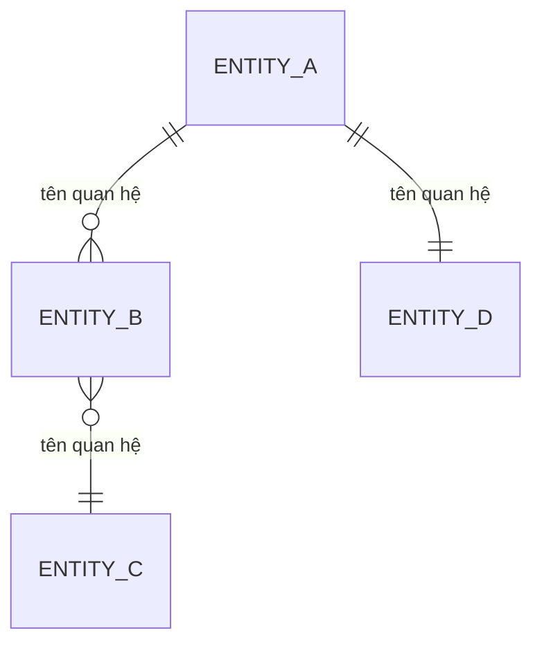
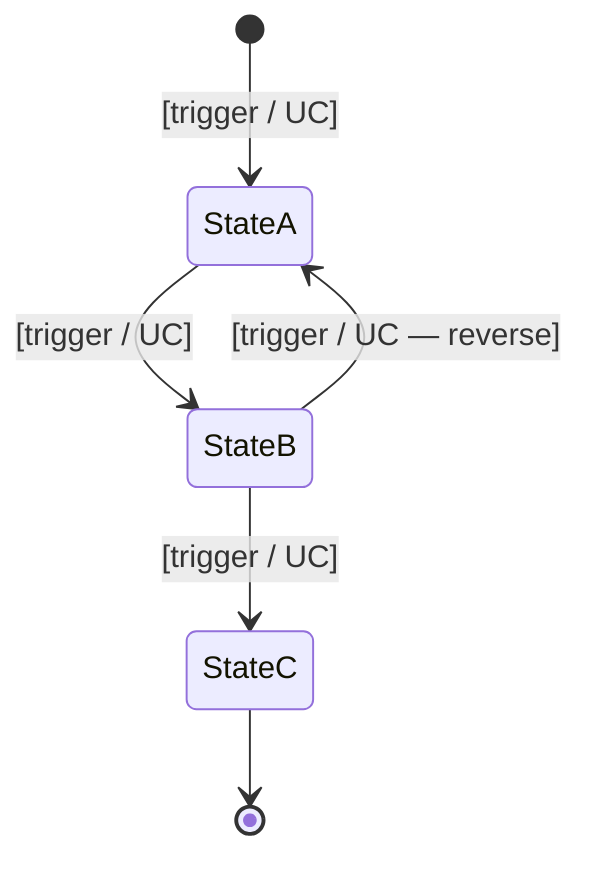

# QC Data Map: [Tên project]

**Trạng thái:** Draft / In-use
**Mode:** Initialization / Update
**Ngày tạo/cập nhật:** YYYY-MM-DD
**Người chuẩn bị:** [Agent name hoặc QC]
**Người review:** QC Lead
**Baseline:** `project-context-master.md`, `qc-site-map.md`
**Mục đích:** Cung cấp bản đồ data-entity (đối tượng dữ liệu) theo góc nhìn QC để hỗ trợ phân tích lifecycle (vòng đời) của từng entity, phân quyền dữ liệu cấp field, đánh giá impact (tác động) khi có change request, và làm nền cho integration test plan / system test scenario / regression scope.

> File này là **data-entity-first QC data map**.
> File này KHÔNG thay thế: `project-context-master.md` (góc nhìn project/scope), `qc-site-map.md` (góc nhìn screen/UI), spec/wireframe/API doc, hoặc `qc-dashboard.md`.
> File này bổ sung góc nhìn **DATA ENTITY-centric** cho 2 file trên — 3 file cùng tạo thành 3 trục bổ sung nhau: **project / screen / data**.
> File này nên ngắn gọn, chỉ giữ thông tin có ảnh hưởng đến cách QC Agent phân tích lifecycle, đánh giá impact CR, hoặc thiết kế test plan dựa trên data flow.

---

## 1. Metadata

| Thuộc tính | Giá trị |
|---|---|
| Project / Product | [Tên project — nên trùng với project-context-master] |
| Platform | [Web / Mobile / Backend service / kết hợp] |
| Source baseline | `project-context-master.md` (ngày X — mode Y), `qc-site-map.md` (ngày X — mode Y) |
| Data map readiness | **Full / Partial / Initial** — [ghi rõ tình trạng: entity nào đã có spec chi tiết, entity nào chỉ derive từ backbone] |
| Source quality | [Confirmed từ FRD/spec / Derived từ UC list / Inferred từ wireframe] |
| Dashboard relationship | Không ghi trực tiếp `qc-dashboard.md`; không tạo data-map handoff mặc định. Chỉ dùng để tham chiếu QC/Regression cho tới khi `qc-dashboard-sync` có contract data-map riêng. |
| Ghi chú | [Các CR đã apply ảnh hưởng đến entity inventory; các entity mới được giới thiệu/gỡ bởi CR] |

**Hướng dẫn điền:** Bảng metadata ngắn để Agent/QC khác đọc file nhanh hiểu được mức độ tin cậy của data map và file baseline. Khi update mode chạy, ghi rõ delta so với version trước.

---

## 2. Sources consolidated

> Bảng này liệt kê các file đã được đọc và tổng hợp ra nội dung phía dưới. Lần chạy update sau sẽ so version trong tên file (`_v<N>`) để biết source có thay đổi hay không.

| # | File | Version | Loại | Ngày đọc cuối |
|---|---|---|---|---|
| 1 | project-context-master.md | [version hoặc no-version] | Project baseline | YYYY-MM-DD |
| 2 | qc-site-map.md | [version hoặc no-version] | Screen baseline | YYYY-MM-DD |
| 3 | backbone.md | [version] | Feature/UC inventory + module structure + BR + flows | YYYY-MM-DD |
| 4 | [FRD per module] | [version] | Data model chi tiết per module | YYYY-MM-DD |
| 5 | [API spec / DB schema / ERD nếu có] | [version] | Data structure ground truth | YYYY-MM-DD |
| 6 | [Change Request impact-assessment.md per CR] | [version] | Delta entity / field / lifecycle | YYYY-MM-DD |

**Hướng dẫn điền:** Liệt kê đúng các file đã đọc. Nếu data map chủ yếu derived từ UC list (không có DB schema / API spec rõ ràng), phải đánh dấu `Source quality = Derived` ở Section 1 và flag rủi ro trong từng entity ở Section 3.

---

## 3. Data Entity Inventory (Danh mục entity dữ liệu)

**Mục đích:** Liệt kê toàn bộ các đối tượng dữ liệu cốt lõi trong hệ thống ở cấp **entity thuần** (không phải module, không phải screen). Đây là baseline để các matrix sau (Section 7, Section 8) tham chiếu. Mỗi entity được gán một ID duy nhất.

**Hướng dẫn điền:**
- **Entity ID** đặt theo quy ước `ENT-<NHÓM>-<NN>` hoặc theo convention của project (ví dụ: ENT-USER-001, ENT-PATIENT-001). ID không tái sử dụng khi entity bị gỡ.
- **Tên entity** ghi cả tiếng Việt và tên kỹ thuật (table/collection) nếu khác.
- **Các thuộc tính chính** chỉ liệt kê field quan trọng cho QC (primary key, foreign key, field nhạy cảm, field có business rule riêng); KHÔNG copy toàn bộ schema — tham chiếu sang FRD/DB schema để biết đầy đủ.
- **Nơi lưu trữ** ghi cụ thể: PostgreSQL table tên gì / TimescaleDB hypertable / Redis cache / S3 bucket / external system.
- **Phân loại / Classification** để **trống** ở khung này. Khi đưa vào project cụ thể, bổ sung scheme phân loại của project (ví dụ: PII / phi-PII / config, hoặc Confidential / Internal / Public, hoặc theo nội bộ). Phân loại này quyết định checklist test (audit, encryption, mask khi export, negative test cross-tenant...).
- **Ownership boundary** ghi: tenant-scoped (chỉ thuộc 1 tenant), cross-tenant (dùng chung toàn project), hay system-level (không thuộc tenant nào).
- **Nguồn** ghi rõ Confirmed/Derived/Inferred + reference đến UC/FRD cụ thể.

| Entity ID | Tên entity (VN / kỹ thuật) | Mô tả ngắn | Các thuộc tính chính | Nơi lưu trữ | Phân loại / Classification | Ownership boundary | Nguồn |
|---|---|---|---|---|---|---|---|
| ENT-XXX-001 | [Tên VN] / [table_name] | [1–2 dòng mô tả nghiệp vụ] | [field1 (PK), field2 (FK→), field3...] | [PostgreSQL `<table>`] | [để trống — project tự gán] | [tenant-scoped / cross-tenant / system] | [Confirmed/Derived + UC ref] |
| ENT-XXX-002 | ... | ... | ... | ... | ... | ... | ... |

**Lưu ý gỡ entity cũ:** Khi một CR (Change Request) gỡ một entity (ví dụ chuyển field từ entity A sang entity B), giữ lại dòng entity cũ trong inventory với note "Removed by CR-XXX (ngày YYYY-MM-DD)" để regression không bỏ sót dữ liệu legacy còn tồn tại.

---

## 4. Entity Relationship Map (Bản đồ quan hệ entity)

**Mục đích:** Mô tả quan hệ giữa các entity ở cấp **dữ liệu thuần** (không phải cấp module): kiểu quan hệ (1-1, 1-n, n-n), chiều phụ thuộc, và rule cascade khi entity gốc bị xoá/archive/deactivate.

**Hướng dẫn điền:**
- Vẽ diagram tổng quan bằng Mermaid `erDiagram` để dễ nhìn toàn cảnh.
- Bảng chi tiết bên dưới mô tả từng cặp quan hệ — phục vụ Agent đọc parse được, không chỉ con người nhìn.
- **Chiều phụ thuộc** rất quan trọng: ghi rõ "A phụ thuộc B" nghĩa là không có B thì A không tồn tại; ngược lại có B mà chưa có A thì OK.
- **Cascade rule** ghi cụ thể: `cascade-delete` / `cascade-soft-delete` / `set-null` / `set-default` / `block` (chặn xoá nếu còn child) / `archive-and-keep` / `custom` (kèm mô tả).
- Khi có **CR thay đổi quan hệ**, phải update cả diagram lẫn bảng + ghi chú CR-XXX vào cột Ghi chú.

### 4.1 Diagram tổng quan

**Hướng dẫn điền diagram:**
- `||--o{` = 1 đến nhiều (1-n)
- `}o--o{` = nhiều đến nhiều (n-n)
- `||--||` = 1 đến 1 (1-1)
- `||--o|` = 1 đến 0..1 (1-1 optional)

Nếu hệ thống lớn (>20 entity), nên tách thành nhiều diagram theo nhóm chức năng thay vì 1 diagram khổng lồ.

### 4.2 Bảng quan hệ chi tiết

| Entity A | Entity B | Kiểu quan hệ | Chiều phụ thuộc | Cascade rule khi A bị xoá/archive | Cascade rule khi B bị xoá/archive | Foreign key field | Ghi chú QC |
|---|---|---|---|---|---|---|---|
| ENT-XXX-001 | ENT-XXX-002 | 1-n | B phụ thuộc A | [cascade-delete / block / set-null / archive...] | [N/A nếu B là child] | [b.a_id] | [Test cascade scenario nào; CR nào ảnh hưởng] |

**Hướng dẫn QC sử dụng bảng này:**
- Khi thiết kế test xoá/archive entity A: bắt buộc đi xuyên cột "Cascade rule khi A bị xoá" để liệt kê side-effect cần verify.
- Khi review một UC có hành động xoá: nếu UC spec không mô tả cascade theo bảng này → flag conflict cho BA.
- Khi có CR thay đổi quan hệ: update bảng trước, sau đó Section 5 (lifecycle) và Section 7 (CRUD matrix) phải update theo.

---

## 5. Data Lifecycle Flow per Entity (Vòng đời dữ liệu theo từng entity)

**Mục đích:** Đây là **phần lõi** của data map. Mô tả CRUD + side-effect (tác dụng phụ) + sync xuống hệ thống ngoài cho từng entity. Phần này trả lời các câu hỏi: "Entity X sau khi tạo có gì? ở đâu? update / xoá được không? update / xoá xong thì sao? liên kết với entity nào? sync xuống hệ thống nào?"

**Hướng dẫn điền:**
- Lặp lại template `5.x` cho **mỗi entity** trong Section 3 (chỉ làm chi tiết cho entity quan trọng — entity vô danh như audit log có thể tóm gọn).
- Mỗi sub-section đánh số theo Entity ID (ví dụ `5.1 ENT-USER-001 — User`).
- Với entity không hỗ trợ một thao tác nào đó (vd không có Delete) → ghi rõ "Không hỗ trợ — lý do".
- Phần **Side-effect** phải tham chiếu cụ thể: entity nào bị tạo/update theo, hệ thống ngoài nào nhận event/command, email/notification nào được trigger, audit log nào được ghi.
- Phần **Sync xuống hệ thống ngoài** đặc biệt quan trọng cho các project IoT / có integration realtime (vd auto-sync field xuống thiết bị qua TCP gateway / push xuống third-party API).

### 5.x [ENT-XXX-NNN] — [Tên entity]

**Mô tả ngắn:** [Nhắc lại 1 dòng mô tả từ Section 3]

**Source of truth:** [DB table / API endpoint / external system — tham chiếu]

#### Create (Tạo mới)
- **Trigger / từ đâu:** [UC nào, screen nào, hoặc system event nào tạo entity này]
- **Actor được phép tạo:** [Liệt kê role]
- **Pre-condition:** [Entity nào phải tồn tại trước; permission gì cần thoả; tenant context gì]
- **Validate khi tạo:**
  - Field-level: [required, format, length, range — tham chiếu common-rules nếu có]
  - Cross-field: [rule nào]
  - Uniqueness: [field nào phải unique trong scope nào — global / per-tenant / per-parent]
- **Side-effect sau khi tạo:**
  - Tạo entity con / liên kết: [ENT-XXX nào tự sinh theo]
  - Audit log: [log entry loại nào]
  - Notification / Email: [trigger gì, gửi cho ai]
  - Sync hệ thống ngoài: [push xuống đâu, qua kênh nào]
- **State khởi tạo:** [State khi entity vừa được tạo — ví dụ `pending`, `active`]

#### Read (Đọc)
- **Kênh đọc:** [UI screen nào, API endpoint nào, export file nào]
- **Filter / scope mặc định:** [Mặc định filter theo tenant / role / ownership]
- **Permission đọc:** [Role nào đọc được; có giới hạn theo trường không — ví dụ Role X đọc được toàn entity, Role Y chỉ đọc subset field]
- **Field bị mask / che khi đọc:** [Nếu có field bị mask theo role / context — ví dụ PII bị mask khi Role X đọc]
- **Audit:** [Có log mọi lần đọc không, hay chỉ log một số operation nhạy cảm — phụ thuộc compliance project]

#### Update (Cập nhật)
- **Field immutable (không sửa được sau khi tạo):** [Liệt kê — ví dụ ID, ngày tạo, tenant_id]
- **Field mutable (sửa được):**
  - Theo role A: [field nào]
  - Theo role B: [field nào]
  - Theo role C: [field nào]
- **Validate khi update:** [Field-level + cross-field — có khác với Create không]
- **Side-effect sau khi update:**
  - Audit log: [log entry, có capture old-value vs new-value không]
  - Trigger entity khác update: [ENT-XXX nào re-compute / re-sync]
  - Sync hệ thống ngoài: [push update xuống đâu, có retry không, fail-mode là gì]
- **Concurrency (đồng thời):** [2 user cùng update 1 record xử lý thế nào — last-write-wins / optimistic lock / pessimistic lock]

#### Delete / Archive (Xoá / Lưu trữ)
- **Loại:** Hard delete / Soft delete / Archive / Không hỗ trợ
- **Actor được phép:** [Role nào]
- **Pre-condition:** [Phải thu hồi entity con trước? Phải ở state nào?]
- **Cascade tới entity nào:** [Tham chiếu Section 4.2; ghi rõ child nào bị `cascade-delete` / `set-null` / `block`]
- **Dữ liệu liên quan xử lý:** [Telemetry / log / file đính kèm xử lý thế nào — giữ lại theo retention / xoá ngay / tách orphan]
- **Restore (nếu có):** [UC nào restore; restore có auto-restore child không; restore có ràng buộc thời gian không]
- **Audit:** [Log delete/archive entry; retention bản ghi log riêng]
- **Sync hệ thống ngoài:** [Có push delete xuống hệ thống ngoài không, hay chỉ disable]

#### Lock / Deactivate / State change khác (nếu áp dụng)
- **Trigger:** [UC nào kích hoạt — ví dụ deactivate tenant cascade xuống user]
- **Hành vi thay đổi sau khi lock:**
  - Read còn được không, theo role nào
  - Update bị chặn ở đâu
  - Login / API access bị chặn ở đâu
  - Child entity bị ảnh hưởng thế nào
- **Reverse (mở khoá / restore):** [UC nào, có auto-restore child không]
- **Audit:** [Log entry]

---

## 6. State Transition Diagram (Sơ đồ chuyển trạng thái)

**Mục đích:** Mô tả state machine (máy trạng thái) cho các entity có vòng đời phức tạp — bổ sung góc nhìn behavioral mà bảng Section 5 không thể hiện hết. Phần này đặc biệt quan trọng để phát hiện transition cấm bị bỏ sót trong spec.

**Hướng dẫn điền:**
- Chỉ làm cho entity có **≥3 state** hoặc có transition không tuyến tính (có vòng lặp, có nhánh, có state terminal). Entity chỉ có 2 state (active/deactivated) có thể bỏ qua section này — đã đủ trong Section 5.
- Mỗi sub-section một entity, đánh số theo Entity ID.
- Diagram dùng Mermaid `stateDiagram-v2` để Agent parse được.
- Trên mỗi transition, ghi rõ **điều kiện kích hoạt** (UC nào / role nào / pre-condition gì) và **side-effect** chính.
- Bảng "Transition cấm" liệt kê các transition về mặt logic có thể nghĩ tới nhưng KHÔNG được phép — đây là test case negative bắt buộc.

### 6.x [ENT-XXX-NNN] — [Tên entity]

#### Diagram

#### Bảng transition hợp lệ

| Từ state | Tới state | Trigger (UC / event) | Actor | Pre-condition | Side-effect chính |
|---|---|---|---|---|---|
| StateA | StateB | [UC-XXX-NNN] | [Role] | [Điều kiện] | [Trigger gì, audit gì] |

#### Bảng transition CẤM (negative test scope)

| Từ state | Tới state | Lý do cấm | Hành vi mong đợi khi user cố thực hiện |
|---|---|---|---|
| StateC | StateA | [Terminal state không quay lại được] | [Error message gì, audit có ghi attempt không] |

---

## 7. CRUD × Role Matrix at Data Level (Ma trận CRUD theo role ở cấp dữ liệu)

**Mục đích:** Bảng tra cứu nhanh: với mỗi entity, role nào có quyền C/R/U/D. Đây là góc nhìn **data-level**, khác với `qc-site-map.md §7` (screen-level access). Một entity có thể bị tác động từ nhiều screen — bảng này tổng hợp lại để thấy bức tranh phân quyền dữ liệu hoàn chỉnh.

**Hướng dẫn điền:**
- **Cột** = role (lấy từ `project-context-master.md §5`).
- **Hàng** = entity (lấy từ Section 3 của file này).
- **Ô** điền tổ hợp C/R/U/D viết liền (ví dụ `CRUD`, `RU`, `R`, `-` nếu không có quyền nào).
- Hậu tố `(*)` nếu quyền chỉ áp dụng cho **subset field** — chi tiết tách sang bảng per-field bên dưới.
- Hậu tố `(†)` nếu quyền chỉ áp dụng với **scope điều kiện** (vd chỉ với entity do mình tạo) — chi tiết ghi vào cột Note.
- Hậu tố `(‡)` nếu quyền chỉ áp dụng cho **subset state** (vd chỉ update được khi entity ở state `draft`).

### 7.1 Bảng CRUD × Role tổng quan

| Entity ↓ / Role → | [Role A] | [Role B] | [Role C] | [Role D] | [Role E] | Note |
|---|---|---|---|---|---|---|
| ENT-XXX-001 | CRUD | RU | R | - | - | [Chú thích quyền điều kiện] |
| ENT-XXX-002 | CRUD | RU(*) | R | R(†) | - | [Role B chỉ U một số field; Role D chỉ R entity do mình tạo] |

### 7.2 Per-field permission cho entity có field nhạy cảm

> Chỉ làm bảng này cho entity có field cần phân quyền **chi tiết hơn cấp entity** (vd entity Patient có field PII chỉ Role X được update, field phi-PII Role Y cũng được update).

**Entity: [ENT-XXX-NNN] — [Tên entity]**

| Field | Phân loại (theo Section 3) | Role được Create | Role được Read | Role được Update | Role được Delete (nếu nullable) | Note |
|---|---|---|---|---|---|---|
| [field_name] | [classification project gán] | [Role list] | [Role list] | [Role list] | [Role list hoặc N/A] | [Validate đặc biệt, CR liên quan, sync xuống hệ thống ngoài] |

### 7.3 Anti-pattern cần test negative

> Liệt kê các tổ hợp "Role + thao tác + entity" mà về logic người dùng có thể thử nhưng phải bị chặn. Đây là test case bắt buộc cho mỗi role.

| Role | Thao tác cố thực hiện | Entity / Field | Hành vi mong đợi |
|---|---|---|---|
| [Role X] | Update field [PII] của ENT-YYY | [tên field cụ thể] | [HTTP 403 / UI ẩn nút / Toast error — chốt theo project] |
| [Role X từ Tenant A] | Read ENT-ZZZ của Tenant B | [bất kỳ] | [HTTP 404 hoặc 403 — chốt theo project] |

---

## 8. Feature × Entity Coverage Matrix (Ma trận phủ feature theo entity)

**Mục đích:** Bảng 2 chiều **UC × Entity** để (1) phát hiện entity bị thiếu CRUD operation nào (gap), (2) phát hiện feature đụng quá nhiều entity (hotspot regression), (3) làm baseline để tính regression scope khi có CR. Đây là góc nhìn ngược với `qc-site-map.md §8` (Screen ↔ Feature).

**Hướng dẫn điền:**
- **Cột** = Entity ID (Section 3).
- **Hàng** = Feature ID (UC ID — đồng bộ với `qc-dashboard.md` và backbone). Một feature = một UC.
- **Ô** điền tổ hợp C/R/U/D; để trống nếu UC không động vào entity đó.
- Sau bảng có sub-section **Gap analysis** để tổng hợp findings.

### 8.1 Ma trận UC × Entity

| Feature (UC) ↓ / Entity → | ENT-XXX-001 | ENT-XXX-002 | ENT-XXX-003 | ENT-XXX-004 | ... |
|---|---|---|---|---|---|
| UC-XXX-001 — [Tên UC] | C | - | R | - | |
| UC-XXX-002 — [Tên UC] | R | U | - | - | |
| UC-XXX-003 — [Tên UC] | - | - | - | D | |

### 8.2 Gap analysis — đọc theo CỘT (entity-centric)

> Với mỗi entity, kiểm tra trong toàn bộ ma trận có UC nào Create / Read / Update / Delete entity đó không. Nếu thiếu một loại → flag.

| Entity | Có Create? | Có Read? | Có Update? | Có Delete / Archive? | Gap finding & risk |
|---|---|---|---|---|---|
| ENT-XXX-001 | UC-XXX-001 | UC-XXX-002, UC-XXX-005 | UC-XXX-003 | (thiếu) | [Phân tích: entity không có UC xoá → tích tụ dữ liệu; cần xác nhận có job purge background không, có nằm trong scope MVP không, có thuộc compliance retention không] |

**Câu hỏi mẫu QC nên đặt cho BA khi phát hiện gap:**
- Entity X không có UC Read public — có view internal/admin không?
- Entity Y không có UC Update — đây là entity append-only có chủ ý không, hay thiếu spec?
- Entity Z không có UC Delete — chính sách retention là gì, có job purge tự động không, có UC export trước khi purge không?

### 8.3 Hotspot analysis — đọc theo HÀNG (feature-centric)

> Với mỗi feature, đếm số entity nó tác động + số entity bị Update/Delete. Feature đụng nhiều entity → rủi ro regression cao → test sâu hơn.

| Feature (UC) | Số entity tác động | Số entity bị U/D | Hotspot rating | Lý do |
|---|---|---|---|---|
| UC-XXX-NNN | [N] | [M] | High / Medium / Low | [Vì sao là hotspot: đụng cả entity gốc và entity con; có sync ra ngoài; cascade rộng...] |

**Quy tắc đề xuất Hotspot rating:**
- **High**: ≥4 entity tác động, hoặc có U/D entity gốc với cascade ≥2 child, hoặc có sync xuống hệ thống ngoài.
- **Medium**: 2–3 entity tác động, có ít nhất 1 U/D.
- **Low**: 1 entity, hoặc chỉ Read.

### 8.4 Map sang test strategy

> Sau khi có Gap + Hotspot, map sang 3 loại test:

| Loại test | Đối tượng chính | Cách suy ra từ data map |
|---|---|---|
| **Integration test (Kiểm thử tích hợp)** | Các luồng dữ liệu xuyên service / xuyên entity boundary | Lấy từ Section 5 (Lifecycle) — mỗi side-effect cross-entity = 1 integration scenario. Lấy thêm mọi "Sync hệ thống ngoài" = 1 integration scenario riêng có happy + failure mode. |
| **System test (Kiểm thử hệ thống)** | End-to-end theo journey kết hợp nhiều UC | Lấy từ Hotspot feature (8.3 High) — mỗi feature High là một system test scenario. Kết hợp với NAV flow từ `qc-site-map.md §6` để có path xuyên UI. |
| **Regression scope (Phạm vi hồi quy)** | Các entity gốc trong dependency graph | Khi 1 entity gốc thay đổi, lấy bảng Section 4.2 truy ngược ra child entity bị cascade → lấy ô tương ứng trong ma trận 8.1 → ra danh sách UC cần regression. |

---

## Phụ lục — Change Impact Analysis Template (Mẫu phân tích tác động khi có Change Request)

**Mục đích:** Form 1 trang để Agent/QC sử dụng nhanh **khi có CR mới**: trace ngược qua các ma trận trong file để liệt kê impact-area (vùng tác động) và scope test cần re-run. Không thay thế file `impact-assessment.md` chi tiết của BA/PM — file này là góc nhìn QC.

**Hướng dẫn điền:**
- Copy nguyên template phía dưới khi có CR mới, đặt tên file `CR-NNN-qc-impact.md` (hoặc append vào file `impact-assessment.md` của CR đó dưới section "QC view").
- Mỗi bước trong template trace ngược qua một ma trận cụ thể của file này — chỉ rõ "tra bảng X.Y".

---

### CR-NNN — [Tên CR ngắn gọn]

**Ngày phân tích:** YYYY-MM-DD
**Người phân tích:** [QC name / Agent]
**Status CR:** Proposed / Approved / Applied / Rolled-back

#### Bước 1 — Mô tả thay đổi từ góc nhìn data

| Hạng mục | Trước CR | Sau CR | Loại thay đổi |
|---|---|---|---|
| Entity được thêm mới | — | [ENT-XXX-NNN nếu có] | Add entity |
| Entity bị gỡ | [ENT-XXX-NNN nếu có] | — | Remove entity |
| Field thêm/bớt trên entity X | [field list] | [field list] | Add/Remove field |
| Phân loại field đổi (classification) | [classification cũ] | [classification mới] | Reclassify |
| Quan hệ entity thay đổi | [quan hệ cũ] | [quan hệ mới] | Restructure relationship |
| Cascade rule thay đổi | [rule cũ] | [rule mới] | Cascade change |
| Sync hệ thống ngoài mới / gỡ | [trước] | [sau] | Sync change |

#### Bước 2 — Trace entity bị tác động

> Liệt kê mọi entity có trường / quan hệ / lifecycle thay đổi.

| Entity ID | Loại thay đổi | Section trong file này cần update | Đã update? |
|---|---|---|---|
| ENT-XXX-NNN | [Add field / change classification / change lifecycle / change cascade...] | Section 3 / 4 / 5 / 6 / 7 / 8 | Yes / No |

#### Bước 3 — Trace UC cần re-test (qua Matrix 8.1)

> Với mỗi entity ở Bước 2, lấy CỘT tương ứng trong Section 8.1 → liệt kê mọi UC có C/R/U/D trên entity đó.

| Entity bị tác động | UC có C/R/U/D liên quan (từ 8.1) | UC ưu tiên re-test (High Hotspot từ 8.3) |
|---|---|---|
| ENT-XXX-NNN | [UC-XXX-001, UC-XXX-002, ...] | [UC nào được rate High] |

#### Bước 4 — Trace Role cần kiểm permission lại (qua Matrix 7.1)

> Nếu CR thay đổi phân quyền hoặc thêm/bớt field nhạy cảm.

| Entity | Role bị ảnh hưởng permission | CRUD mới | Test negative cần bổ sung (mục 7.3) |
|---|---|---|---|
| ENT-XXX-NNN | [Role list] | [CRUD list] | [Anti-pattern mới phát sinh] |

#### Bước 5 — Trace cascade impact (qua Matrix 4.2)

> Nếu CR thay đổi quan hệ entity hoặc cascade rule.

| Entity gốc thay đổi | Child entity bị ảnh hưởng (từ 4.2) | Cascade rule mới | Test scenario cần bổ sung |
|---|---|---|---|
| ENT-XXX-NNN | [ENT-XXX-MMM list] | [rule mới] | [Cascade scenario; rollback scenario] |

#### Bước 6 — Tổng hợp regression scope

| Loại regression | Phạm vi | Estimate effort | Ghi chú |
|---|---|---|---|
| Integration test bị ảnh hưởng | [Số luồng + tên] | [N giờ / N ngày] | [Sync xuống thiết bị / hệ thống ngoài cần re-test toàn bộ?] |
| System test bị ảnh hưởng | [Số scenario + tên] | [N giờ / N ngày] | [E2E journey nào bị break path] |
| Test case bị ảnh hưởng | [Số TC] | [N giờ / N ngày] | [Đánh dấu trong test management tool] |
| Audit log cần re-verify | [Có / Không] | — | [BR-006 hoặc tương đương] |

#### Bước 7 — Open question cần xác nhận với BA / Tech Lead

| # | Câu hỏi | Người trả lời | Status |
|---|---|---|---|
| 1 | [Câu hỏi xuất phát từ phân tích data] | BA / Tech Lead | Open / Answered |

---

## Lưu ý chung khi sử dụng file này

1. **File này là góc nhìn QC, không phải data dictionary của Dev.** Khi spec/DB schema chi tiết có sẵn ở FRD hoặc DB tool, file này chỉ trỏ tham chiếu và lọc ra phần QC cần — không copy nguyên schema.
2. **Khi conflict với spec chi tiết đã signed-off → ưu tiên spec.** File này regenerate lại để đồng bộ.
3. **Khi có CR mới → update theo thứ tự:** Section 3 (Inventory) → Section 4 (Relationship) → Section 5 (Lifecycle) → Section 6 (State) → Section 7 (CRUD Role) → Section 8 (Feature Coverage). Không update Section 8 trước khi 3 và 5 đã được điều chỉnh.
4. **Phụ lục Change Impact Analysis nên được lưu thành file riêng cho mỗi CR**, không tích tụ trong file data map chính để giữ file gọn.
