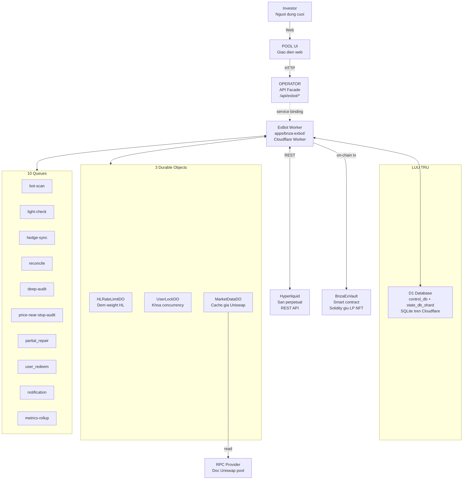
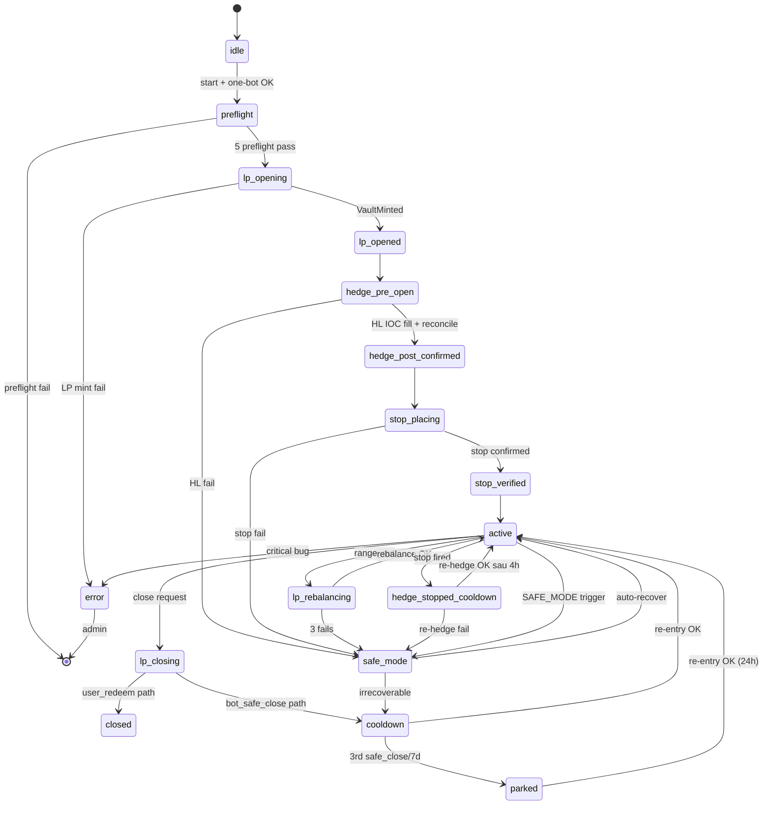
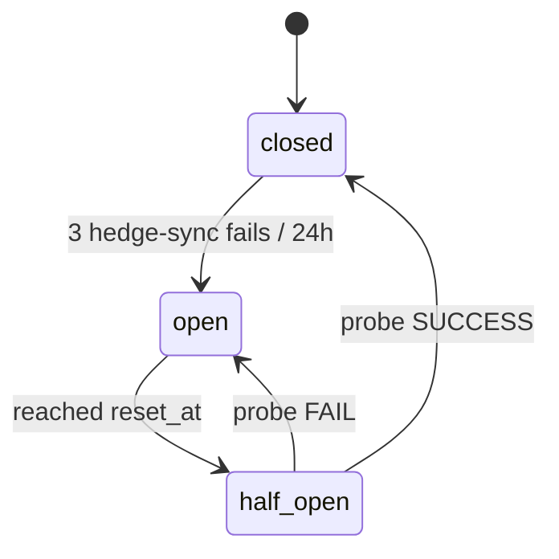
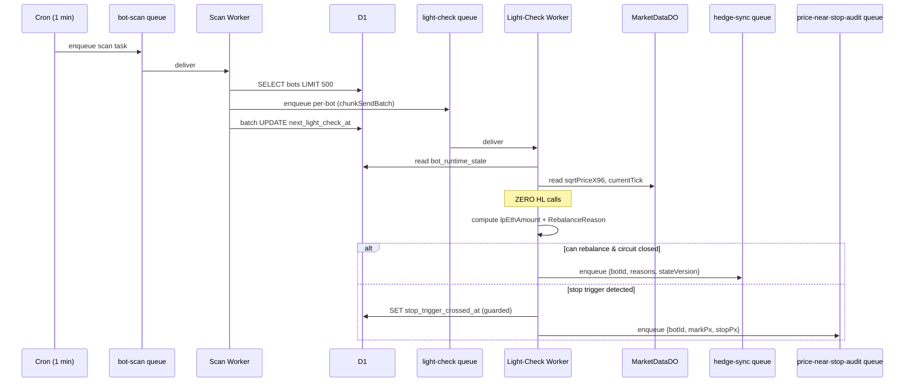
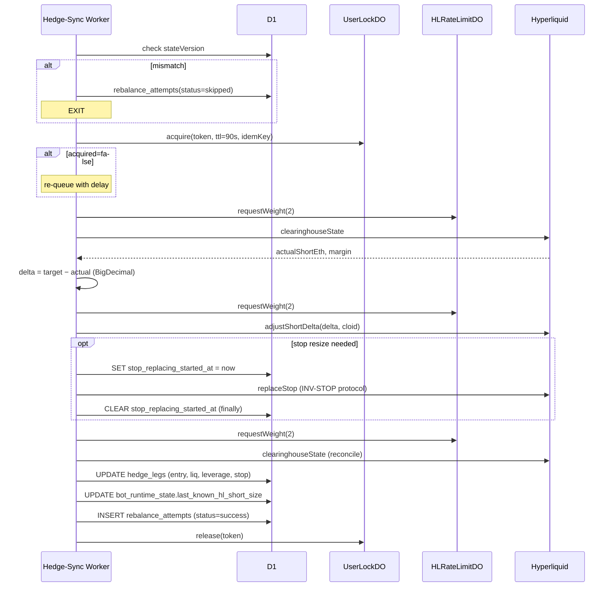
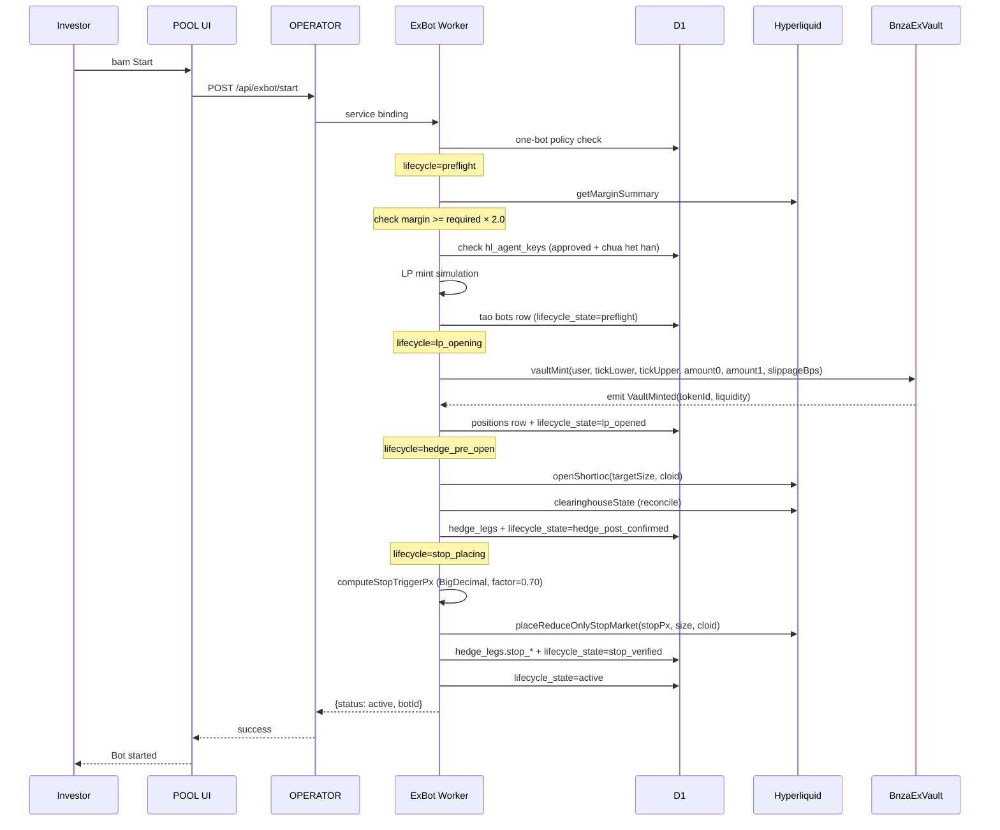
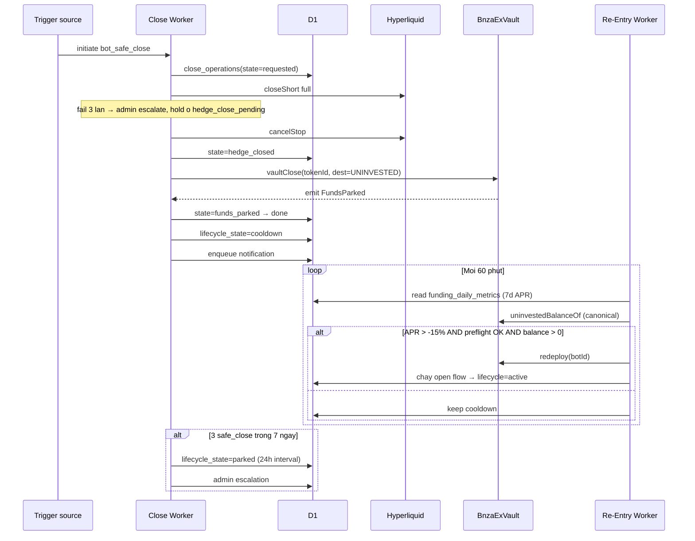
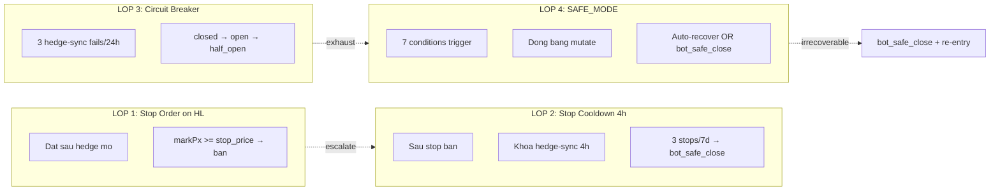

# ExBot Overview for Junior QC — Diễn giải chi tiết từ SRS

> **Mục đích:** Diễn giải toàn bộ kiến trúc, biến, trạng thái và luồng hoạt động của ExBot cho Junior QC chưa biết gì về DeFi và bot trading. Mỗi khái niệm có định nghĩa cơ bản kèm ví dụ đời thường, vai trò trong ExBot (lấy từ srs), ví dụ con số cụ thể, và lý do thiết kế.

> **Nguồn:** 4 file trong [docs/ba/plans/bnza-sotatek-260519-0000/03_modules/exbot/srs/](../../ba/plans/bnza-sotatek-260519-0000/03_modules/exbot/srs/). Mọi trích dẫn FR-EXBOT-*, BR-EXBOT-*, NFR-EXBOT-* đều có nguồn ở `spec.md`. Phần kiến thức nền DeFi (PHẦN A.2) là kiến thức ngành, không nằm trong srs.

---

## Mục lục

- [PHẦN A — ExBot là cái gì?](#phần-a--exbot-là-cái-gì-giải-thích-cho-người-chưa-biết-defi)
- [PHẦN B — Kiến trúc hệ thống ExBot](#phần-b--kiến-trúc-hệ-thống-exbot)
- [PHẦN C — TẤT CẢ các biến trong ExBot](#phần-c--tất-cả-các-biến-trong-exbot-diễn-giải-chi-tiết)
- [PHẦN D — Tất cả các trạng thái](#phần-d--tất-cả-các-trạng-thái-diễn-giải-từng-trạng-thái)
- [PHẦN E — Các luồng hoạt động chính](#phần-e--các-luồng-hoạt-động-chính-diễn-giải-step-by-step)
- [PHẦN F — Hệ thống bảo vệ 4 lớp](#phần-f--hệ-thống-bảo-vệ-4-lớp-quan-trọng-cho-qc)
- [PHẦN G — Khái niệm quan trọng QC cần nắm](#phần-g--khái-niệm-quan-trọng-qc-cần-nắm)
- [PHẦN H — Tóm tắt cuối cùng](#phần-h--tóm-tắt-cuối-cùng)

---

## Bảng mã viết tắt (Reference code glossary)

| Code / Prefix | Meaning + role in this project | Defined in |
|---|---|---|
| **LP** | Liquidity Provider — vị thế cung cấp thanh khoản trên Uniswap V3. Trong dự án này, mỗi LP được lưu dưới dạng một NFT (tokenId) do contract `BnzaExVault` giữ hộ. | (industry term) |
| **HL** | Hyperliquid — sàn perpetual DeFi nơi bot mở vị thế short ETH-USD để hedge. | (industry term) |
| **Hedge** | Vị thế đối ứng nhằm giảm rủi ro của vị thế chính. Ở đây, hedge = HL short. | (industry term) |
| **Delta** | Mức độ nhạy của vị thế với biến động giá ETH. `delta-only adjustment` = chỉ điều chỉnh phần chênh lệch, không đóng/mở toàn bộ. | (industry term) |
| **Cloid** | Client Order ID — mã định danh do bot tự sinh khi gửi lệnh lên HL. Trong dự án, cloid là **deterministic** (sinh từ keccak256 của botId/attemptId/stage/version) để chống đặt lệnh trùng. | spec.md FR-EXBOT-024 |
| **Tick / sqrtPriceX96** | Đơn vị giá nội bộ của Uniswap V3. `currentTick` cho biết giá hiện tại; `tickLower`/`tickUpper` xác định dải giá mà LP còn kiếm phí. | (industry term) |
| **D1** | D1 — dịch vụ database SQLite của Cloudflare. ExBot dùng 2 DB: `control_db` (toàn cục) và `state_db_shard_00` (theo shard). | erd.md DB Separation |
| **DO** | Durable Object — đối tượng có trạng thái lưu trữ trên Cloudflare. ExBot có 3 DO: `HLRateLimitDO`, `UserLockDO`, `MarketDataDO`. | spec.md FR-EXBOT-091..093 |
| **INV-STOP** | Tên giao thức nội bộ (Invariant-Stop) để thay lệnh stop một cách an toàn (không bị "hở" giữa cancel cũ và đặt mới). | spec.md FR-EXBOT-035 |
| **SAFE_MODE** | Trạng thái "đóng băng các thao tác mutate" khi phát hiện bất thường. Không bao giờ là trạng thái cuối — luôn dẫn về auto-recovery hoặc bot_safe_close. | spec.md FR-EXBOT-050 |
| **FM-XB-0x** | Feature Map ID cho 8 nhóm chức năng của ExBot (FM-XB-01 đến FM-XB-08). | spec.md §1.2 |
| **BnzaExVault** | Smart contract Solidity giữ hộ LP NFT, do zen viết. SOTATEK chỉ tích hợp qua ABI. **Lưu ý:** "Vault" này KHÔNG phải là `vaultAddress/subaccount` của HL (BR-EXBOT-008). | spec.md BR-EXBOT-008 |
| **AMM** | Automated Market Maker — mô hình giao dịch tự động không cần sổ lệnh. Uniswap V3 là một AMM dùng công thức `liquidity × sqrtPrice` để tính giá. | (industry term) |
| **Margin** | Tiền cọc đặt khi mở vị thế phái sinh. `isolated margin` = mỗi vị thế có cọc riêng; `cross margin` = dùng chung cọc cho nhiều vị thế. | (industry term) |
| **Funding rate** | Phí định kỳ trả giữa người mua và người bán hợp đồng perpetual (8 giờ/lần phổ biến). Funding dương → short trả long; funding âm → long trả short. | (industry term) |

---

## PHẦN A — ExBot là cái gì? (Giải thích cho người chưa biết DeFi)

### A.1 Hình dung tổng quát bằng ví dụ đời thường

Hãy tưởng tượng bạn có **100,000 USD** muốn cho vay sinh lời. Bạn nghe nói:
- **Cách 1:** Gửi ngân hàng — lãi 5%/năm, an toàn nhưng thấp.
- **Cách 2:** Mở "tiệm đổi tiền" tại chợ giữa USD và Vàng — mỗi giao dịch người ta đến đổi qua lại, bạn ăn phí 0.3%. Nhưng nếu giá Vàng biến động mạnh, kho hàng của bạn có thể lỗ vốn.

**ExBot làm Cách 2, nhưng trên blockchain**, và để giảm rủi ro biến động giá Vàng (ở đây là ETH), nó đồng thời đặt một **vé cá cược "ETH sẽ giảm giá"** ở một sàn khác. Khi ETH giảm → tiệm đổi tiền lỗ, nhưng vé cá cược thắng → bù lại. Khi ETH tăng → tiệm đổi tiền lời, vé cá cược lỗ → cân bằng nhau.

Đó là **delta-hedged LP Bot**: vừa cho thuê thanh khoản (LP) vừa hedge bằng vị thế short.

> Trích spec.md §1.1: _"BNZA-EXBOT is the backend infrastructure for a managed delta-hedged LP Bot."_

### A.2 Các khái niệm DeFi cơ bản (không có trong srs, là kiến thức nền)

#### A.2.1 LP (Liquidity Provider) — "Cho thuê thanh khoản"

**Đời thường:** Bạn bỏ vào két 50,000 USD + 50,000 USD-giá-trị Vàng. Ai đến đổi USD ↔ Vàng đều dùng két của bạn, bạn được hưởng phí giao dịch.

**Trên Uniswap V3** (sàn giao dịch DeFi):
- Người gửi tiền (= bạn) gọi là **LP** (Liquidity Provider).
- Két của bạn được phát hành dưới dạng **LP NFT** — một "chứng nhận sở hữu" duy nhất, có `tokenId`.
- Bạn chọn **dải giá** muốn cung cấp thanh khoản (gọi là `tickLower` → `tickUpper`). Ví dụ: "tôi chỉ cho thuê khi giá ETH trong khoảng 3,000 USD → 5,000 USD". Khi giá đi ra ngoài dải đó, bạn **không còn ăn phí nữa** (gọi là `range_out`).
- ExBot tự động chọn dải, tự mint LP NFT, tự đóng/mở khi cần.

#### A.2.2 Perpetual Short — "Vé cá cược giá giảm"

**Đời thường:** Bạn đặt cược với sòng bài: "nếu ETH giảm từ 4,000 → 3,500 USD, tôi thắng 500 USD/1 ETH cược". Để cá cược, bạn phải đặt cọc (margin) tiền.

**Trên Hyperliquid** (sàn perpetual DeFi):
- **Perpetual** = "vĩnh viễn" — vé cược không có hạn kết thúc, bạn giữ bao lâu cũng được.
- **Short** = cá cược giá GIẢM.
- **Leverage (đòn bẩy)** = bạn chỉ cần đặt cọc 1,000 USD nhưng được cá cược như có 4,000 USD (leverage 4x). Càng cao càng lời nhiều / lỗ nhiều.
- **Liquidation price (giá thanh lý)** = nếu giá đi ngược ý bạn quá xa, sòng bài tự đóng vé và lấy hết tiền cọc của bạn. Đây là rủi ro nguy hiểm nhất.
- **Stop order (lệnh stop)** = bạn dặn trước sòng bài: "nếu giá vượt 4,200 USD, đóng vé giúp tôi" — để chốt lỗ trước khi bị thanh lý.

#### A.2.3 Delta — "Mức độ nhạy cảm với giá"

**Đời thường:** Nếu giá vàng tăng 10%, kho vàng của bạn tăng 10% giá trị → delta = 1. Nếu bạn cùng lúc có vé "vàng giảm 10% thì được 10%", delta vé = −1. Tổng delta = 0 → bạn KHÔNG bị ảnh hưởng bởi biến động giá (gọi là **delta-neutral**).

**Trong ExBot:**
- LP có delta dương (giá ETH lên → LP có nhiều ETH hơn về giá trị).
- HL short có delta âm.
- ExBot điều chỉnh kích thước short để tổng delta ~ 0.
- "Delta-only adjustment" = chỉ chỉnh phần chênh, không đóng/mở lại từ đầu (tiết kiệm phí và giảm rủi ro).

#### A.2.4 Hyperliquid (HL) — Sàn nơi đặt vị thế short

Là một sàn giao dịch phái sinh chạy trên blockchain riêng. ExBot gọi API REST của HL để mở/đóng vị thế short. HL có giới hạn tốc độ API (rate limit) là **1,200 weight/phút** — mỗi loại lệnh tốn "weight" khác nhau. ExBot tự giới hạn dùng **800 weight/phút** (NFR-EXBOT-004 — chỉ dùng 67% để chừa buffer an toàn).

#### A.2.5 Cloudflare Workers + D1 + Queues + Durable Objects

**Hạ tầng** mà ExBot chạy trên đó:
- **Cloudflare Worker** = một chương trình chạy "serverless" trên hạ tầng Cloudflare (giống AWS Lambda). Mỗi lần có request, Worker được spin up, chạy xong, biến mất.
- **D1** = database SQLite của Cloudflare, lưu trạng thái lâu dài.
- **Queue** = hàng đợi message; producer "đẩy" message vào, consumer worker "lấy" message ra xử lý. Cho phép xử lý bất đồng bộ (async) và retry tự động.
- **Durable Object (DO)** = một loại object có **trạng thái lưu lâu dài + đảm bảo single-instance** (chỉ có 1 bản chạy đồng thời) — dùng để khóa concurrency, cache shared state.

> Trích spec.md IC-EXBOT-004: _"ExBot Worker is deployed exclusively as a Cloudflare Worker."_

---

## PHẦN B — Kiến trúc hệ thống ExBot

### B.1 Sơ đồ thành phần và luồng dữ liệu



**Giải thích từng thành phần:**

| Thành phần | Nó là gì | Vai trò |
|---|---|---|
| **Investor** | Người dùng có USDC muốn cho ExBot quản lý | Tương tác qua UI POOL, không trực tiếp gọi ExBot |
| **POOL UI** | Giao diện web bên ngoài ExBot (do module `bnza-pool` làm) | Hiển thị status của ExBot. Module ExBot **không sở hữu UI nào** (spec.md §6) |
| **OPERATOR Facade** | Một Worker khác chỉ làm "lễ tân" | Nhận HTTP request từ UI, chuyển vào ExBot qua kênh nội bộ Cloudflare. ExBot **không truy cập được từ Internet** (BR-EXBOT-010) |
| **ExBot Worker** | Bộ não chính, xử lý tất cả logic | Chạy preflight, mở/đóng vị thế, giám sát, đóng bot |
| **D1 Database** | SQLite của Cloudflare | Lưu mọi trạng thái lâu dài: bot, position, hedge, log, idempotency |
| **3 Durable Objects** | Object trạng thái lâu dài | (Chi tiết ở mục B.3) |
| **10 Queues** | Hàng đợi message | (Chi tiết ở mục B.4) |
| **Hyperliquid API** | Sàn perpetual ngoài | Nơi ExBot mở/đóng vị thế short ETH-USD |
| **BnzaExVault** | Smart contract Solidity (zen viết, SOTATEK chỉ tích hợp ABI) | Giữ hộ LP NFT; redeem; uninvested_balances on-chain |
| **RPC Provider** | Service đọc blockchain | MarketDataDO dùng để đọc giá Uniswap V3 pool |

### B.2 D1 Database — Cấu trúc 2 database

ExBot dùng **2 database tách biệt** (theo erd.md DB Separation):

#### B.2.1 `control_db` (toàn cục, 1 instance)

Chứa thông tin "ai là ai" — không phân shard.

| Bảng | Lưu cái gì | Khi nào ghi |
|---|---|---|
| `users` | Thông tin user: email, ví, địa chỉ HL | Khi user đăng ký |
| `bot_registry` | Danh sách bot per user: bot_id, user_id, status, chain | Khi tạo bot, update khi đổi status |
| `shard_registry` | Danh sách shard và số bot đang ở mỗi shard | Khi thêm shard (Phase B) |
| `hl_agent_keys` | Agent key đã mã hóa cho từng user | Khi user submit key, admin approve, key revoke |

#### B.2.2 `state_db_shard_00` (1 shard ở Phase A, 4 ở Phase B, 16 ở Phase C)

Chứa **trạng thái nóng** của bot. Tách shard để scale (NFR-EXBOT-012). Khóa shard: `shard_id = hash(bot_id) % shard_count`.

| Bảng | Lưu cái gì | Tại sao ở đây |
|---|---|---|
| `bots` | Bot record chính | Cần truy cập rất thường xuyên |
| `positions` | Thông tin LP NFT của bot | Mỗi bot có đúng 1 position |
| `hedge_legs` | Thông tin vị thế HL short | Mỗi bot có đúng 1 hedge_leg |
| `bot_runtime_state` | Trạng thái nóng: tick, giá, size hiện tại | Ghi mỗi khi light-check thấy có thay đổi |
| `circuit_breakers` | Trạng thái circuit breaker | Mỗi hedge_leg có 1 circuit_breaker |
| `rebalance_attempts` | Log từng lần hedge-sync (ledger) | Append-only |
| `lp_operations` | Log từng lần mint/burn/rebalance LP (ledger) | Append-only với UNIQUE idempotency_key |
| `close_operations` | Log từng lần close (ledger) | Append-only với UNIQUE idempotency_key |
| `queue_idempotency` | Dedup queue message | Mỗi message_id ghi 1 row |
| `funding_daily_metrics` | Funding tracking daily | Daily metrics |

### B.3 Ba Durable Objects — Giải thích chi tiết

Theo spec.md FR-EXBOT-091..093:

#### B.3.1 `HLRateLimitDO` — Cảnh sát giao thông cho HL API

**Vấn đề:** HL cho dùng tối đa 1,200 weight/phút. Nếu 1,000 bot cùng gọi HL → vượt giới hạn → bị HL chặn.

**Giải pháp:** Trước khi gọi HL, mỗi worker phải "xin phép" `HLRateLimitDO`:

```
worker → HLRateLimitDO: "Toi sap goi clearinghouseState (weight=2), cho phep khong?"
HLRateLimitDO → worker: { allowed: true } hoac { allowed: false, retryAfterMs: 1500 }
```

**Cụ thể:**
- Sliding window 60 giây, budget **800 weight/phút** (67% của HL limit).
- Nếu xin vượt budget → từ chối + báo `retryAfterMs` → worker phải re-queue message và chờ.
- Một DO instance phục vụ toàn bộ worker trong 1 vùng địa lý.

#### B.3.2 `UserLockDO` — Khóa chống chạy đồng thời 1 user

**Vấn đề:** Nếu 2 worker cùng xử lý hedge-sync cho cùng 1 user, có thể gửi 2 lệnh trùng nhau lên HL → double order.

**Giải pháp:** Lease-based mutex (khóa có TTL).

```
worker A → UserLockDO: acquire(holderToken=UUID, ttl=90s, idempotencyKey="hedge-sync:bot123:v45")
UserLockDO → A: { acquired: true, leaseId: "L1" }

worker B → UserLockDO: acquire(holderToken=UUID2, ttl=90s, idempotencyKey=...)
UserLockDO → B: { acquired: false }  // B phai re-queue

(A chay qua 30s → A goi heartbeat() de gia han lease)
A xong → A.release(holderToken)
```

**Quan trọng:** "Work runs in the caller, not inside the DO" — tức là DO chỉ giữ khóa, **việc thật chạy ở Worker bên ngoài**.

#### B.3.3 `MarketDataDO` — Cache giá Uniswap chung

**Vấn đề:** Mỗi light-check cần biết giá pool Uniswap (`sqrtPriceX96`, `currentTick`). Nếu 10,000 worker mỗi 5 phút đều gọi RPC → vỡ rate limit RPC provider, tốn tiền.

**Giải pháp:** 1 DO instance đứng ra fetch giá định kỳ, cache lại, tất cả worker đều đọc từ DO.

```
LightCheckWorker → MarketDataDO: getPoolState()
MarketDataDO → Worker: { sqrtPriceX96, currentTick, blockNumber, ageMs }

(DO tu refresh cache moi N giay — N do Phase 0 NV-12 quyet dinh, OQ-EXBOT-09)
```

**Quy tắc:** `blockNumber` phải tăng đơn điệu — nếu lùi → DO tự fetch lại.

### B.4 Mười Queues — Giải thích từng cái

Theo spec.md FR-EXBOT-010:

| # | Queue | Producer (ai đẩy) | Consumer (ai xử lý) | Ý nghĩa |
|---|---|---|---|---|
| 1 | `bot-scan` | Cron Worker (1 phút/lần) | Scan Worker | Quét D1 tìm bot nào đến giờ light-check |
| 2 | `light-check` | Scan Worker | Light-Check Worker | Mỗi bot 1 message — kiểm tra cần rebalance hay không (KHÔNG gọi HL) |
| 3 | `hedge-sync` | Light-Check Worker | Hedge-Sync Worker | Khi cần điều chỉnh hedge → message này dẫn đến gọi HL |
| 4 | `reconcile` | Hedge-Sync Worker | Reconcile Worker | Sau khi gửi lệnh HL → cần xác minh actual state |
| 5 | `deep-audit` | Cron (6h/lần, hoặc 1h khi rủi ro cao) | Deep-Audit Worker | Full reconcile mọi bot |
| 6 | `price-near-stop-audit` | Light-Check Worker | Stop-Audit Worker | Khi `markPrice >= stop_price` → cần check stop có thật sự bắn |
| 7 | `partial_repair` | Hedge-Sync / Light-Check / LP Worker | Partial-Repair Worker | Sửa lỗi: hedge fill 1 phần, LP rebalance fail |
| 8 | `user_redeem` | Redeem Event Watcher (on-chain) | Redeem Worker | **Ưu tiên cao nhất, SLA 5 phút** — khi user redeem on-chain |
| 9 | `notification` | Bất kỳ worker | Notification Worker | Gửi thông báo cho user/admin |
| 10 | `metrics-rollup` | Cron | Metrics Worker | Tổng hợp số liệu theo ngày |

**Quy tắc bắt buộc** (FR-EXBOT-010, 011):
- Mọi `sendBatch` phải đi qua helper `chunkSendBatch()` (max 100 msg/lần).
- Mọi consumer phải insert `message_id` vào `queue_idempotency` với UNIQUE constraint → nếu trùng → exit ngay (chống xử lý 2 lần).

---

## PHẦN C — TẤT CẢ các biến trong ExBot (Diễn giải chi tiết)

Tôi sẽ liệt kê từng bảng, từng cột, kèm ý nghĩa, ví dụ giá trị, và **khi nào** biến đó được ghi/đọc.

### C.1 Bảng `users` (control_db)

Nguồn: erd.md.

| Cột | Kiểu | Ý nghĩa | Ví dụ |
|---|---|---|---|
| `id` | TEXT, PK | ID nội bộ của user trong hệ thống BNZA | `usr_abc123` |
| `email` | TEXT | Email đăng ký | `nguoidung@gmail.com` |
| `wallet_address` | TEXT | Địa chỉ ví Ethereum của user | `0x1234...abcd` |
| `hl_user_address` | TEXT | Địa chỉ user trên Hyperliquid (có thể khác wallet) | `0x5678...wxyz` |
| `hl_agent_key_id` | TEXT, FK | Trỏ tới `hl_agent_keys.id` đang được dùng | `key_xyz789` |
| `created_at` / `updated_at` | TEXT | Timestamps | `2026-06-12T10:00:00Z` |

### C.2 Bảng `bot_registry` (control_db)

| Cột | Ý nghĩa | Ví dụ |
|---|---|---|
| `bot_id` | ID duy nhất của bot | `bot_aaa111` |
| `user_id` | Bot này thuộc user nào | `usr_abc123` |
| `shard_id` | Bot này ở shard nào (để biết query database nào) | `0` (Phase A chỉ có shard 0) |
| `status` | **Trạng thái thô**: `active / paused / closing / closed / safe_mode / error` | `active` |
| `chain` | Bot chạy trên chain nào | `base` hoặc `optimism` |
| `bot_type` | Loại bot — Phase A chỉ có `ex` | `ex` |

**Quy tắc one-bot-per-user** (FR-EXBOT-001): trước khi tạo bot mới, query:

```sql
SELECT COUNT(*) FROM bot_registry
WHERE user_id=? AND bot_type='ex'
  AND status IN ('active','paused','closing','safe_mode','error')
```

Nếu > 0 → từ chối (mã lỗi E-EXBOT-001).

### C.3 Bảng `hl_agent_keys` (control_db) — Quan trọng nhất về bảo mật

Theo spec.md FR-EXBOT-080..083:

| Cột | Ý nghĩa | Giải thích thêm |
|---|---|---|
| `id` | PK | |
| `user_id` | FK → users | |
| `hl_user_address` | Địa chỉ user trên HL | |
| `agent_address` | Địa chỉ agent (key được ủy quyền) — không phải master key | Master key của user **không bao giờ** lưu (NFR-EXBOT-006) |
| `encrypted_secret` | BLOB chứa agent key đã mã hóa AES-256-GCM | |
| `secret_iv` | Initialization Vector cho phép giải mã | IV là số random dùng kèm khi mã hóa |
| `secret_auth_tag` | Auth tag của AES-GCM | Để verify ciphertext không bị sửa |
| `wrapped_dek` | DEK (Data Encryption Key) đã bị wrap bằng Master Key | DEK = key tạm dùng để mã hóa secret. Master Key giữ ở Cloudflare Secrets Store |
| `dek_iv` | IV của DEK wrap | |
| `encryption_key_version` | Version của Master Key | Phục vụ rotation |
| `approval_status` | `pending / approved / revoked / superseded` | Lifecycle của key |
| `approved_at` | Khi admin approve | |
| `expires_at` | Khi nào hết hạn | Còn ≤ 7 ngày → gửi thông báo user |
| `rotated_from` | FK trỏ về row cũ khi key bị xoay | Audit trail |

**Quy trình giải mã** (khi hedge-sync cần ký lệnh HL):
1. Đọc row từ D1 → có `encrypted_secret`, `wrapped_dek`.
2. Dùng Master Key (từ Cloudflare Secrets) unwrap DEK → có plain DEK (chỉ trong RAM).
3. Dùng plain DEK giải mã `encrypted_secret` → có plain agent key (chỉ trong RAM).
4. Ký lệnh HL bằng plain agent key.
5. **Ngay sau ký**: hủy plain DEK và plain agent key khỏi memory. KHÔNG log.

### C.4 Bảng `bots` (state_db_shard) — Bot record chính

| Cột | Ý nghĩa | Ví dụ giá trị | Khi nào được ghi |
|---|---|---|---|
| `id` | Bot ID | `bot_aaa111` | Khi tạo bot |
| `user_id` | Sở hữu | `usr_abc123` | Khi tạo |
| `status` | **Trạng thái thô** (đồng bộ với `bot_registry.status`) | `active` | Mỗi khi đổi status |
| `lifecycle_state` | **Trạng thái chi tiết** — 18 giá trị | `active` | Mỗi bước trong lifecycle |
| `chain` | Chain bot chạy | `base` | Khi tạo |
| `wallet_address` | Ví user | `0x1234...` | Khi tạo |
| `position_id` | FK → positions.id | `pos_xxx` | Sau khi mint LP |
| `hedge_leg_id` | FK → hedge_legs.id | `hl_yyy` | Sau khi tạo hedge |
| `next_light_check_at` | Khi nào chạy light-check tiếp | `2026-06-17T10:05:30Z` | Sau mỗi scan: `now + 5min ± 45s` |
| `next_deep_audit_at` | Khi nào deep audit tiếp | `2026-06-17T16:00:00Z` | Sau mỗi deep audit |

**Hai trường status quan trọng:**

`status` (thô — 6 giá trị):

| Giá trị | Nghĩa |
|---|---|
| `active` | Bot đang chạy bình thường |
| `paused` | User pause; hedge + LP giữ nguyên, không mutate |
| `closing` | Đang trong quá trình đóng |
| `closed` | Đã đóng hoàn toàn (terminal) |
| `safe_mode` | Đóng băng mutate, chờ recovery |
| `error` | Bug nặng, cần admin |

`lifecycle_state` (chi tiết — 18 giá trị, chi tiết ở PHẦN D).

### C.5 Bảng `positions` — Vị thế LP

| Cột | Ý nghĩa | Ví dụ |
|---|---|---|
| `id` | PK | `pos_xxx` |
| `bot_id` | FK | `bot_aaa111` |
| `token_id` | ID của LP NFT trên Uniswap | `123456789` |
| `pool_address` | Địa chỉ pool USDC/WETH 0.3% | `0xpool...` |
| `token0`, `token1` | 2 token trong pool (có thể là USDC/WETH hoặc WETH/USDC tùy chain) | `0xUSDC...` / `0xWETH...` |
| `fee` | Fee tier của pool (basis points) | `3000` = 0.3% |
| `tick_lower`, `tick_upper` | Biên dải giá LP (đơn vị tick) | `-887220` / `+887220` |
| `liquidity` | Lượng thanh khoản đã mint (uint128, lưu TEXT) | `"123456789012345"` |
| `weth_index` | **WETH là token0 hay token1** | `0` hoặc `1` — verify per chain, không hardcode (FR-EXBOT-004) |
| `token0_decimals`, `token1_decimals` | Số decimals của token | `6` (USDC) / `18` (WETH) |
| `custodian` | Ai giữ NFT | `BnzaExVault` |
| `custodian_address` | Địa chỉ contract | `0xvault...` |

**Tại sao `weth_index` quan trọng?**
Pool Uniswap có 2 token; token nào là "0" và token nào là "1" phụ thuộc địa chỉ contract (sort theo địa chỉ). Trên Base có thể USDC là token0, trên Optimism có thể WETH là token0 — KHÁC NHAU. Nếu hardcode sai → bot tính nhầm lượng ETH cần hedge → mất tiền.

### C.6 Bảng `hedge_legs` — Vị thế short HL (Quan trọng nhất)

Đây là bảng nhiều cột nhất. Tôi chia nhóm:

#### Nhóm cấu hình (gán khi tạo)

| Cột | Ý nghĩa | Ví dụ |
|---|---|---|
| `id` | PK | `hl_yyy` |
| `bot_id` | FK | `bot_aaa111` |
| `hl_asset` | Tài sản cá cược | `ETH-USD` |
| `target_ratio` | Tỉ lệ hedge mục tiêu (lưu TEXT) | `"0.70"` = hedge 70% lượng ETH trong LP |
| `tolerance_ratio` | Sai số chấp nhận trước khi rebalance | `"0.05"` |
| `leverage` | Đòn bẩy mục tiêu | `3` (3x) |
| `margin_mode` | `isolated` (Phase A) hay `cross` | `isolated` |
| `hl_account_address` | Subaccount HL của user | `0x...` |

#### Nhóm stop order (cập nhật khi đặt stop)

| Cột | Ý nghĩa | Ví dụ | Quy tắc |
|---|---|---|---|
| `stop_order_id` | ID lệnh stop trên HL | `987654` | Lấy từ HL response |
| `stop_cloid` | Client order ID (deterministic) | `0xabc...` | Sinh từ keccak256 (FR-EXBOT-024) |
| `stop_price` | Giá kích hoạt stop | `"4250.50"` | BigDecimal |
| `stop_size` | Kích thước stop | `"2.5"` | |
| `stop_distance_pct` | Khoảng cách stop so với giá hiện tại (%) | `"5.2"` | |
| `stop_last_verified_at` | Lần xác minh stop gần nhất | timestamp | Stop integrity scan |

#### Nhóm reconcile data (cập nhật sau mỗi lần reconcile)

| Cột | Ý nghĩa | Ví dụ |
|---|---|---|
| `entry_price` | Giá entry hiện tại | `"4000.00"` |
| `liquidation_price` | Giá thanh lý theo HL | `"4800.00"` |
| `effective_leverage` | Đòn bẩy thực tế | `"3.15"` — có thể khác `leverage` mục tiêu do biến động |
| `isolated_margin_usd` | Ký quỹ isolated | `"5000.00"` |

#### Nhóm margin status (FR-EXBOT-060)

| Cột | Ý nghĩa | Ví dụ |
|---|---|---|
| `margin_status` | `ok / warning / critical / safe_mode` | `ok` |
| `margin_balance_usd` | Số dư margin hiện có | `"10000.00"` |
| `margin_required_usd` | Margin yêu cầu | `"5500.00"` |

Công thức (FR-EXBOT-060):

```
marginUsage = marginRequiredUsd / marginBalanceUsd
marginRequiredUsd = (lpEthAmount × hedgeRatio × hlOraclePrice) / leverage
```

- `< 0.55` → `ok`
- `0.55 – 0.75` → `warning` (chặn lệnh tăng size, banner UI cho user)
- `≥ 0.75` (2 lần liên tiếp) → `critical` → SAFE_MODE + alert admin

#### Nhóm marker quan trọng (cờ báo bất thường)

| Cột | Ý nghĩa | Quy tắc |
|---|---|---|
| `stop_trigger_crossed_at` | Khi light-check phát hiện `markPrice >= stop_price` lần đầu | **Ghi MỘT LẦN** (BR-EXBOT-005). Light-check sau chỉ set nếu hiện đang NULL. Phục vụ detect kẹt > 30 phút → SAFE_MODE |
| `stop_replacing_started_at` | Khi bắt đầu thay lệnh stop | Set khi vào critical section, clear ở `finally`. Quá 60s → SAFE_MODE (FR-EXBOT-033) |
| `circuit_state` | Snapshot trạng thái circuit (denormalized từ `circuit_breakers.state`) | Tiện cho query |
| `last_stop_audit_at` | Lần audit stop gần nhất | |

#### Nhóm scaling (Phase B+)

| Cột | Ý nghĩa |
|---|---|
| `scale_step_pct` | Bước scale |
| `scale_baseline_lp_usd` | LP baseline để so |
| `last_scale_change_at` | Khi nào scale cuối cùng |
| `budget_breach_since` | Khi nào bắt đầu vượt budget |

### C.7 Bảng `bot_runtime_state` — Trạng thái nóng

Theo erd.md.

| Cột | Ý nghĩa | Khi nào ghi |
|---|---|---|
| `bot_id` | PK (1-1 với bots) | Khi tạo bot |
| `state_version` | **Số phiên bản tăng dần** | Mỗi lần state thay đổi (optimistic concurrency — FR-EXBOT-027) |
| `current_tick` | Tick hiện tại (snapshot) | Mỗi light-check |
| `sqrt_price_x96` | Giá hiện tại (định dạng Uniswap) | Mỗi light-check |
| `lp_amount0_raw` | Lượng token0 trong LP (chưa quy đổi) | Mỗi light-check |
| `lp_amount1_raw` | Lượng token1 trong LP | Mỗi light-check |
| `lp_eth_amount` | Quy đổi: lượng ETH tương đương trong LP | Mỗi light-check |
| `eth_price_usd` | Giá ETH theo USD | Snapshot |
| `lp_value_usd` | Giá trị LP tính bằng USD | (Công thức chưa chốt — OQ-EXBOT-11) |
| `target_short_size` | Kích thước short mục tiêu | Sau hedge-sync compute |
| `last_known_hl_short_size` | Kích thước short ghi nhận gần nhất từ HL | Sau reconcile |
| `last_hl_reconcile_at` | Reconcile gần nhất | |
| `last_light_check_at` | Light-check gần nhất | |
| `last_deep_audit_at` | Deep audit gần nhất | |
| `last_rebalance_attempt_id` | FK → rebalance_attempts | |
| `health_status` | Tổng hợp tình trạng | |

**Tại sao `state_version` quan trọng?**
Light-check enqueue message hedge-sync với `stateVersion=N`. Trước khi worker xử lý, state có thể đã đổi (qua message khác) → `state_version` trong DB là N+1. Worker so sánh, nếu khác → **skip silently** (không gửi lệnh HL) — tránh việc rebalance theo state cũ.

**Quy tắc NFR-EXBOT-005:** chỉ ghi khi có diff. `next_light_check_at` batch UPDATE 1 statement/shard.

### C.8 Bảng `circuit_breakers` — Trạng thái circuit breaker

| Cột | Ý nghĩa | Ví dụ |
|---|---|---|
| `hedge_leg_id` | PK (1-1 với hedge_legs) | `hl_yyy` |
| `bot_id` | FK | `bot_aaa111` |
| `asset` | Tài sản | `ETH-USD` |
| `state` | `closed / open / half_open` | `closed` |
| `opened_at` | Khi vào open | timestamp |
| `reason` | Lý do open | `"3 hedge-sync failures: HL 503"` |
| `failure_count` | Số lần fail liên tục | `0–3` |
| `last_failure_at` | Lần fail cuối | timestamp |
| `reset_at` | Khi nào sang half_open | `now + 1h` khi vào open |
| `half_open_probe_used` | 0 hoặc 1 — atomic claim cho probe | Chỉ cho phép **1 probe duy nhất** trong half_open |

### C.9 Bảng `rebalance_attempts` — Ledger từng lần hedge-sync

Append-only log:

| Cột | Ý nghĩa | Ví dụ |
|---|---|---|
| `id` | PK | `att_001` |
| `bot_id`, `user_id`, `hedge_leg_id` | FKs | |
| `asset` | | `ETH-USD` |
| `state_version` | Snapshot của bot_runtime_state.state_version | `45` |
| `status` | `success / failed / partial / skipped` | `success` |
| `reason` | Lý do trigger (canonical RebalanceReason, có thể CSV) | `"drift_threshold,margin_warning"` |
| `old_short_size` | Size trước khi adjust | `"2.0"` |
| `target_short_size` | Size mục tiêu | `"2.3"` |
| `reconciled_short_size` | Size thực tế sau reconcile | `"2.298"` |
| `adjust_cloid` | Cloid của lệnh adjust | |
| `close_cloid` / `open_cloid` | Cloid khi full close/open (chỉ dùng cho bot_safe_close) | |
| `stop_cloid` | Cloid lệnh stop mới | |
| `error_code`, `error_message` | Nếu fail | |
| `started_at`, `finished_at` | Timestamps | |

**9 giá trị canonical `reason`** (FR-EXBOT-023):

| Giá trị | Ý nghĩa |
|---|---|
| `drift_threshold` | `|delta error|` vượt ngưỡng tuyệt đối |
| `drift_relative` | `|delta error|/lpValueUsd` vượt ngưỡng % |
| `range_out` | Giá ra ngoài dải LP |
| `range_boundary_near` | Giá gần biên dải LP (90% — formula chưa chốt OQ-EXBOT-10) |
| `margin_warning` | margin_status vào warning |
| `funding_alert` | Funding APR 7d < −15% (formula chưa chốt OQ-EXBOT-12) |
| `time_fallback` | Trigger định kỳ phòng hờ |
| `manual_admin` | Admin force |
| `recovery_reconcile` | Recovery sau SAFE_MODE |

### C.10 Bảng `lp_operations` — Ledger thao tác LP

| Cột | Ý nghĩa |
|---|---|
| `id` | PK |
| `bot_id` | FK |
| `op_type` | `mint / burn / rebalance` |
| `idempotency_key` | **UNIQUE** — chống double op |
| `tx_hash` | Hash giao dịch on-chain |
| `pre_token_id` / `post_token_id` | NFT token_id trước và sau (rebalance = burn cũ, mint mới) |
| `status` | `pending / confirmed / failed` |
| `submitted_at`, `confirmed_at` | Timestamps |

### C.11 Bảng `close_operations` — Ledger đóng bot

Theo erd.md.

| Cột | Ý nghĩa |
|---|---|
| `id` | PK |
| `bot_id` | FK |
| `kind` | `user_redeem` hoặc `bot_safe_close` |
| `state` | (Xem mục C.11.1) |
| `idempotency_key` | **UNIQUE** — chống double close |
| `hedge_close_tx` | Tx hash đóng hedge (có thể null nếu HL fail) |
| `lp_close_tx` | Tx hash đóng LP |
| `usdc_amount` | USDC trả về |
| `residual_amount` | Nếu hedge fail → ghi nhận liability |

#### C.11.1 Các giá trị `close_operations.state`

| State | Dùng cho | Ý nghĩa |
|---|---|---|
| `requested` | Cả 2 | Trigger nhận, row vừa tạo |
| `hedge_close_pending` | Cả 2 | Đang gửi lệnh đóng hedge |
| `hedge_closed` | Cả 2 | HL position về 0, stop đã cancel |
| `lp_closed` | Cả 2 | Vault.redeem đã chạy, LP NFT burned |
| `funds_returned` | user_redeem | USDC LP-portion về user trong cùng tx |
| `funds_parked` | bot_safe_close | USDC park ở `uninvested_balances` on-chain |
| `residual_hl_liability` | Cả 2 | Nếu hedge close fail — outstanding liability |
| `done` | Cả 2 | Hoàn tất |

### C.12 Bảng `queue_idempotency` — Dedup message

Theo spec.md FR-EXBOT-011:

| Cột | Ý nghĩa |
|---|---|
| `key` | PK |
| `message_id` | **UNIQUE INDEX** — ID của queue message |
| `kind` | Loại queue |
| `state` | `started / succeeded / failed / retryable` |
| `attempt` | Số lần retry |
| `bot_id` | Bot liên quan |
| `result_json` | Cache result để replay |
| `expires_at` | TTL để dọn dẹp |

**Pattern xử lý:**

```
consumer nhan message_id=X
→ INSERT INTO queue_idempotency (message_id=X, state='started')
  → UNIQUE conflict? → return ngay (duplicate)
  → Insert OK → xu ly → UPDATE state='succeeded'/'failed'
```

### C.13 Bảng `funding_daily_metrics`

Daily aggregate funding:

| Cột | Ý nghĩa |
|---|---|
| `bot_id` + `bucket_day` | Composite PK |
| `funding_paid_usd` | Funding trả (short trả khi funding rate dương) |
| `funding_received_usd` | Funding nhận |
| `funding_net_usd` | Net |
| `events_count` | Số sự kiện funding trong ngày |

**Dùng để:** tính 7d APR cho điều kiện re-entry. Công thức chưa chốt (OQ-EXBOT-12).

---

## PHẦN D — Tất cả các trạng thái (Diễn giải từng trạng thái)

ExBot có **3 state machine song song:**
1. **Bot lifecycle** (18 giá trị) — vòng đời chính.
2. **Circuit breaker** (3 giá trị) — bảo vệ khi HL liên tục lỗi.
3. **Margin status** (4 mức) — cảnh báo theo mức ký quỹ.

### D.1 Bot Lifecycle — 18 trạng thái

#### D.1.1 Nhóm khởi tạo (8 trạng thái transient)

| # | State | Khi vào | Bot làm gì trong state này | Khi ra |
|---|---|---|---|---|
| 1 | `idle` | (chưa tồn tại) | — | Khi user gọi `/api/exbot/start` và pass one-bot check |
| 2 | `preflight` | Sau one-bot check | Chạy 5 preflight checks (margin, agent key, builder fee, LP sim) | Tất cả pass → `lp_opening`; bất kỳ fail → terminate (không tạo bot) |
| 3 | `lp_opening` | Sau preflight pass | Gọi `BnzaExVault.vaultMint()` → on-chain tx mint LP NFT | Event `VaultMinted` → `lp_opened`; LP mint fail → `error` |
| 4 | `lp_opened` | Khi VaultMinted | Update `positions` row | Đi tiếp → `hedge_pre_open` |
| 5 | `hedge_pre_open` | Sau LP confirmed | Gọi HL `openShortIoc` mở vị thế short | IOC filled + reconcile OK → `hedge_post_confirmed`; HL fail → `safe_mode` |
| 6 | `hedge_post_confirmed` | Sau reconcile OK | Update `hedge_legs` (entry_price, liq_price, effective_leverage) | Đi tiếp → `stop_placing` |
| 7 | `stop_placing` | Sau hedge confirmed | Tính `stop_trigger_px` (BigDecimal, safetyFactor=0.70), gọi HL `placeReduceOnlyStopMarket` | Stop confirmed → `stop_verified`; stop fail → `safe_mode` |
| 8 | `stop_verified` | Sau stop placed | Update `hedge_legs.stop_price`, `stop_cloid` | Đi tiếp → `active` |

**Quy tắc thép** (FR-EXBOT-003): KHÔNG bỏ bước. Mỗi transition ghi atomic vào D1 trước khi đi tiếp.

#### D.1.2 Trạng thái vận hành chính

**9. `active`** — Bot đang chạy bình thường:
- **Light-check:** chạy mỗi 5 phút (± 45s jitter).
- **Hedge-sync:** chạy theo sự kiện (khi light-check phát hiện cần rebalance).
- **Deep-audit:** chạy mỗi 6h (1h khi rủi ro cao).
- **Khi nào ra:**
  - Phát hiện `range_out` → `lp_rebalancing`.
  - Phát hiện stop trigger → `hedge_stopped_cooldown`.
  - User redeem hoặc trigger bot_safe_close → `lp_closing`.
  - Trigger SAFE_MODE → `safe_mode`.
  - Bug nặng → `error`.

**10. `hedge_stopped_cooldown`** — Vừa bị stop bắn, đang nghỉ 4h:
- Theo FR-EXBOT-034.
- **Khi vào:** Stop trên HL bị kích hoạt (giá vượt stop_price).
- **Light-check:** chạy NHƯNG **không enqueue hedge-sync** (suppressed).
- **Hedge-sync:** chặn 4 giờ.
- **Khi ra:**
  - Sau 4h, tự re-hedge → nếu OK → `active`.
  - Re-hedge fail → `safe_mode`.
  - Nếu là lần thứ 3 trong 7 ngày → trigger `bot_safe_close` → `lp_closing`.

**11. `lp_rebalancing`** — Đang rebalance dải LP:
- Theo FR-EXBOT-015.
- **Khi vào:** Light-check thấy `rangeState != 'in'` (giá đi ra ngoài tickLower/tickUpper).
- **Light-check:** **SKIP hoàn toàn**.
- **Hedge-sync:** SKIP.
- **Quy trình:** gọi `BnzaExVault.redeem(tokenId)` đóng LP cũ → tính tick range mới → mint LP mới.
- **Khi ra:** OK → `active`. Fail 3 lần liên tiếp → `bot_safe_close` → `lp_closing`.

#### D.1.3 Nhóm đóng bot

**12. `lp_closing`** — Đang trong quá trình đóng:
- **Khi vào:** User redeem (event on-chain) hoặc trigger bot_safe_close.
- **Light-check / Hedge-sync:** SKIP.
- **Khi ra:**
  - Path user_redeem → `closed`.
  - Path bot_safe_close → `cooldown`.

**13. `closed`** — Bot đã đóng hoàn toàn (terminal cho user_redeem path):
- Không có hoạt động.
- Chỉ admin có thể giải quyết edge case.

**14. `cooldown`** — Nghỉ 60 phút sau bot_safe_close, chờ tự re-entry:
- Theo FR-EXBOT-071.
- **Light-check / Hedge-sync:** SKIP.
- **Deep-audit:** vẫn chạy mỗi 6h.
- **Re-entry Worker** chạy mỗi 60 phút, kiểm tra:
  - `funding APR (7d) > −15%`? (formula chưa chốt OQ-EXBOT-12)
  - Preflight check pass? (margin ≥ required × 2.0)
  - On-chain `uninvested_balances > 0`?
- Tất cả → tự re-deploy → `preflight` → ... → `active`.
- Lần thứ 3 trong 7 ngày → `parked`.

**15. `parked`** — Sau 3 lần safe_close, chuyển sang chờ 24h:
- **Re-entry Worker:** kiểm tra mỗi 24h thay vì 60 phút.
- **Admin escalation:** notify admin xem có nên can thiệp.
- **Khi ra:** Cùng điều kiện như cooldown → `active`.

#### D.1.4 Nhóm bất thường

**16. `safe_mode`** — Đóng băng mutate, chỉ giám sát:
- Theo FR-EXBOT-050.
- **Cấm:** cancel stop, mở vị thế, rebalance hedge/LP, đổi leverage, rút margin.
- **Cho phép:** đọc state, retry HL connectivity, alert, light-check (phần không gọi HL), deep-audit khi HL recover.
- **Khi ra:**
  - HL responsive + 3 reconciles liên tiếp OK + `margin_status='ok'` → auto-recover → `active`.
  - Không cứu được → trigger `bot_safe_close` → `cooldown`.

**17. `error`** — Bug nặng, admin xử lý:
- Terminal cho đến khi admin can thiệp.

#### D.1.5 Trạng thái `paused` (đặc biệt — không thay đổi `lifecycle_state`)

- Theo FR-EXBOT-005.
- Khi user pause: `status='paused'` nhưng `lifecycle_state` giữ nguyên giá trị trước đó.
- Hedge và LP **giữ nguyên** — không bị đóng.
- Light-check và hedge-sync: SUPPRESSED.
- Deep-audit: **vẫn chạy mỗi 6h**.
- Resume: `status='active'`, light-check trở lại trong vòng 5 phút.

**Quy tắc** (BR-EXBOT-002): PAUSED ≠ CLOSED. UI phải dùng nhãn khác nhau rõ ràng.

#### D.1.6 Sơ đồ lifecycle (trích từ states.md)



### D.2 Circuit Breaker — 3 trạng thái

Theo states.md.

#### D.2.1 Giải thích khái niệm Circuit Breaker

**Đời thường:** Như cầu dao điện. Nếu trong nhà cứ chập điện liên tục, cầu dao tự ngắt → tránh cháy. Sau một thời gian, bạn bật lại → nếu hoạt động OK thì để chạy, vẫn lỗi thì lại ngắt.

**Trong ExBot:**
- Đếm số lần hedge-sync FAIL liên tục.
- 3 lần fail trong 24h → "ngắt cầu dao" (open) → cấm hedge-sync 1h.
- Sau 1h → "thử lại 1 lần" (half_open) → nếu OK → bình thường (closed); fail → ngắt tiếp.

#### D.2.2 Ba trạng thái

| State | Cho phép gì | Khi nào sang state khác |
|---|---|---|
| `closed` | Hedge-sync OK, stop monitoring OK | 3 fails liên tiếp trong 24h → `open`, `reset_at = now + 1h` |
| `open` | **Chặn hedge-sync** nhưng **VẪN stop monitoring** | Đến `reset_at` → `half_open` |
| `half_open` | **Đúng 1 probe duy nhất** (atomic claim qua `half_open_probe_used` 0→1) | Probe success → `closed`; probe fail → `open` mới với `reset_at = now + 1h` |

**Quy tắc vàng** (FR-EXBOT-014): "Stop monitoring always active." Kể cả `open`, vẫn theo dõi giá stop. Lý do: stop là cơ chế an toàn cuối cùng, không được tắt vì lý do nào.

#### D.2.3 Sơ đồ



### D.3 Margin Status — 4 mức

| State | marginUsage | Hành vi | Cảnh báo |
|---|---|---|---|
| `ok` | `< 0.55` | Bình thường | Không |
| `warning` | `0.55 – 0.75` | **Khóa tăng size hedge**; nếu light-check muốn rebalance size lên → bị từ chối | Banner UI cho investor |
| `critical` | `≥ 0.75` (cần **2 lần liên tiếp** mới trigger SAFE_MODE) | Vào SAFE_MODE | Investor + Admin |
| `safe_mode` | (qua SAFE_MODE entry) | Chặn mọi mutation | Investor + Admin |

**Khi nào tính lại?** (FR-EXBOT-060): chỉ trong hedge-sync preflight và deep-audit. **Light-check không được gọi HL** → light-check đọc `margin_status` từ D1 trực tiếp.

### D.4 Close Operations State — 8 trạng thái

Đã diễn giải ở mục C.11.1.

---

## PHẦN E — Các luồng hoạt động chính (Diễn giải step-by-step)

### E.1 Luồng F-01: Cron → Scan → Light-Check

**Bối cảnh:** Hệ thống có thể có hàng ngàn bot. Làm sao kiểm tra tất cả chúng định kỳ mà không vỡ rate limit?

**Trình tự:**

1. **Mỗi 1 phút**, Cron Worker chạy.
2. Nó enqueue messages vào `bot-scan` queue: `{shardId, cursor, limit=500, now}` — tức là "ai đó hãy đi quét shard này, đến cursor này, lấy tối đa 500 bot".
3. **Scan Worker** nhận message, query D1:

```sql
SELECT * FROM bots
WHERE status='active' AND next_light_check_at <= now
LIMIT 500
```

4. Với mỗi bot tìm được, Scan Worker enqueue 1 message `light-check`: `{botId, userId, shardId}`.
5. Scan Worker **batch UPDATE** `next_light_check_at` cho cả 500 bot trong **1 statement duy nhất** (FR-EXBOT-013) — tránh ghi 500 statement riêng lẻ vì quá tốn D1 write budget. `next_light_check_at = now + 5min + random(−45s, +45s)`.

**Tại sao có jitter ±45s?** Để 500 bot không cùng được scan lại cùng lúc → phân bố đều theo thời gian.

6. **Light-Check Worker** nhận message:
   - Đọc `bot_runtime_state` (last_known_hl_short_size, lifecycle_state).
   - Hỏi `MarketDataDO` xin `sqrtPriceX96, currentTick`.
   - Tự tính `lpEthAmount` bằng TickMath + LiquidityAmounts (thuật toán Uniswap V3 local).
   - **TUYỆT ĐỐI KHÔNG gọi HL API**. Đây là invariant cứng (BR-EXBOT-003).
   - Tính 9 `RebalanceReason` từ data có sẵn → quyết định cần làm gì:

| Tình huống | Hành động |
|---|---|
| Cần rebalance AND circuit NOT open | Enqueue `hedge-sync` |
| `markPrice >= stop_price` (stop trigger) | SET `stop_trigger_crossed_at` (guarded — chỉ nếu NULL); enqueue `price-near-stop-audit` |
| Circuit `open` | Suppress hedge-sync NHƯNG vẫn check stop |
| `stop_replacing_started_at` > 60s | Enqueue `partial_repair` (reason=`stop_replacing_overrun`) + trigger SAFE_MODE |



### E.2 Luồng F-02: Hedge-Sync Execution

**Bối cảnh:** Light-check đã quyết định "cần điều chỉnh hedge". Bây giờ phải thực sự gọi HL.

**Trình tự:**

1. **Hedge-Sync Worker** nhận message `{botId, reasons, stateVersion=N}`.
2. **Bước 1 — Check stateVersion** (FR-EXBOT-027):
   - Đọc `bot_runtime_state.state_version` hiện tại = M.
   - Nếu N < M → state cũ, message stale → INSERT `rebalance_attempts (status='skipped')`, exit ngay.
3. **Bước 2 — Acquire UserLockDO lease** (FR-EXBOT-026):
   - Sinh `holderToken = UUID`.
   - Call `UserLockDO.acquire(holderToken, ttl=90s, idempotencyKey='hedge-sync:bot123:v45')`.
   - Nếu `acquired=false` → re-queue message với delay.
   - Nếu `acquired=true` → tiếp tục.
4. **Bước 3 — Fetch HL state** (qua HLRateLimitDO xin permission):
   - Call HL `clearinghouseState` (weight=2).
   - Lấy `actualShortEth`, margin info.
5. **Bước 4 — Compute delta** (BigDecimal, FR-EXBOT-021):

```
targetShortEth = lpEthAmount × hedgeRatio
delta = targetShortEth − actualShortEth
```

Tất cả phép tính dùng BigDecimal. `Number()` và `parseFloat()` bị cấm cho financial value.

6. **Bước 5 — Submit delta-only adjust** (FR-EXBOT-022):
   - Sinh deterministic cloid: `first128BitsHex(keccak256("bnza:botId:attemptId:stage:version"))`.
   - Call HL `adjustShortDelta(delta, cloid)`.
   - Nếu cloid duplicate → reconcile trước, KHÔNG resubmit mù.
7. **Bước 6 — (Nếu cần) Replace stop** qua INV-STOP protocol (FR-EXBOT-035):
   - Set `stop_replacing_started_at = now`.
   - Chạy giao thức protected (không cancel-then-place trực tiếp).
   - Clear `stop_replacing_started_at` ở `finally`.
8. **Bước 7 — Reconcile** (FR-EXBOT-025):
   - Call HL `clearinghouseState` lại để xác nhận actual size.
   - Update `hedge_legs`: `entry_price`, `liquidation_price`, `effective_leverage`, `stop_price`.
   - Update `bot_runtime_state.last_known_hl_short_size`.
9. **Bước 8 — Insert ledger row:**
   - `rebalance_attempts (status='success', reconciled_short_size=...)`.
10. **Bước 9 — Release lease:**
    - `UserLockDO.release(holderToken)` (luôn trong `finally`).



### E.3 Luồng F-03: Bot Initialization (Tạo bot mới)

**Bối cảnh:** User bấm "Start ExBot" trên POOL UI.



**Chi tiết 5 preflight checks** (FR-EXBOT-002):
1. **One-bot policy:** Query `bot_registry`, nếu count > 0 → E-EXBOT-001 (409).
2. **Margin check:** `marginBalanceUsd >= marginRequired × 2.0`. Fail → E-EXBOT-002 (400) kèm số tiền cần nạp thêm.
3. **Agent key:** `approval_status='approved'` AND `expires_at > now`. Fail → E-EXBOT-003 hoặc E-EXBOT-004.
4. **Builder fee:** HL builder fee 5bps đã approve. Fail → E-EXBOT-005.
5. **LP mint sim:** simulate trước, nếu fail → E-EXBOT-006.

### E.4 Luồng F-04: user_redeem (LP-First)

**Bối cảnh:** User muốn rút tiền ngay.

**Đặc điểm vàng** (BR-EXBOT-006): **LP-portion USDC trả về user trong cùng tx redeem** — KHÔNG phụ thuộc vào việc hedge đóng có thành công không. Nếu hedge close fail → ghi nhận liability nhưng TUYỆT ĐỐI không revert phần đã trả.

**Trình tự:**

1. **User gọi on-chain** `BnzaExVault.redeem(tokenId)`.
2. **Trong cùng tx:** Vault unwind LP NFT, gửi LP-portion USDC về địa chỉ user.
3. **Vault emit event** `RedemptionEvent(botId, redeemTxHash, userAddress)`.
4. **Redeem Event Watcher** (off-chain) bắt event → enqueue `user_redeem` (priority cao nhất).
5. **Redeem Worker** (SLA 5 phút từ khi nhận event):
   - Tạo `close_operations` (kind=user_redeem, state=`lp_closed`→`funds_returned`).
   - Call HL `closeShortReduceOnlyIoc(full close, cloid)`.
   - Call HL `cancelStop` qua §19.5 replaceStopProtected với size=0.
   - Call HL `clearinghouseState` reconcile → verify size=0.
   - Update `close_operations.state='hedge_closed'`.
   - Gửi HL-portion USDC cho user qua RedemptionQueue ledger.
   - Update `close_operations.state='done'`, `lifecycle_state='closed'`.
6. **Nếu hedge close fail:**
   - `close_operations.state='residual_hl_liability'`.
   - Enqueue admin notification (outstanding liability amount).
   - **KHÔNG revert** LP-portion repayment.
   - Nếu vượt 5 phút SLA → E-EXBOT-010 alert internal.

### E.5 Luồng F-05: bot_safe_close + Re-Entry

**Bối cảnh:** Hệ thống tự quyết định đóng bot (không phải user request).

**5 trigger** (FR-EXBOT-072):
1. Circuit breaker exhausted — `state='open'` và `reset_at` đã được extend ≥3 lần không probe success.
2. Margin critical 2 lần liên tiếp → SAFE_MODE không recover.
3. 3 stops trong 7 ngày.
4. Partial repair exhausted (3 lần liên tiếp).
5. Admin force-close.

**Trình tự đóng (hedge-first)** (FR-EXBOT-073):
1. Tạo `close_operations (kind='bot_safe_close', state='requested', idempotency_key UNIQUE)`.
2. Đóng HL short trước (target=0). Nếu fail → retry 3 lần → fail → admin escalate, giữ state `hedge_close_pending`.
3. State → `hedge_closed`. Cancel stop.
4. Call `BnzaExVault.redeem(tokenId)` đóng LP. State → `lp_closed`.
5. USDC park vào `uninvested_balances` on-chain. State → `funds_parked`.
6. State → `done`. `lifecycle_state → cooldown` (60 phút).
7. Notify user (cooldown entry).

**Re-Entry Worker** (chạy 60 phút/lần trong cooldown):
- Đọc `funding_daily_metrics` → tính 7d APR.
- Call on-chain `BnzaExVault.uninvestedBalanceOf(user, botId)` (on-chain là canonical source, không phải D1).
- Nếu `7d APR > −15%` AND preflight pass AND balance > 0:
  - Call `BnzaExVault.redeploy(botId)` → emit `FundsRedeployed`.
  - Update D1 `uninvested_balances = 0`.
  - Chạy lại open flow: `preflight → ... → active`.
- Nếu không đủ điều kiện → giữ `cooldown`.

**Lần thứ 3 safe_close trong 7 ngày** → `lifecycle_state='parked'` (interval 24h) + admin escalation.



---

## PHẦN F — Hệ thống bảo vệ 4 lớp (Quan trọng cho QC)

### F.1 Tổng quan

ExBot có 4 cơ chế bảo vệ chạy đồng thời, mỗi cơ chế xử lý loại rủi ro khác nhau:



### F.2 LỚP 1 — Stop Order trên HL (Native stop)

**Tại sao cần?** Khi giá biến động cực mạnh, ExBot có thể không kịp phản ứng từ bên off-chain → cần lệnh stop **đặt sẵn trên HL** để bảo vệ.

**Công thức** (FR-EXBOT-030):

```
liq_distance_pct = (liquidation_price − entry_price) / entry_price
                  (fallback: 1 / effective_leverage neu HL khong tra liquidationPx)
stop_trigger_px = entry_price × (1 + liq_distance_pct × stopSafetyFactor)
stopSafetyFactor = 0.70 (Phase A)
```

**Ví dụ con số:**
- `entry_price = 4,000`, `liquidation_price = 5,200` (vì là short, liq cao hơn entry).
- `liq_distance_pct = (5,200 − 4,000) / 4,000 = 0.30` (30%).
- `stop_trigger_px = 4,000 × (1 + 0.30 × 0.70) = 4,000 × 1.21 = 4,840`.
- Khi giá ETH vượt 4,840 USD → stop bắn, đóng vị thế short trước khi đến liq 5,200.
- Buffer giữa stop và liq: `5,200 − 4,840 = 360` (~7% headroom).

**Yêu cầu** (FR-EXBOT-031): bot **không bao giờ** đến state `active` nếu chưa confirm stop được đặt.

### F.3 LỚP 2 — Stop Cooldown 4 giờ

**Khi stop bắn:**
1. HL tự đóng vị thế short.
2. ExBot phát hiện qua reconcile → `lifecycle_state='hedge_stopped_cooldown'`.
3. Khóa hedge-sync 4 giờ.
4. Sau 4 giờ → tự re-hedge → quay về `active`.
5. **Đếm sự kiện:** nếu 3 stops xảy ra trong 7 ngày rolling → trigger `bot_safe_close` (FR-EXBOT-034) → vào re-entry loop.

**Tại sao cooldown 4 giờ?** Sau stop bắn, thị trường có thể còn biến động mạnh. Mở lại ngay → dễ bị stop tiếp.

### F.4 LỚP 3 — Circuit Breaker

Đã giải thích ở mục D.2.

**Quy tắc bonus** (FR-EXBOT-040): trong `half_open`, **chỉ đúng 1 probe** — đảm bảo bằng atomic claim `half_open_probe_used` (0→1).

### F.5 LỚP 4 — SAFE_MODE

**7 trigger** (FR-EXBOT-050):

| # | Trigger | Ngưỡng | Lớp detect |
|---|---|---|---|
| 1 | HL API unreachable | > 5 phút | Hedge-sync attempt |
| 2 | Reconcile mismatch | actual ≠ expected | Reconcile worker |
| 3 | `margin_status='critical'` 2 lần liên tiếp | — | Hedge-sync preflight / deep-audit |
| 4 | `effective_leverage > 4.5` | > 4.5x | Reconcile |
| 5 | `liquidation_price` trong khoảng 5% của `hlMarkPrice` | ≤ 5% | Reconcile |
| 6 | `stop_trigger_crossed_at` kẹt | > 30 phút | Deep-audit |
| 7 | `stop_replacing_started_at` kẹt | > 60 giây | **Primary:** light-check (≤5 phút); **Secondary:** deep-audit |

**Trong SAFE_MODE:**
- **Cấm:** cancel stop, mở vị thế, rebalance hedge/LP, đổi leverage, rút margin.
- **Cho phép:** đọc state, retry HL connectivity, alert user/admin, light-check (phần không gọi HL), deep-audit khi HL recover.

**Recovery:** HL responsive + 3 reconciles liên tiếp OK + `margin_status='ok'` → quay về `active`. Không recover được → `bot_safe_close`.

**Quy tắc thép** (BR-EXBOT-007): SAFE_MODE **không bao giờ** là trạng thái cuối. Mọi đường đi từ SAFE_MODE đều dẫn về auto-recover hoặc bot_safe_close + re-entry closed loop.

---

## PHẦN G — Khái niệm quan trọng QC cần nắm

### G.1 Idempotency (Bất biến với retry)

**Vấn đề:** Queue có thể gửi message 2 lần (mỗi message ít nhất 1 lần — at-least-once delivery). Nếu xử lý 2 lần → có thể double order trên HL → mất tiền.

**3 lớp idempotency** trong ExBot:

| Lớp | Cơ chế | Bảo vệ gì |
|---|---|---|
| **Queue message** | `queue_idempotency.message_id UNIQUE` | Chống xử lý 2 lần cùng message |
| **HL order** | Deterministic cloid (FR-EXBOT-024) | HL tự dedup nếu cùng cloid |
| **Close operation** | `close_operations.idempotency_key UNIQUE` | Chống double close (2 admin cùng force-close 1 bot) |

### G.2 Optimistic Concurrency (state_version)

Như mục C.7 đã nói: trước khi xử lý hedge-sync, worker so sánh `stateVersion` trong message với DB. Lệch → skip silently.

**Ví dụ tình huống:**
- t=0: light-check thấy cần rebalance, enqueue message với `stateVersion=45`.
- t=1: deep-audit phát hiện reconcile mismatch → SAFE_MODE → state thay đổi → `state_version` lên 46.
- t=2: hedge-sync worker xử lý message stateVersion=45 → so sánh với DB (46) → skip, không gọi HL.

### G.3 BigDecimal — không Float

**Quy tắc** (NFR-EXBOT-008): mọi tính toán financial dùng BigDecimal. `Number()`, `parseFloat()`, `*`, `/` trực tiếp trên số → **cấm**.

**Tại sao?** Float có lỗi làm tròn: `0.1 + 0.2 = 0.30000000000000004`. Với tiền → sai số tích lũy → kế toán không khớp.

**Lưu trữ trong D1:** tất cả financial fields lưu dạng `TEXT` (string BigDecimal), không phải `REAL`.

### G.4 3-way Price Split (v5.2.6 X-5)

Theo FR-EXBOT-012: ExBot có **3 nguồn giá khác nhau**, KHÔNG được dùng lẫn:

| Nguồn giá | Dùng cho | Ghi chú |
|---|---|---|
| `uniPoolPrice` (từ Uniswap V3 pool slot0 `sqrtPriceX96`) | Tính `deltaErrorUsd` cho drift threshold | Đọc từ MarketDataDO |
| `hlMarkPrice` | Detect stop trigger (`markPrice >= stop_price`) | Đọc từ HL |
| `hlOraclePrice` | Tính margin | Đọc từ HL |

**Dùng nhầm** → tính sai → ra quyết định sai (rebalance khi không cần, hoặc miss khi cần).

### G.5 BnzaExVault ≠ HL vaultAddress (BR-EXBOT-008)

**Cẩn thận terminology:**
- **`BnzaExVault`** = smart contract Solidity giữ LP NFT (do zen viết).
- **HL `vaultAddress` / `subaccount`** = mã định danh subaccount trên Hyperliquid.

Hai khái niệm hoàn toàn khác nhau, chỉ trùng tên. Code và document không được trộn lẫn.

---

## PHẦN H — Tóm tắt cuối cùng

### H.1 Một câu mô tả ExBot

ExBot là một **bot delta-hedged LP** chạy trên Cloudflare Worker: nó mint LP NFT trên Uniswap V3 (Base/Optimism) đồng thời mở vị thế short ETH-USD trên Hyperliquid để cân bằng rủi ro biến động giá, giám sát mỗi 5 phút bằng light-check không gọi HL (chỉ đọc D1 + MarketDataDO + tính TickMath local), điều chỉnh delta-only khi cần, được bảo vệ 4 lớp (stop order on HL → 4h cooldown → circuit breaker → SAFE_MODE) và có 2 cơ chế đóng bot khác nhau (user_redeem LP-first instant vs bot_safe_close hedge-first), cả hai đều tự re-entry sau cooldown nếu điều kiện cho phép.

### H.2 5 invariant quan trọng nhất QC phải kiểm

1. **Light-check HL weight = 0** — bất kỳ HL API call trong light-check là vi phạm kiến trúc (BR-EXBOT-003).
2. **Delta-only adjustment** trong hedge-sync — full close→open là bug (BR-EXBOT-004).
3. **`stop_trigger_crossed_at` write-once** per stop event — guarded chỉ set nếu NULL (BR-EXBOT-005).
4. **`user_redeem` LP-portion repayment unconditional** — hedge fail không revert (BR-EXBOT-006).
5. **SAFE_MODE never terminal** — mọi path đều dẫn về recovery hoặc bot_safe_close (BR-EXBOT-007).

### H.3 Các đại lượng cụ thể QC cần nhớ

| Đại lượng | Giá trị | Nguồn |
|---|---|---|
| Light-check interval | 5 phút ± 45s jitter | FR-EXBOT-013 |
| Deep-audit normal | 6h | FR-EXBOT-016 |
| Deep-audit high-risk | 1h | FR-EXBOT-016 |
| HL rate budget | 800 weight/min (67% của HL limit 1200) | NFR-EXBOT-004, FR-EXBOT-091 |
| UserLockDO TTL | 90s | FR-EXBOT-026 |
| Circuit open period | 1h reset | FR-EXBOT-040 |
| Stop cooldown | 4h | FR-EXBOT-034 |
| 3-stops window | 7 ngày rolling | FR-EXBOT-034 |
| Margin warning | 0.55 ≤ usage < 0.75 | FR-EXBOT-060 |
| Margin critical | usage ≥ 0.75 (×2 liên tiếp → SAFE_MODE) | FR-EXBOT-060 |
| Stop safety factor | 0.70 (Phase A) | FR-EXBOT-030 |
| Hedge ratio default | 0.70 (ví dụ trong spec) | FR-EXBOT-021 |
| Preflight margin buffer | × 2.0 | FR-EXBOT-061 |
| Re-entry interval (cooldown) | 60 phút | FR-EXBOT-071 |
| Re-entry interval (parked) | 24h | FR-EXBOT-071 |
| `bot_safe_close` re-entry threshold | 7d funding APR > −15% | FR-EXBOT-071 |
| `stop_replacing_started_at` SAFE_MODE | > 60s | FR-EXBOT-033 |
| `stop_trigger_crossed_at` SAFE_MODE | > 30 phút | FR-EXBOT-033 |
| `user_redeem` SLA | 5 phút từ event detection | NFR-EXBOT-003 |
| 10,000-bot scan window | 5 phút | NFR-EXBOT-001 |
| Max concurrent HL calls / Worker | 6 | NFR-EXBOT-011 |

### H.4 Các Open Question (OQ) cần BA/zen làm rõ trước khi test

| OQ ID | Vấn đề | Block FR | Status |
|---|---|---|---|
| OQ-EXBOT-01 | NV-1: HL `marginSummary` exact field names | FR-EXBOT-060 | Open |
| OQ-EXBOT-02 | NV-3: HL có support place-before-cancel stop replacement? | FR-EXBOT-035 INV-STOP path | Open |
| OQ-EXBOT-03 | NV-12: Pool addresses + `wethIndex` Base + Optimism | FR-EXBOT-004 | Open |
| OQ-EXBOT-04 | NV-13: HL ETH-USD min order size / dust handling | FR-EXBOT-022 | Open |
| OQ-EXBOT-05 | NV-14: HL builder fee 5bps approval flow | FR-EXBOT-002 step 4 | Open |
| OQ-EXBOT-06 | Margin thresholds 0.55/0.75 final | FR-EXBOT-060 | Open |
| OQ-EXBOT-07 | `stopSafetyFactor` Phase B+ value | FR-EXBOT-030 | Open |
| OQ-EXBOT-08 | BnzaExVault final ABI | IC-EXBOT-002 | Open |
| OQ-EXBOT-09 | MarketDataDO cache refresh interval | FR-EXBOT-093 | Open |
| OQ-EXBOT-10 | `range_boundary_near` formula (tick or price-based?) | FR-EXBOT-012 | Open |
| OQ-EXBOT-11 | `lpValueUsd` computation formula | FR-EXBOT-012 drift_threshold | Open |
| OQ-EXBOT-12 | 7d funding APR aggregation formula | FR-EXBOT-012 funding_alert + FR-EXBOT-071 | Open |

---

## Ghi chú cuối

**Phần nguồn:**
- Toàn bộ FR-EXBOT-xxx, BR-EXBOT-xxx, NFR-EXBOT-xxx, OQ-EXBOT-xx → từ `spec.md`.
- Sơ đồ lifecycle, circuit breaker, margin → trích từ `states.md`.
- Sơ đồ sequence flow (F-01 đến F-05) → diễn giải lại từ `flows.md`.
- Cấu trúc bảng D1 (users, bots, hedge_legs, ...) → từ `erd.md`.

**Phần kiến thức nền** (PHẦN A.2, ví dụ con số minh họa, các analogy "đời thường") → kiến thức ngành DeFi tôi bổ sung để giải thích, KHÔNG có trong srs.

**Phần chưa rõ:** mọi OQ-EXBOT-* và thông tin chưa chốt đã được đánh dấu rõ là "chưa chốt" hoặc "Open". Trước khi viết test scenario/test case cho phần đó, cần đợi BA/zen làm rõ.

**Nếu có sai khác giữa file này và srs gốc** → srs gốc là ground truth (FR-EXBOT-006: "Where this SRS conflicts with SPEC v5.2.6, SPEC prevails.").
