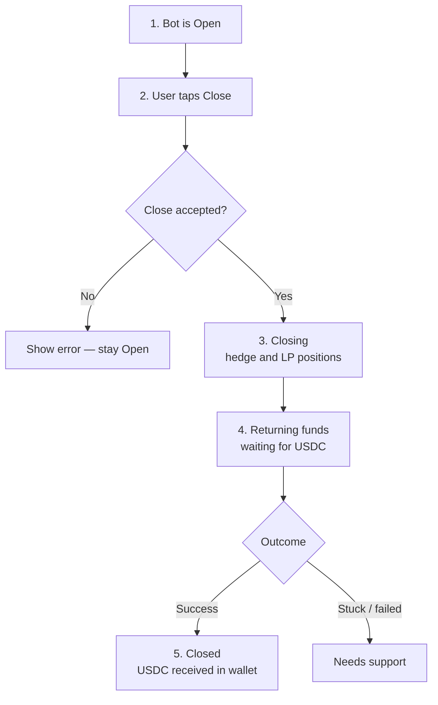
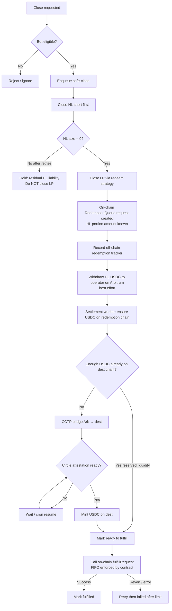
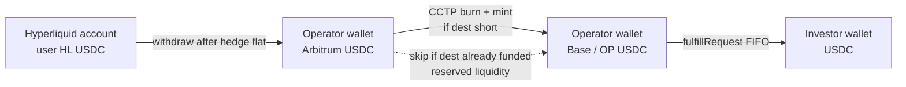
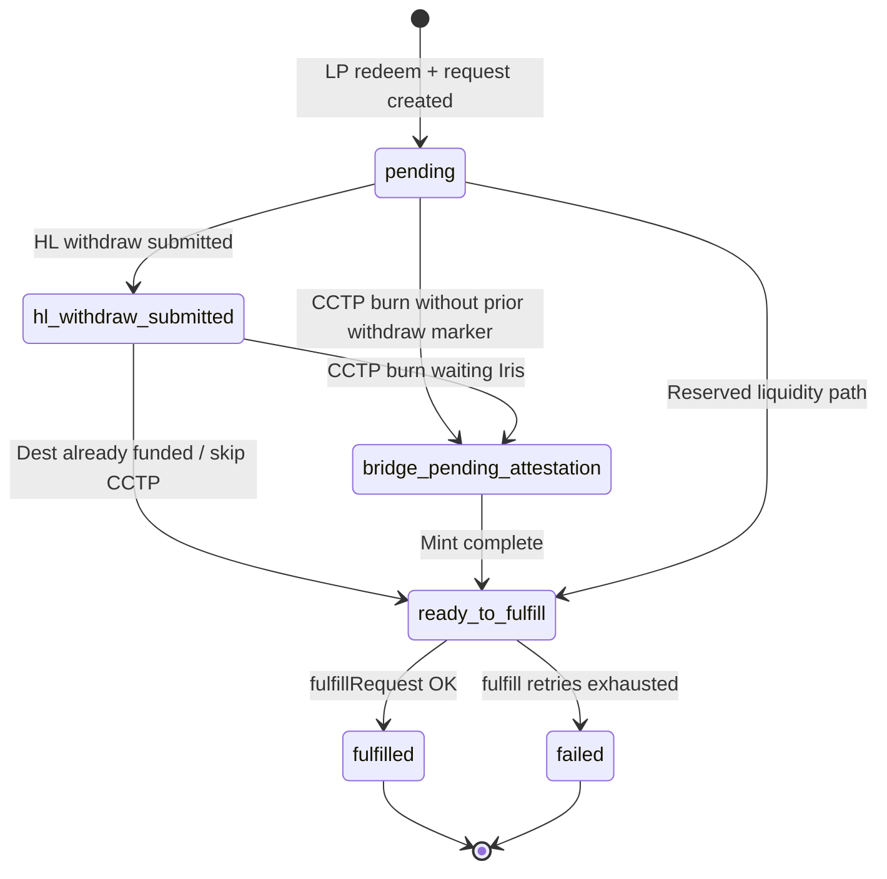
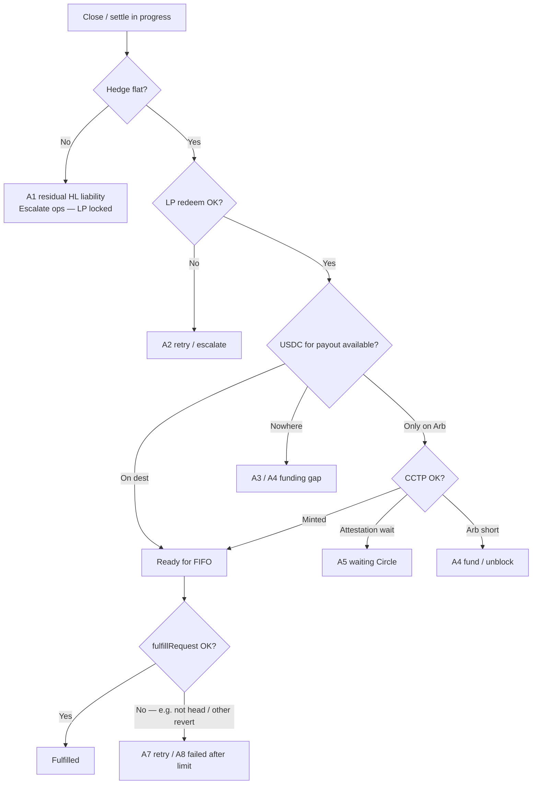
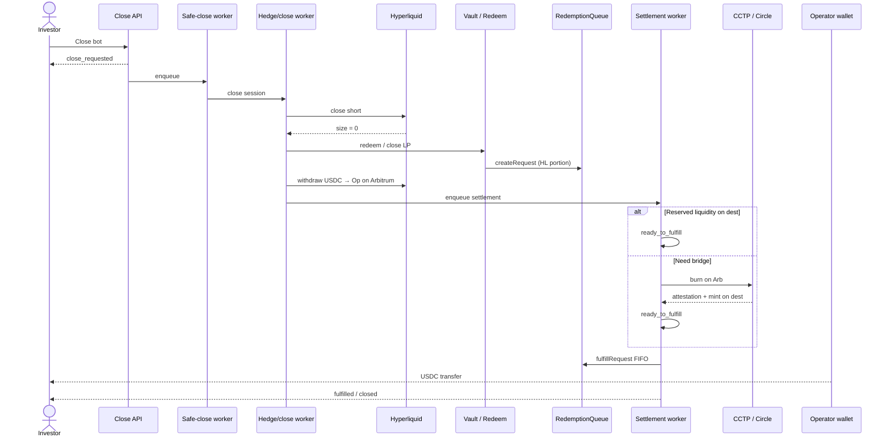
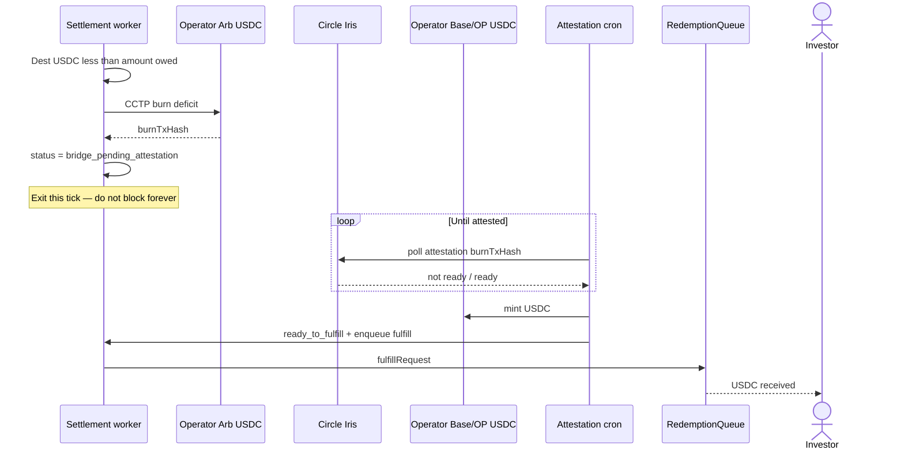
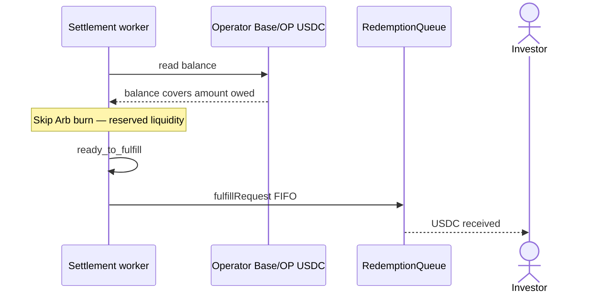
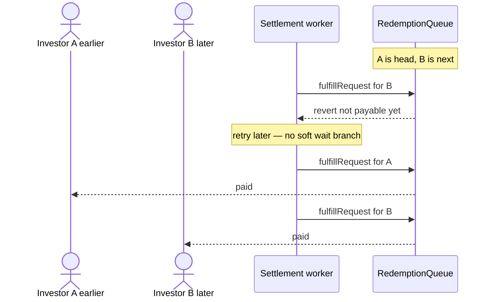
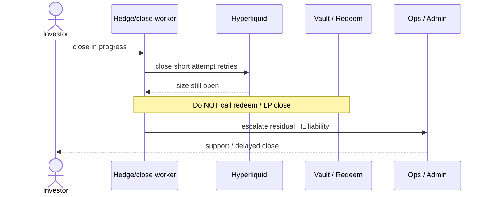

# EXBOT Withdraw / Close Settlement Flow (BA)

Business description of how an investor’s ExBot is closed and how the **HL (Hyperliquid) portion of capital** is returned as USDC on the redemption chain (Base / Optimism).

> Scope: **system-initiated / API close** path that ends in on-chain `RedemptionQueue.fulfillRequest` (FIFO).  
> LP principal is returned in the redeem/close strategy step; this flow focuses on the **HL portion settlement** after that.

---

## 1. Business intent

When a bot is closed:

1. **Hedge (HL short) is closed first** — no LP close until the short is confirmed flat.
2. **LP position is redeemed on-chain** — LP-related value is settled per vault/redeem strategy.
3. **A redemption request is created on-chain** for the HL portion the user is owed.
4. **Operator moves USDC** from Hyperliquid → Arbitrum → (if needed) redemption chain via CCTP.
5. **Operator pays the user on-chain, FIFO** via `fulfillRequest`.
6. Bot is treated as **fully settled** only after fulfill succeeds.

**Money rule (HL portion):** fulfillment is funded by the HL close proceeds (withdrawn after hedge exit), not by “operator decides to pay from spare balance as the policy funding source.” If dest-chain USDC is already available for the amount owed, CCTP may be skipped as an operational shortcut (“reserved liquidity”).

---

## 2. Actors

| Actor                            | Role                                                                                         |
| -------------------------------- | -------------------------------------------------------------------------------------------- |
| Investor / Admin                 | Triggers close (user or admin force-close)                                                   |
| Close API                        | Accepts close request; queues safe-close work                                                |
| Safe-close worker                | Starts close session; hands work to hedge/sync                                               |
| Hedge / sync worker              | Closes HL short, then LP; creates redemption record; requests HL withdraw; queues settlement |
| Settlement worker (`hl-fulfill`) | Ensures USDC on redemption chain; calls on-chain fulfill                                     |
| CCTP attestation cron            | Finishes cross-chain mint when Circle attestation is ready                                   |
| Hyperliquid                      | Hedge marketplace + USDC withdraw destination = operator on Arbitrum                         |
| BnzaExVault / Redeem strategy    | On-chain LP close                                                                            |
| RedemptionQueue                  | On-chain FIFO payout ledger                                                                  |
| Operator wallet                  | Holds USDC and pays user via FIFO fulfill                                                    |

---

## 3. Entry conditions (when close may start)

Close may be requested when **any** of the following is true (product triggers; implementation may route differently):

| #   | Trigger                                   | Business meaning                  |
| --- | ----------------------------------------- | --------------------------------- |
| T1  | User / admin calls **Close API**          | Explicit “close this bot”         |
| T2  | Circuit breaker exhausted                 | System cannot safely keep trading |
| T3  | Margin critical / irrecoverable SAFE_MODE | Capital at risk                   |
| T4  | Repeated stops (e.g. 3 in 7 days)         | Unstable hedge lifecycle          |
| T5  | Partial repair exhausted                  | Fix path failed repeatedly        |

**Reject / no-op conditions at entry:**

| Condition                                              | Outcome                                                                        |
| ------------------------------------------------------ | ------------------------------------------------------------------------------ |
| Bot already **fulfilled / closed** for this redemption | Idempotent skip (no second payout)                                             |
| Bot already **closing** / duplicate close session      | Duplicate close must not create a second settlement for the same logical close |
| Missing auth / missing bot id                          | Close request rejected                                                         |

---

## 4. Investor user journey (UI only — keep it simple)

Investors should **not** see hedge-sync vs hl-fulfill, CCTP, or FIFO internals. They only see a short linear story:

| Step              | What user sees                    | What is happening behind the scenes (ops only)         |
| ----------------- | --------------------------------- | ------------------------------------------------------ |
| 1 Open            | Bot running                       | Normal trading                                         |
| 2 Close           | Confirm close                     | Close API enqueue                                      |
| 3 Closing         | “Closing hedge and LP positions…” | Hedge flat → LP redeem (hedge-sync)                    |
| 4 Returning funds | “Returning funds…”                | HL withdraw → bridge if needed → FIFO pay (hl-fulfill) |
| 5 Closed          | Done + balance up                 | Redemption `fulfilled`                                 |

**BA rule:** “Close accepted” ≠ “USDC already in wallet.” Steps 3→4→5 can take minutes. Do not expose CCTP / queue details in product copy.

---

## 5. Happy path (system end-to-end)

### Step narrative

1. **Close accepted** → `close_requested`; work enters safe-close queue.
2. **Hedge-first:** close HL short; confirm size = 0.
3. **LP close:** vault redeem strategy; emit on-chain redemption/`RequestCreated` for HL portion.
4. **Off-chain tracker** created with amount owed (`principalAmount` = HL portion).
5. **HL withdraw** to operator **Arbitrum** wallet (source of settlement funds).
6. **Bridge / liquidity check** so operator can pay on Base/OP → `ready_to_fulfill`.
7. **fulfillRequest** pays investor USDC on-chain (contract enforces FIFO; not a separate off-chain gate).
8. **Done** — off-chain status `fulfilled`.

> **Code truth (FIFO):** `hl-fulfill` logs `nextPendingRequestId` then **always attempts** `fulfillRequest`. There is no off-chain “wait until head” branch. If this request is not payable yet (e.g. not queue head), the **contract reverts** → attempt counted → SQS retry. Success path is one outcome: pay + `markFulfilled`.

---

## 6. Money movement chart (HL portion)

---

## 7. Settlement status journey

Off-chain redemption tracker statuses (what BA / support should see):

| Status                       | Meaning                                              | Who owns progress   |
| ---------------------------- | ---------------------------------------------------- | ------------------- |
| `pending`                    | Close finished LP/redeem; settlement not done        | Settlement worker   |
| `hl_withdraw_submitted`      | HL withdraw instruction submitted                    | Settlement / HL     |
| `bridge_pending_attestation` | CCTP burn done; waiting Circle signature             | Attestation cron    |
| `ready_to_fulfill`           | Operator has enough USDC on the redemption chain     | Settlement worker   |
| `fulfilled`                  | On-chain payout succeeded                            | Terminal success    |
| `failed`                     | Fulfill retried too many times (policy: typically 3) | Terminal fail → ops |

---

## 8. Conditions catalog (all gates)

### 8.1 Close / hedge / LP

| ID   | Condition                                      | If true                            | If false                                             |
| ---- | ---------------------------------------------- | ---------------------------------- | ---------------------------------------------------- |
| C-01 | Close auth OK + bot_id present                 | Proceed                            | Reject request                                       |
| C-02 | Bot not already terminal for this close        | Proceed                            | Skip duplicate                                       |
| C-03 | HL short size = 0 after close                  | Allow LP close                     | Retry; after limit → escalate; **LP must not close** |
| C-04 | LP redeem succeeds                             | Create on-chain redemption request | Retry / escalate; hold                               |
| C-05 | On-chain request id + HL portion amount &gt; 0 | Continue HL settlement             | No HL settlement enqueue (nothing to pay for HL leg) |

### 8.2 HL withdraw (Arbitrum)

| ID   | Condition                           | If true                          | If false                                                                       |
| ---- | ----------------------------------- | -------------------------------- | ------------------------------------------------------------------------------ |
| C-06 | Custody / master withdraw available | Withdraw HL USDC to operator Arb | Log skip; **settlement still attempted** if Arb/dest already funded            |
| C-07 | Withdraw succeeds                   | Mark `hl_withdraw_submitted`     | Soft-fail; do not block FIFO settlement queue forever solely on withdraw error |

### 8.3 CCTP / liquidity on redemption chain

| ID   | Condition                              | If true                                                          | If false                                        |
| ---- | -------------------------------------- | ---------------------------------------------------------------- | ----------------------------------------------- |
| C-08 | Operator dest-chain USDC ≥ amount owed | **Skip CCTP** (“reserved liquidity”); mark ready                 | Need bridge deficit from Arbitrum               |
| C-09 | Operator Arb USDC ≥ deficit            | Burn/bridge via CCTP                                             | **Hard fail** — cannot fund payout              |
| C-10 | Burn already in flight                 | **Must finish mint** (do not skip because dest balance looks OK) | N/A                                             |
| C-11 | Circle attestation ready               | Mint on dest; mark ready                                         | Stay `bridge_pending_attestation`; cron retries |
| C-12 | Force-bridge test flag on              | Always bridge full amount (ignore reserved liquidity)            | Normal C-08 behavior                            |

### 8.4 On-chain FIFO fulfill

| ID   | Condition                          | If true                            | If false                                                                 |
| ---- | ---------------------------------- | ---------------------------------- | ------------------------------------------------------------------------ |
| C-13 | Status = `ready_to_fulfill`        | Attempt `fulfillRequest`           | Wrong phase — wait / no fulfill                                          |
| C-14 | On-chain `fulfillRequest` succeeds | Mark `fulfilled`                   | Revert (incl. not FIFO head / other) → retry; after threshold → `failed` |
| C-15 | Already `fulfilled`                | Idempotent success / no double pay | —                                                                        |

---

## 9. Alternate / exception paths

| Path                                | Trigger                  | Business outcome                                          | User impact                                                  |
| ----------------------------------- | ------------------------ | --------------------------------------------------------- | ------------------------------------------------------------ |
| A1 Hedge cannot close               | C-03 fails after retries | Residual HL liability; admin escalation                   | LP not closed until hedge flat                               |
| A2 LP redeem fails                  | C-04                     | Held pending ops                                          | Funds not fully settled                                      |
| A3 HL withdraw fails                | C-06/C-07                | Settlement may still proceed if liquidity already present | Delay if funds never arrive                                  |
| A4 Operator short USDC              | C-09                     | Settlement blocked                                        | User waits; ops fund/bridge                                  |
| A5 CCTP waiting attestation         | C-11 false               | Automatic retry via cron                                  | Delay minutes typically                                      |
| A6 Mint already applied             | Race / retry             | Treat as success; advance to ready/fulfill                | No double mint                                               |
| A7 Not FIFO head / contract revert  | C-14                     | Retry via SQS until head paid or fail limit               | Delay                                                        |
| A8 Fulfill fails ×N                 | C-14                     | `failed`                                                  | Ops intervention; queue still source of truth until resolved |
| A9 Duplicate close / SQS redelivery | C-02 / C-15              | No second transfer                                        | Safe idempotency                                             |

### Exception flowchart (support view)

---

## 10. What the investor sees (business UX)

| Phase                       | Investor-facing meaning                                      |
| --------------------------- | ------------------------------------------------------------ |
| Close accepted              | “Close requested — processing”                               |
| Hedge + LP closing          | Closing hedge and LP positions                               |
| Waiting settlement / bridge | HL portion still returning (may take minutes if cross-chain) |
| Fulfilled                   | USDC received in wallet from RedemptionQueue payout          |
| Failed / escalated          | Support / admin action required                              |

**Messaging note:** LP close and HL settlement can complete at different times. LP-related return can occur at redeem; HL portion returns only after settlement + FIFO fulfill.

---

## 11. Sequence diagrams

### 11.1 Happy path overview (reserved liquidity **or** CCTP)

### 11.2 Path — CCTP required (attestation wait)

### 11.3 Path — reserved liquidity (skip CCTP)

### 11.4 Path — FIFO is on-chain (not a separate off-chain wait)

### 11.5 Path — hedge cannot close (LP protected)

---

## 12. Business rules summary

1. **Hedge-first:** never close LP while HL short remains open.
2. **FIFO payout:** later redemptions cannot jump earlier ones on-chain.
3. **HL portion funding:** comes from HL exit → Arb (then CCTP if needed), not ad-hoc “operator fronting” as the defined source.
4. **Reserved liquidity skip:** if dest already has enough USDC, CCTP may be skipped; payout still FIFO.
5. **In-flight CCTP:** once burn started, process must complete mint (cannot abandon because balance looks sufficient).
6. **Idempotency:** redelivery must not pay twice.
7. **Failure containment:** failed fulfill after retries becomes ops-owned (`failed`); on-chain request remains the durable claim until paid.

---

## 13. Trace / open items for BA

| Item                                          | Notes                                                                            |
| --------------------------------------------- | -------------------------------------------------------------------------------- |
| Align older F-05 / UC-bot-safe-close          | Older diagrams omit HL withdraw + CCTP; this doc is the settlement-accurate view |
| User-initiated on-chain redeem (LP-first SLA) | Separate path (`uc-user-redeem`) — not identical to API close                    |
| Notification copy                             | Confirm exact investor strings with product                                      |
| SLA for CCTP wait                             | Product to set target (minutes vs hours)                                         |

### Unresolved questions

1. Should “reserved liquidity” be visible to support as a distinct settlement reason in UI/ops tools?
2. After `failed`, is manual fulfill + status override allowed, or only replay workers?
3. Exact investor notification text for CCTP delay vs fulfill complete?
