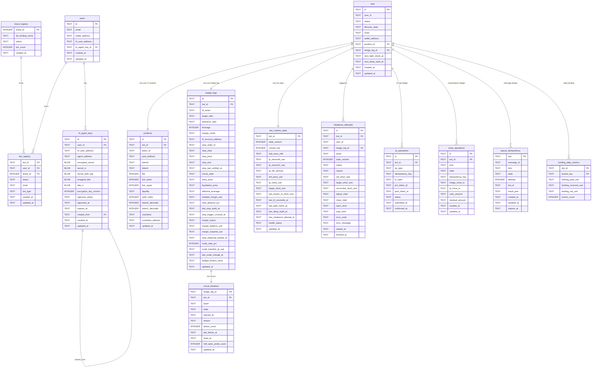

# SRS ERD — BNZA-EXBOT Infrastructure

## D1 Entity Relationship Diagram

## DB Separation

| Database | Tables | Phase |
|----------|--------|-------|
| `control_db` (global, 1) | users, bot_registry, shard_registry, hl_agent_keys | Phase A |
| `state_db_shard_00` (1 shard) | bots, positions, hedge_legs, bot_runtime_state, circuit_breakers, rebalance_attempts, lp_operations, close_operations, queue_idempotency, funding_daily_metrics, hourly_bot_metrics, daily_bot_metrics | Phase A |
| `state_db_shard_00..03` (4 shards) | same as above | Phase B |
| `state_db_shard_00..15` (16 shards) | same as above — deferred until Phase B stable + 10k load benchmark | Phase C |

Shard key: `shard_id = hash(bot_id) % shard_count`

## Key Invariants

| Invariant | Rule |
|-----------|------|
| 1 bot : 1 position | `positions.bot_id UNIQUE` |
| 1 bot : 1 hedge_leg | `hedge_legs.bot_id UNIQUE` |
| 1 hedge_leg : 1 circuit_breaker | `circuit_breakers.hedge_leg_id PK` |
| close idempotency | `close_operations.idempotency_key UNIQUE` |
| LP op idempotency | `lp_operations.idempotency_key UNIQUE` |
| message dedup | `queue_idempotency.message_id UNIQUE INDEX` |
| no float storage | All financial amounts stored as TEXT (BigDecimal string) |
| no DROP/RENAME | Schema change = ADD COLUMN only after Phase A deploy |
