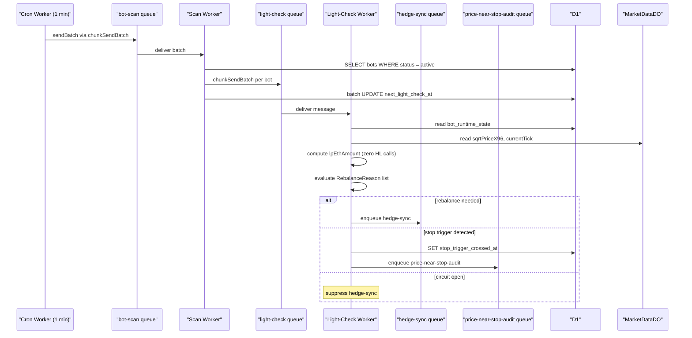
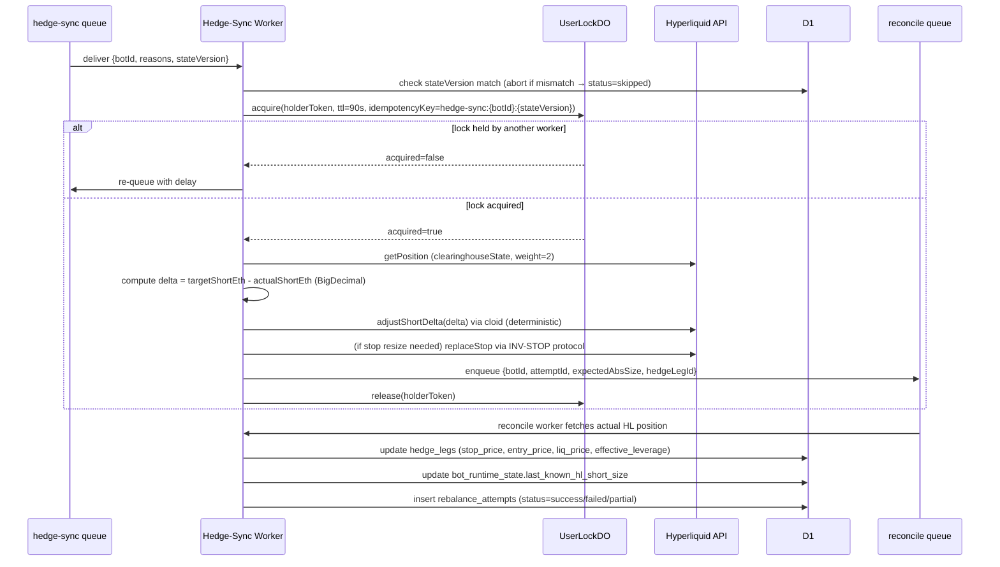
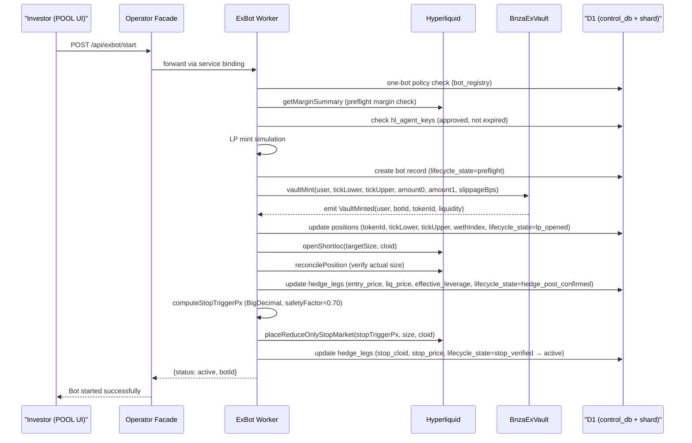
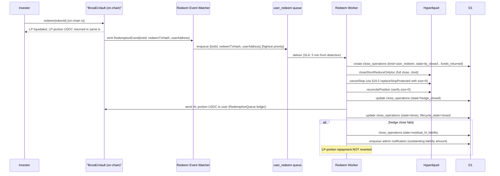
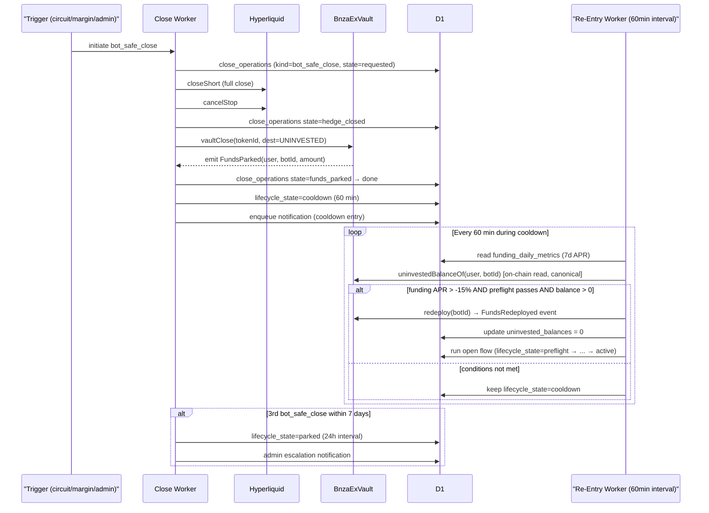

# SRS Flows — BNZA-EXBOT Infrastructure

## F-01: Queue Fan-Out (Cron → Scan → Light-Check → Hedge-Sync)

## F-02: Hedge-Sync Execution (Delta-Only)

## F-03: Bot Initialization Flow

## F-04: Close Flow — user_redeem (LP-First)

## F-05: bot_safe_close + Automatic Re-Entry

