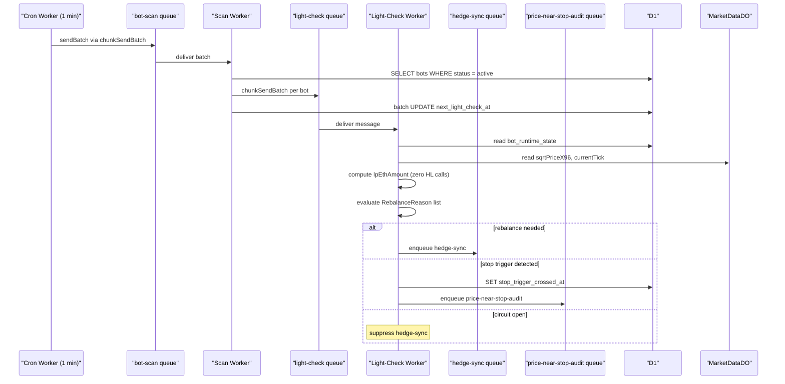
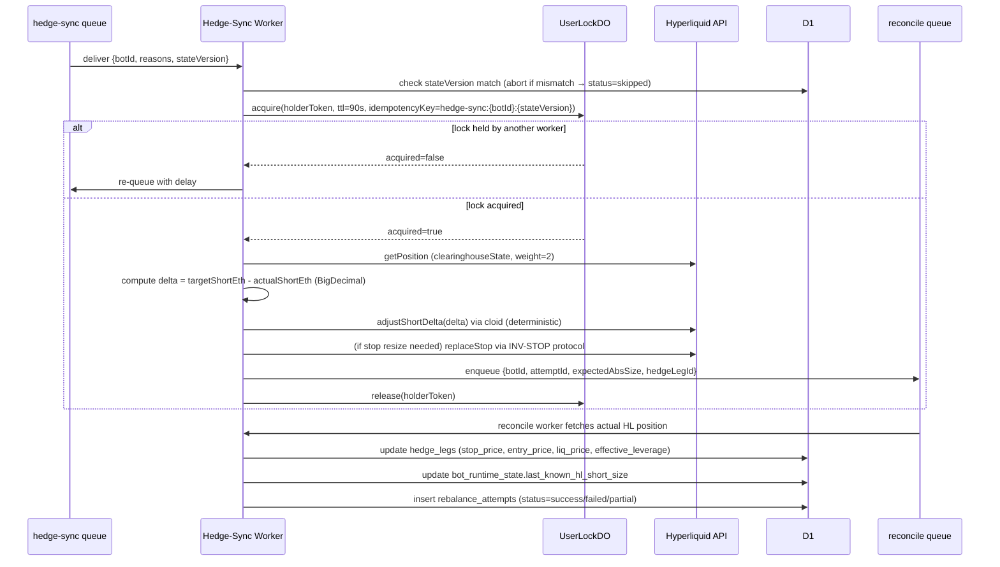
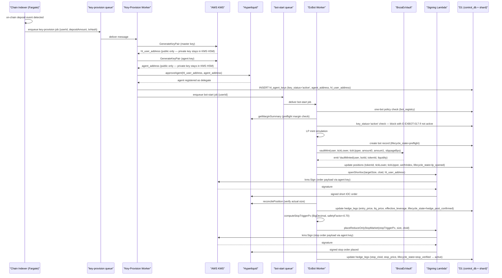
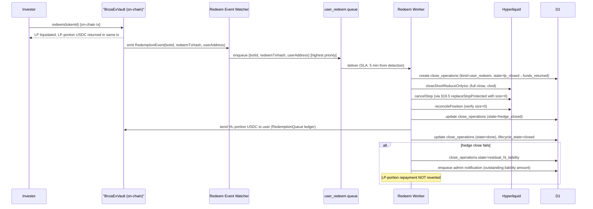
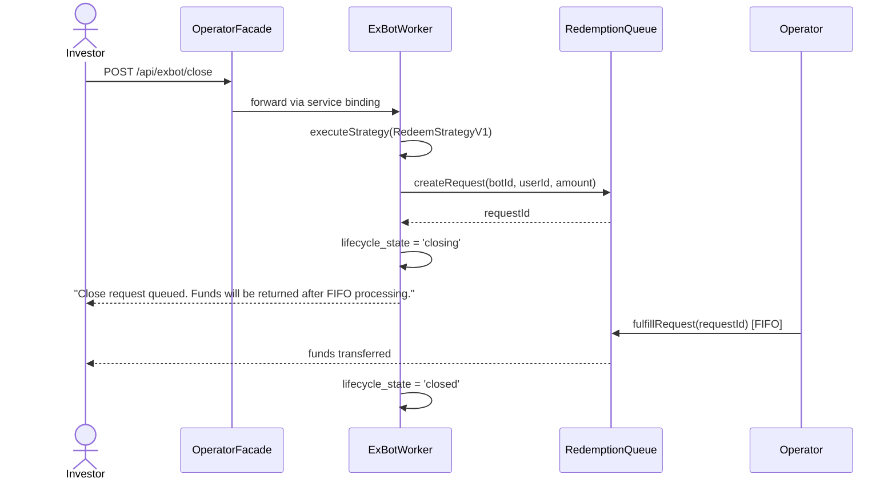

# SRS Flows — BNZA-EXBOT Infrastructure

## F-01: Queue Fan-Out (Cron → Scan → Light-Check → Hedge-Sync)

## F-02: Hedge-Sync Execution (Delta-Only)

## F-03: Bot Initialization Flow

> **Flow updated 2026-06-29:** Bot start is now fully automatic. On user on-chain deposit, the chain indexer (Fargate) enqueues a `key-provision` job. The key-provision worker generates a per-user master key and agent key entirely inside AWS KMS (private keys never leave the HSM), registers the agent key with Hyperliquid via `approveAgent`, then enqueues bot start. No investor UI action or admin approval is required.

## F-04: Close Flow — user_redeem (LP-First)

## F-05: bot_safe_close (Direct Close via RedemptionQueue)

