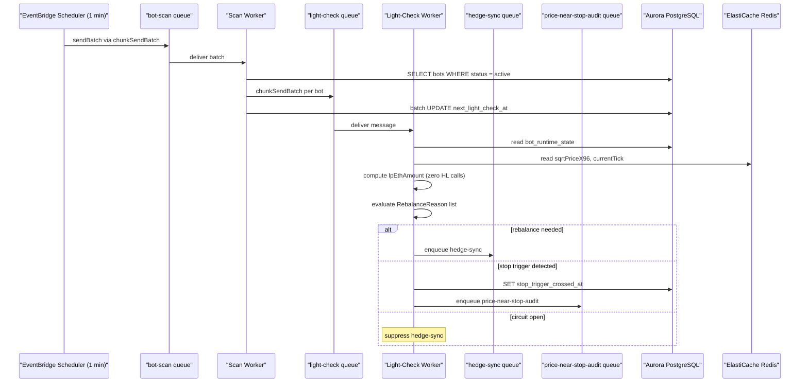
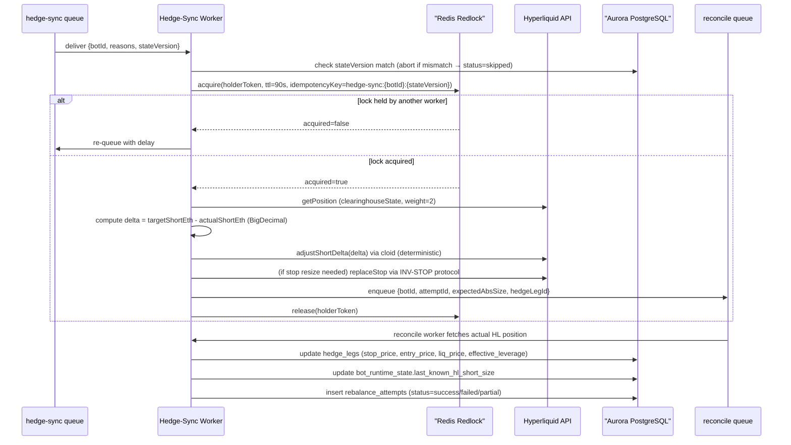
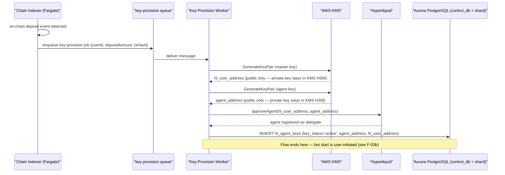
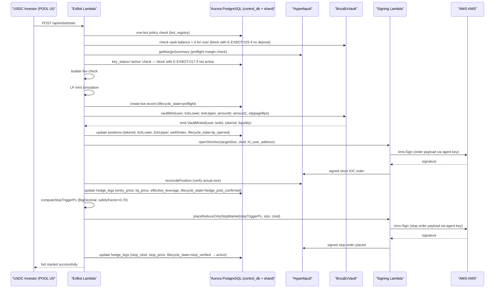
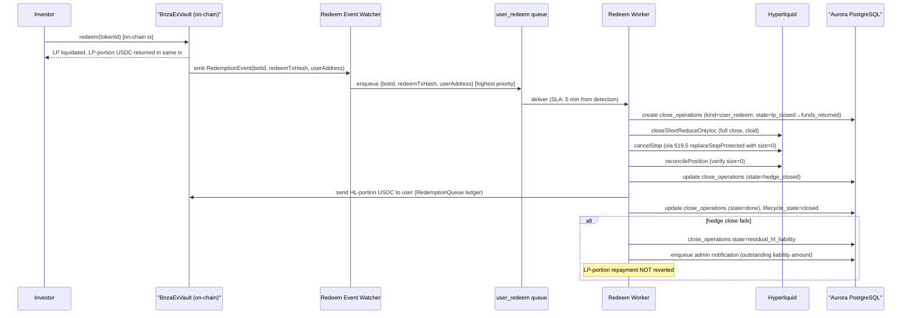
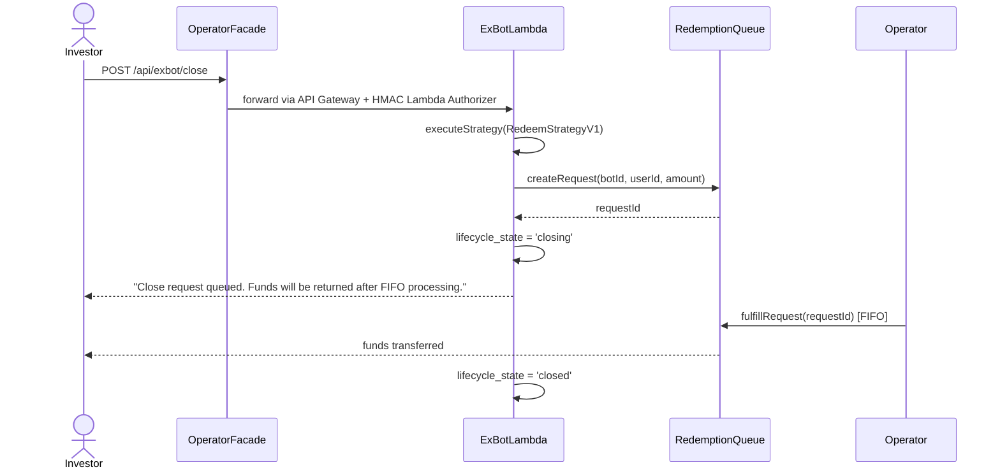

# SRS Flows — BNZA-EXBOT Infrastructure

## F-01: Queue Fan-Out (Cron → Scan → Light-Check → Hedge-Sync)

```mermaid
sequenceDiagram
    participant Cron as "EventBridge Scheduler (1 min)"
    participant ScanQ as "bot-scan queue"
    participant ScanW as "Scan Worker"
    participant LCQ as "light-check queue"
    participant LCW as "Light-Check Worker"
    participant HSQ as "hedge-sync queue"
    participant PSAQ as "price-near-stop-audit queue"
    participant D1 as "Aurora PostgreSQL"
    participant MDO as "ElastiCache Redis"

    Cron->>ScanQ: sendBatch via chunkSendBatch
    ScanQ->>ScanW: deliver batch
    ScanW->>D1: SELECT bots WHERE status = active
    ScanW->>LCQ: chunkSendBatch per bot
    ScanW->>D1: batch UPDATE next_light_check_at

    LCQ->>LCW: deliver message
    LCW->>D1: read bot_runtime_state
    LCW->>MDO: read sqrtPriceX96, currentTick
    LCW->>LCW: compute lpEthAmount (zero HL calls)
    LCW->>LCW: evaluate RebalanceReason list

    alt rebalance needed
        LCW->>HSQ: enqueue hedge-sync
    else stop trigger detected
        LCW->>D1: SET stop_trigger_crossed_at
        LCW->>PSAQ: enqueue price-near-stop-audit
    else circuit open
        Note over LCW: suppress hedge-sync
    end
```

## F-02: Hedge-Sync Execution (Delta-Only)

```mermaid
sequenceDiagram
    participant HSQ as hedge-sync queue
    participant HSW as Hedge-Sync Worker
    participant UDO as "Redis Redlock"
    participant HL as Hyperliquid API
    participant D1 as "Aurora PostgreSQL"
    participant RQ as reconcile queue

    HSQ->>HSW: deliver {botId, reasons, stateVersion}
    HSW->>D1: check stateVersion match (abort if mismatch → status=skipped)
    HSW->>UDO: acquire(holderToken, ttl=90s, idempotencyKey=hedge-sync:{botId}:{stateVersion})
    alt lock held by another worker
        UDO-->>HSW: acquired=false
        HSW->>HSQ: re-queue with delay
    else lock acquired
        UDO-->>HSW: acquired=true
        HSW->>HL: getPosition (clearinghouseState, weight=2)
        HSW->>HSW: compute delta = targetShortEth - actualShortEth (BigDecimal)
        HSW->>HL: adjustShortDelta(delta) via cloid (deterministic)
        HSW->>HL: (if stop resize needed) replaceStop via INV-STOP protocol
        HSW->>RQ: enqueue {botId, attemptId, expectedAbsSize, hedgeLegId}
        HSW->>UDO: release(holderToken)
    end

    RQ->>HSW: reconcile worker fetches actual HL position
    HSW->>D1: update hedge_legs (stop_price, entry_price, liq_price, effective_leverage)
    HSW->>D1: update bot_runtime_state.last_known_hl_short_size
    HSW->>D1: insert rebalance_attempts (status=success/failed/partial)
```

## F-03a: Auto Key-Provision on Deposit

> **Triggered automatically** when Chain Indexer (Fargate) detects an on-chain deposit. No user action required. Bot start does NOT happen here — this flow only provisions the HL account so it is ready when the user later calls Start Bot.

```mermaid
sequenceDiagram
    participant CHAIN as "Chain Indexer (Fargate)"
    participant KPQ as "key-provision queue"
    participant KP as "Key-Provision Worker"
    participant KMS as "AWS KMS"
    participant HL as "Hyperliquid"
    participant DB as "Aurora PostgreSQL (control_db + shard)"

    CHAIN->>CHAIN: on-chain deposit event detected
    CHAIN->>KPQ: enqueue key-provision job {userId, depositAmount, txHash}
    KPQ->>KP: deliver message

    KP->>KMS: GenerateKeyPair (master key)
    KMS-->>KP: hl_user_address (public only — private key stays in KMS HSM)
    KP->>KMS: GenerateKeyPair (agent key)
    KMS-->>KP: agent_address (public only — private key stays in KMS HSM)

    KP->>HL: approveAgent(hl_user_address, agent_address)
    HL-->>KP: agent registered as delegate

    KP->>DB: INSERT hl_agent_keys (key_status='active', agent_address, hl_user_address)
    Note over KP,DB: Flow ends here — bot start is user-initiated (see F-03b)
```

## F-03b: User-Triggered Bot Start

> **Triggered by user** calling `POST /api/exbot/start` via POOL UI. Key-provision must already be complete (`key_status='active'`) from F-03a. Preflight now includes vault balance check as first guard.

```mermaid
sequenceDiagram
    participant INV as "USDC Investor (POOL UI)"
    participant EXW as "ExBot Lambda"
    participant DB as "Aurora PostgreSQL (control_db + shard)"
    participant HL as "Hyperliquid"
    participant VAULT as "BnzaExVault"
    participant SL as "Signing Lambda"
    participant KMS as "AWS KMS"

    INV->>EXW: POST /api/exbot/start
    EXW->>DB: one-bot policy check (bot_registry)
    EXW->>VAULT: check vault balance > 0 for user (block with E-EXBOT-025 if no deposit)
    EXW->>HL: getMarginSummary (preflight margin check)
    EXW->>DB: key_status='active' check — block with E-EXBOT-017 if not active
    EXW->>EXW: builder fee check
    EXW->>EXW: LP mint simulation
    EXW->>DB: create bot record (lifecycle_state=preflight)

    EXW->>VAULT: vaultMint(user, tickLower, tickUpper, amount0, amount1, slippageBps)
    VAULT-->>EXW: emit VaultMinted(user, botId, tokenId, liquidity)
    EXW->>DB: update positions (tokenId, tickLower, tickUpper, wethIndex, lifecycle_state=lp_opened)

    EXW->>SL: openShortIoc(targetSize, cloid, hl_user_address)
    SL->>KMS: kms:Sign (order payload via agent key)
    KMS-->>SL: signature
    SL->>HL: signed short IOC order
    EXW->>HL: reconcilePosition (verify actual size)
    EXW->>DB: update hedge_legs (entry_price, liq_price, effective_leverage, lifecycle_state=hedge_post_confirmed)

    EXW->>EXW: computeStopTriggerPx (BigDecimal, safetyFactor=0.70)
    EXW->>SL: placeReduceOnlyStopMarket(stopTriggerPx, size, cloid)
    SL->>KMS: kms:Sign (stop order payload via agent key)
    KMS-->>SL: signature
    SL->>HL: signed stop order placed
    EXW->>DB: update hedge_legs (stop_cloid, stop_price, lifecycle_state=stop_verified → active)
    EXW-->>INV: bot started successfully
```

## F-04: Close Flow — user_redeem (LP-First)

```mermaid
sequenceDiagram
    participant INV as Investor
    participant VAULT as "BnzaExVault (on-chain)"
    participant EVWATCHER as Redeem Event Watcher
    participant UREQ as user_redeem queue
    participant UREW as Redeem Worker
    participant HL as Hyperliquid
    participant D1 as "Aurora PostgreSQL"

    INV->>VAULT: redeem(tokenId) [on-chain tx]
    VAULT-->>INV: LP liquidated, LP-portion USDC returned in same tx
    VAULT->>EVWATCHER: emit RedemptionEvent(botId, redeemTxHash, userAddress)

    EVWATCHER->>UREQ: enqueue {botId, redeemTxHash, userAddress} [highest priority]
    UREQ->>UREW: deliver (SLA: 5 min from detection)

    UREW->>D1: create close_operations (kind=user_redeem, state=lp_closed→funds_returned)
    UREW->>HL: closeShortReduceOnlyIoc (full close, cloid)
    UREW->>HL: cancelStop (via §19.5 replaceStopProtected with size=0)
    UREW->>HL: reconcilePosition (verify size=0)
    UREW->>D1: update close_operations (state=hedge_closed)
    UREW->>VAULT: send HL-portion USDC to user (RedemptionQueue ledger)
    UREW->>D1: update close_operations (state=done), lifecycle_state=closed

    alt hedge close fails
        UREW->>D1: close_operations.state=residual_hl_liability
        UREW->>D1: enqueue admin notification (outstanding liability amount)
        Note over UREW: LP-portion repayment NOT reverted
    end
```

## F-05: bot_safe_close (Direct Close via RedemptionQueue)

```mermaid
sequenceDiagram
    actor Investor
    participant OperatorFacade
    participant ExBotLambda
    participant RedemptionQueue
    participant Operator

    Investor->>OperatorFacade: POST /api/exbot/close
    OperatorFacade->>ExBotLambda: forward via API Gateway + HMAC Lambda Authorizer
    ExBotLambda->>ExBotLambda: executeStrategy(RedeemStrategyV1)
    ExBotLambda->>RedemptionQueue: createRequest(botId, userId, amount)
    RedemptionQueue-->>ExBotLambda: requestId
    ExBotLambda->>ExBotLambda: lifecycle_state = 'closing'
    ExBotLambda-->>Investor: "Close request queued. Funds will be returned after FIFO processing."
    Operator->>RedemptionQueue: fulfillRequest(requestId) [FIFO]
    RedemptionQueue-->>Investor: funds transferred
    ExBotLambda->>ExBotLambda: lifecycle_state = 'closed'
```
