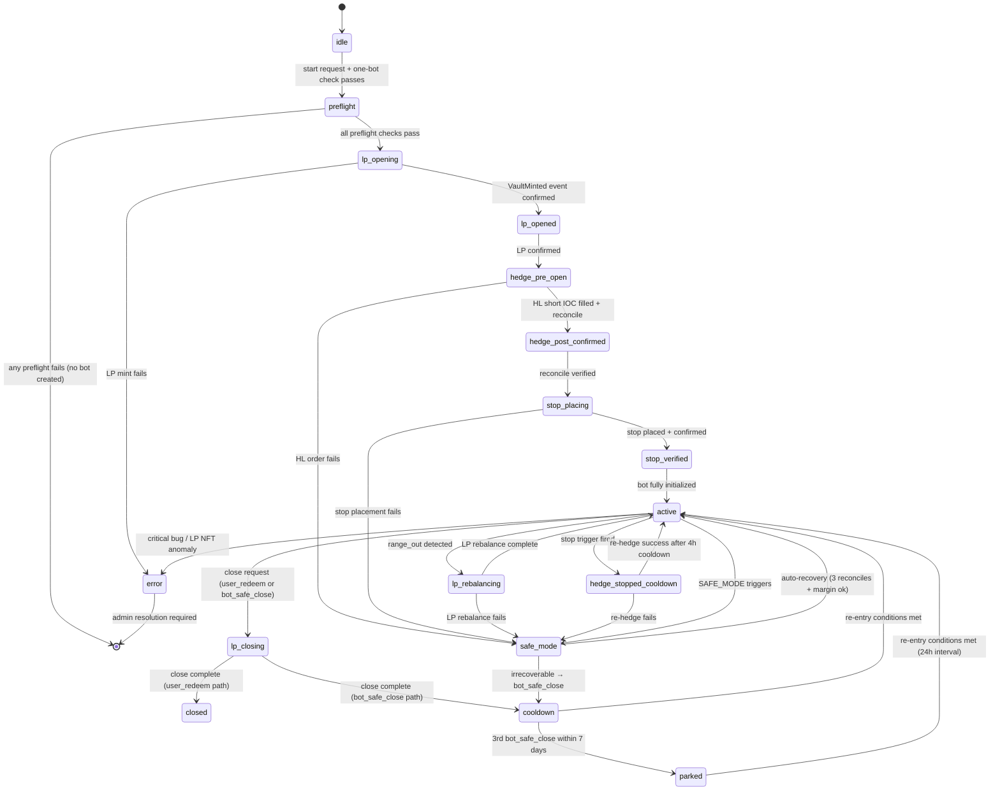
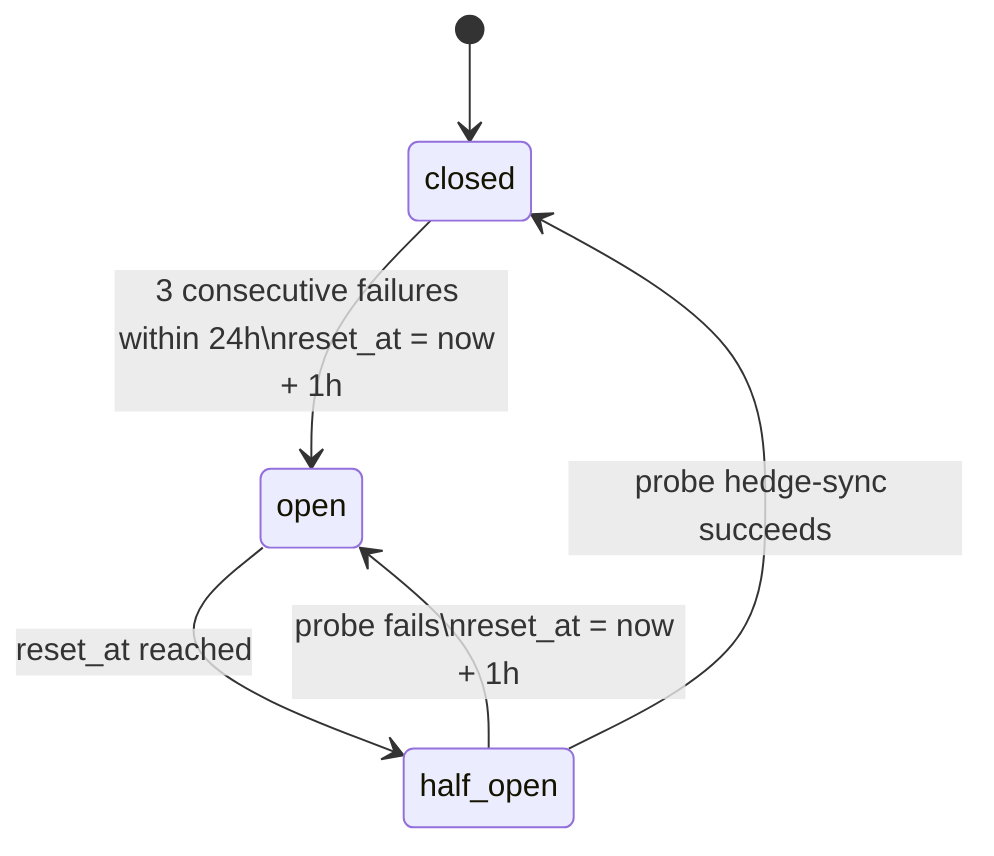

# SRS States — BNZA-EXBOT Infrastructure

## Bot Lifecycle State Machine

States are stored in `bots.lifecycle_state` (fine-grained) and `bots.status` (coarse-grained).

## State Registry

| lifecycle_state | bots.status | Description | Light-Check | Hedge-Sync | Deep-Audit |
|----------------|------------|-------------|------------|-----------|-----------|
| `idle` | (pre-create) | Not started | — | — | — |
| `preflight` | (transitional) | Running preflight checks | skip | skip | skip |
| `lp_opening` | (transitional) | LP mint in progress | skip | skip | skip |
| `lp_opened` | (transitional) | LP minted, hedge not yet open | skip | skip | skip |
| `hedge_pre_open` | (transitional) | Opening HL short | skip | skip | skip |
| `hedge_post_confirmed` | (transitional) | Short confirmed, stop not placed | skip | skip | skip |
| `stop_placing` | (transitional) | Placing native stop | skip | skip | skip |
| `stop_verified` | (transitional) | Stop confirmed | skip | skip | skip |
| `active` | active | Normal monitoring | every 5 min | event-driven | every 6h |
| `hedge_stopped_cooldown` | active | Stop fired; hedge-sync suppressed 4h | run (no hedge-sync) | suppressed | every 6h |
| `lp_rebalancing` | active | LP range rebalance in progress | **skip** | skip | skip |
| `cooldown` | active | Post bot_safe_close; re-entry judgment 60 min | skip | skip | every 6h |
| `parked` | active | Repeated safe_close; 24h re-entry interval | skip | skip | every 6h |
| `lp_closing` | closing | Close in progress | **skip** | skip | skip |
| `closed` | closed | Fully closed | skip | skip | skip |
| `safe_mode` | safe_mode | No mutations; monitor only | limited (no HL) | blocked | when HL recovers |
| `error` | error | Admin required | skip | skip | skip |
| (pre-pause value) | paused | Hedge maintained; no new mutations | skip | skip | every 6h |

## Circuit Breaker States (`circuit_breakers.state`)

| State | Hedge-Sync Allowed | Stop Monitoring |
|-------|-------------------|----------------|
| `closed` | Yes | Yes |
| `open` | No (suppressed) | Yes — ALWAYS |
| `half_open` | One probe only (atomic claim) | Yes — ALWAYS |

## Margin Status (`hedge_legs.margin_status`)

| State | marginUsage | Hedge Behavior | Alert |
|-------|------------|---------------|-------|
| `ok` | < 0.55 | Normal | None |
| `warning` | 0.55–0.75 | Size-increase disabled | Investor (UI banner) |
| `critical` | ≥ 0.75 (×2 consecutive) | Enter SAFE_MODE | Investor + Admin |
| `safe_mode` | (via SAFE_MODE entry) | All mutations blocked | Investor + Admin |

## close_operations States

| State | user_redeem | bot_safe_close |
|-------|------------|---------------|
| `requested` | ✓ | ✓ |
| `lp_closed` | ✓ (LP liquidated on-chain) | ✓ (after hedge close) |
| `funds_returned` | ✓ (LP-portion USDC to user in same tx) | — |
| `hedge_close_pending` | ✓ (after funds_returned) | ✓ (first step after requested) |
| `hedge_closed` | ✓ | ✓ |
| `funds_parked` | — | ✓ (USDC → uninvested_balances) |
| `residual_hl_liability` | if hedge close fails | if hedge close fails |
| `done` | ✓ | ✓ |
