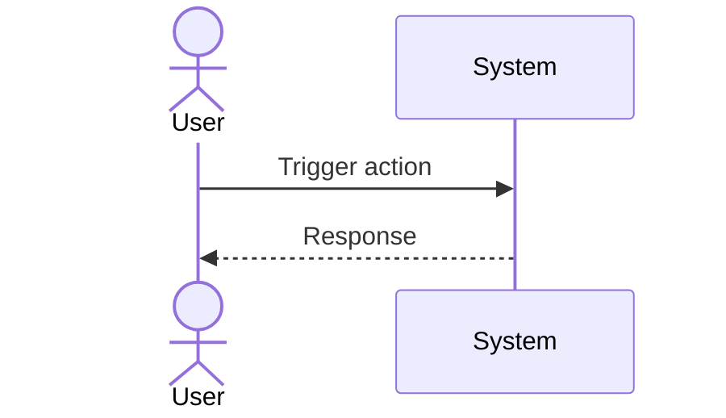

# UC-EXBOT-agent-key: Submit and Approve HL Agent Key

## Trigger

User navigates to the relevant screen or initiates the described action.

---

## 1. Actors
- **Primary:** USDC Investor (key submission), ExBot Admin (key approval)
- **System:** ExBot Worker, D1 (control_db: hl_agent_keys), Cloudflare Secrets Store

## 2. Preconditions
- Investor has generated an HL agent key (approved delegate, not master private key)
- ExBot Worker has access to Master Key in Cloudflare Secrets Store

## 3. Main Success Scenario — Key Submission
1. Investor submits agent key via POOL UI → `POST /api/exbot/agent-key`
2. OPERATOR forwards to ExBot Worker via service binding
3. ExBot Worker generates a per-row DEK (random, AES-256)
4. Encrypts agent key: `encrypted_secret = AES-256-GCM(plainKey, DEK, IV)` → stores `encrypted_secret`, `secret_iv`, `secret_auth_tag`
5. Wraps DEK with Master Key (Cloudflare Secrets Store): `wrapped_dek = MasterKey.wrap(DEK, dek_iv)`
6. System automatically sets `expires_at = submitted_at + 90 days` (investor does not supply this value — HL does not provide expiry on agent keys)
7. Inserts row into `hl_agent_keys`: only encrypted blobs stored; plain DEK and plain key destroyed immediately
8. Returns confirmation: "Agent key received and encrypted. Awaiting approval."

**Admin Approval Flow:**
9. Admin sees pending key in admin dashboard
10. Admin approves → ExBot Worker updates `approval_status='approved'`, `approved_at=now`
11. Key is now active — bot start preflight will pass the agent key check automatically on next start attempt

## 4. Alternate Flows
- **A1 (key expired):** At preflight time — `expires_at < now` → block start: "Agent key expired. Please submit a new one."
- **A2 (key rotation):** New row inserted (new DEK + new wrap); old row set to `status='superseded'`, `rotated_from` chain preserved. `revoked` reserved for explicit admin revocation action only.
- **A3 (decryption during hedge-sync):** Unwrap `wrapped_dek` with Master Key → decrypt `encrypted_secret` → use plain key in function scope → destroy immediately; nothing logged

- **A5 (expiry notification):** Out of scope for this UC — handled by UC-EXBOT-deep-audit. Cross-ref FR-083.

## 5. Postconditions
- `hl_agent_keys.approval_status='approved'`
- No plain key or plain DEK persisted anywhere
- `users.hl_agent_key_id` references the approved key row

---

## 6. Business Rules

| BR ID | Summary | Source FR |
|-------|---------|-----------|
| BR-EXBOT-011 | Plain agent key and plain DEK must never be persisted — function-scoped during decryption only. | FR-EXBOT-080 |
| BR-EXBOT-012 | Only one `approval_status='approved'` row per user allowed at any time — enforced at DB level. | FR-EXBOT-082 |
| BR-EXBOT-013 | Revocation and rotation are non-destructive — `revoked` and `superseded` rows must never be deleted. | FR-EXBOT-082 |
| BR-EXBOT-014 | Key rotation atomicity — old row `superseded` and new row `approved` committed in the same transaction. | FR-EXBOT-083 |

Canonical source: `srs/spec.md §4` (BR-EXBOT-011..014) and `srs/spec.md §2` (FR-EXBOT-080..083).

### Error Codes for This UC

| E-Code | Trigger | Message | HTTP |
|--------|---------|---------|------|
| E-EXBOT-003 | Bot start preflight — key still `pending` | "Agent key is awaiting approval. Please complete the approval process before starting." | 400 |
| E-EXBOT-004 | Bot start preflight — `expires_at < now` (A1) | "Your HL agent key has expired. Please submit a new one." | 400 |
| E-EXBOT-014 | Submit while existing key is `pending` (A4) | "Your agent key is awaiting admin approval. You cannot submit a new key until the current one is reviewed." | 409 |
| E-EXBOT-015 | Submit while existing key is `approved` (A6) | "You already have an active agent key. You can only submit a new key after your current key has expired." | 409 |
| E-EXBOT-016 | Admin approves a key where `expires_at < now` (A8) | "This agent key has already expired and cannot be approved. Please ask the investor to submit a new key." | 409 |

Canonical source: `srs/spec.md §5` and `02_backbone/message-list.md §EXBOT`.

---

## Diagram

> **No diagram yet.** Add a Mermaid sequence diagram or PlantUML flow chart documenting the actor-system interaction for this use case.

## 7. FR Trace
FR-EXBOT-080, FR-EXBOT-081, FR-EXBOT-082, FR-EXBOT-083

Note: frd.md uses implementation grouping numbers; srs/spec.md is canonical. Trace here always refers srs/spec.md.
