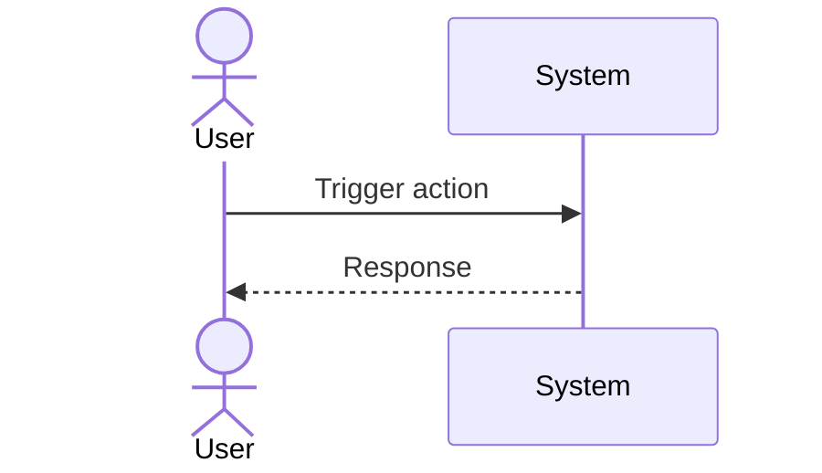

# UC-EXBOT-bot-safe-close: System-Initiated Safe Close + Auto Re-Entry

## Trigger

User navigates to the relevant screen or initiates the described action.

---

## 1. Actors
- **Primary:** ExBot System Operator (Close Worker)
- **System:** Hyperliquid, BnzaExVault, BnzaExPositionManager, RedemptionQueue, D1

## 2. Preconditions
- Trigger condition met: circuit breaker retries exhausted, OR margin critical + SAFE_MODE irrecoverable, OR 3 stops within 7 days, OR admin force-close

## 3. Main Success Scenario
1. Trigger creates `close_operations` row (kind='bot_safe_close', state='requested')
2. Close Worker: acquire `UserLockDO` lease; full close HL short (`closeShortReduceOnlyIoc`)
3. Cancel stop via `§19.5 replaceStopProtected` with size=0
4. Reconcile: verify HL size = 0; update `close_operations.state='hedge_closed'`
5. Call `vault.executeStrategy(RedeemStrategyV1, user, botId, params)` — closes LP position via BnzaExPositionManager
6. RedeemStrategyV1: earned fees routed via LpFeeOps (operation fee + performance fee in pair currency); principal returned in pair currency (optional convertPrincipalToUsdc)
7. `close_operations.state='lp_closed'`; `PositionClosed` event emitted by BnzaExPositionManager
8. `RedemptionQueue.createRequest(user, botId, tokenId, hlPortionId)` — enqueue HL portion payout
9. `close_operations.state='redemption_queued'`; `RequestCreated` event emitted
10. Operator closes HL portion off-chain → calls `RedemptionQueue.fulfillRequest(tokens, amounts)` — FIFO pop, `safeTransferFrom(operator, user, amount)` on-chain
11. `close_operations.state='done'`; `RequestFulfilled` event emitted; `bots.status='closed'`
12. Investor notification: "Bot safely closed. Funds have been returned to your wallet."

## 4. Alternate Flows
- **A1 (hedge close impossible):** Step 3 — `close_operations.state='residual_hl_liability'` + SAFE_MODE; do NOT touch LP until hedge confirmed closed
- **A2 (LP close reverts):** Step 5 — retry up to 3 times; on failure escalate to admin, hold at `lp_closed` pending
- **A3 (RedemptionQueue fulfillRequest fails):** Step 10 — request stays in queue; Operator retries; user funds not lost (request remains enqueued)
- **A4 (3rd bot_safe_close trigger within 7 days):** Step 1 — create `close_operations` row; proceed with same flow; admin escalation notification sent concurrently

## 5. Postconditions
- `bots.status='closed'`, `close_operations.state='done'`
- LP position fully closed; HL hedge fully closed
- Funds returned to user wallet via RedemptionQueue fulfillRequest (on-chain)
- Audit log entries recorded

## 6. Business Rules
- BR-EXBOT-007 (SAFE_MODE not a terminal state)

---

## Diagram

> **No diagram yet.** Add a Mermaid sequence diagram or PlantUML flow chart documenting the actor-system interaction for this use case.

## 7. FR Trace
FR-EXBOT-070, FR-EXBOT-072, FR-EXBOT-073
