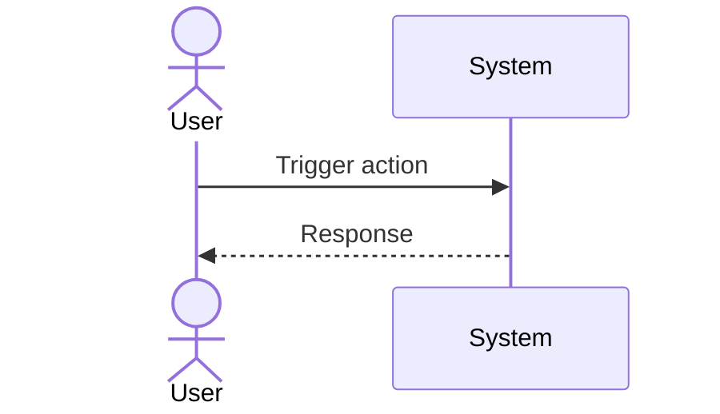

# UC-EXBOT-bot-start: Start ExBot

## Trigger

User navigates to the relevant screen or initiates the described action.

---

## 1. Actors
- **Primary:** USDC Investor (via POOL UI → Operator Facade → ExBot Worker)
- **System:** ExBot Worker, BnzaExVault (Solidity), Hyperliquid

## 2. Preconditions
- User has no existing ExBot with `status IN ('active','paused','closing','safe_mode','error')`
- User has HL account with isolated margin balance ≥ required × 2.0
- User's HL agent key `approval_status='approved'` and not expired
- Builder fee (5bps) confirmed on HL
- ERC-20 allowance: User has approved BnzaExVault to spend USDC ≥ deposit amount
- Native gas: User wallet holds sufficient ETH/native token for vault tx gas

## 3. Main Success Scenario
1. Investor submits start request via POOL UI
2. OPERATOR receives `POST /api/exbot/start`, forwards to ExBot Worker via service binding
3. ExBot Worker runs preflight: one-bot check → margin check → agent key check → builder fee check → LP mint simulation
4. ExBot Worker creates bot record (`lifecycle_state='preflight'`)
5. ExBot Worker calls `BnzaExVault.vaultMint(...)` → receives `VaultMinted` event with `tokenId`
6. D1 `positions` updated with `tokenId`, `tickLower`, `tickUpper`, `wethIndex`, `lifecycle_state='lp_opened'`
7. ExBot Worker opens HL short IOC (`targetShortEth = lpEthAmount × hedgeRatio (Phase A = 0.70)`)
8. Post-order reconcile: fetches actual HL position, extracts `entry_price`, `liquidation_price`, `effective_leverage`
9. `lifecycle_state='hedge_post_confirmed'`; D1 `hedge_legs` updated
10. Computes `stop_trigger_px` (BigDecimal, `stopSafetyFactor (Phase A = 0.70)`); places reduce-only stop market on HL
11. Stop confirmed → `lifecycle_state='stop_verified'` → `'active'`
12. Response returned to POOL UI: bot active

## 4. Alternate Flows
- **A1 (one-bot policy fail):** Step 3 — reject with "You already have an active ExBot."
- **A2 (margin insufficient):** Step 3 — block with margin amount details
- **A3 (agent key pending):** Step 3 — block with E-EXBOT-003: "Agent key not approved. Please submit and get approval before starting."
- **A4 (LP mint fails):** Step 5 — enter `error` state, return funds
- **A5 (builder fee not confirmed):** Step 3 — block with "Builder fee (5bps) must be confirmed on HL before starting."
- **A6 (LP mint simulation fail):** Step 3 — block with simulation error details; no vault call made.
- **A7 (HL unreachable):** Step 5 or 7 — enter `error` state; return "HL service unavailable, please retry."
- **A8 (stop placement fail):** Step 10 — enter `error` state; HL short open but stop not confirmed; alert operator.
- **A9 (agent key expired at preflight):** Step 3 — block with E-EXBOT-003: "Agent key expired. Please submit a new one."
- **A10 (HL order rejection):** Step 7 — HL rejects IOC order; enter `error` state; return HL rejection reason.
- **A11 (reconcile mismatch):** Step 8 — actual size deviates > threshold; enqueue `partial_repair`; alert operator.

## 5. Postconditions
- `bots.lifecycle_state='active'`, `bots.status='active'`
- LP NFT held by BnzaExVault (`positions.custodian='vault'`)
- HL short open with reduce-only stop placed
- `hedge_legs.stop_price`, `stop_cloid`, `entry_price`, `effective_leverage` populated

## 6. Business Rules
- BR-EXBOT-001 (one-bot policy), BR-EXBOT-010 (standalone Worker)

---

## Diagram

> **No diagram yet.** Add a Mermaid sequence diagram or PlantUML flow chart documenting the actor-system interaction for this use case.

## 7. FR Trace
FR-EXBOT-001, FR-EXBOT-002, FR-EXBOT-004, FR-EXBOT-020, FR-EXBOT-030, FR-EXBOT-031

Note: frd.md uses implementation grouping numbers; srs/spec.md is canonical. Trace here always refers srs/spec.md.
