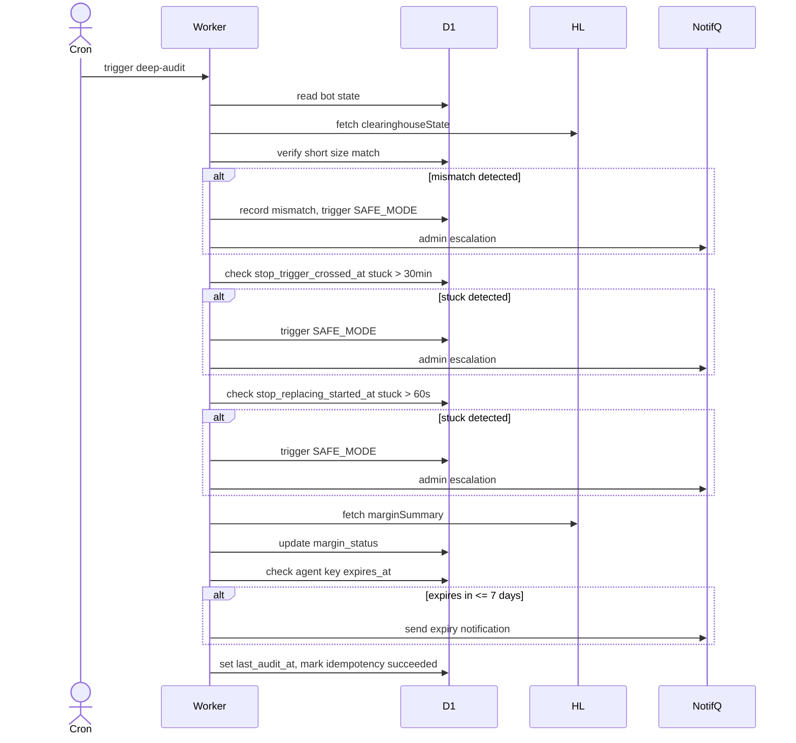

# UC-EXBOT-deep-audit: Periodic Deep Audit and Backstop SAFE_MODE Detection

## Trigger

Cron scheduler (system-initiated, background worker).

---

## 1. Actors
- **Primary:** ExBot System Operator (Deep-Audit Worker)
- **System:** D1, Hyperliquid, Notification Queue

## 2. Preconditions
- `deep-audit` cron fires per schedule:
  - **Normal:** every 6 hours for all bots with `status IN ('active','paused')`
  - **High-risk mode:** every 1 hour when `circuit_breakers.state != 'closed'` OR `margin_status IN ('warning','critical')`

## 3. Main Success Scenario
1. Worker reads bot state from D1: `bots.status`, `bots.lifecycle_state`, `hedge_legs`, `circuit_breakers.state`, `margin_status`
2. Worker fetches `clearinghouseState` from HL (weight=2; gated by HLRateLimitDO FR-EXBOT-091)
3. Verify actual short size from HL matches `hedge_legs.last_known_hl_short_size` — if mismatch: record mismatch in D1, trigger SAFE_MODE entry (see A3)
4. Detect `stop_trigger_crossed_at` set AND `(now − stop_trigger_crossed_at) > 30 minutes` — if true: trigger SAFE_MODE entry (see A4)
5. Detect `stop_replacing_started_at` set AND `(now − stop_replacing_started_at) > 60 seconds` — if true: trigger SAFE_MODE entry; secondary backstop detection path per FR-EXBOT-033 (see A4)
6. Fetch `marginSummary` from HL; update `hedge_legs.margin_status` from fresh HL data
7. Check `hl_agent_keys.expires_at − now <= 7 days` — if true: enqueue notification via `notification` queue: "Your HL agent key expires in {N} days. Submit a new key to avoid bot interruption." (FR-EXBOT-083)
8. Update D1 audit timestamp: `hedge_legs.last_audit_at = now`
9. Insert `queue_idempotency` row: `state='succeeded'`

## 4. Alternate Flows
- **A1 (HL unreachable):** Step 2 — HLRateLimitDO returns `{allowed: false}` or HL API returns 5xx; skip HL-dependent steps (2, 3, 4, 6, 7); update cadence to high-risk interval (1 hour); enqueue notification "Hyperliquid API unreachable"; record retry-pending state
- **A2 (bot status='paused'):** Full audit still runs at 6-hour cadence — pause does NOT skip deep-audit scheduling. All detection paths (steps 3–7) execute normally
- **A3 (reconcile mismatch detected):** Step 3 — actual short size ≠ `last_known_hl_short_size`; record mismatch in D1; trigger SAFE_MODE entry; enqueue admin notification with size delta
- **A4 (stuck stop marker detected):** Step 4 or 5 — trigger SAFE_MODE entry; enqueue admin escalation notification with timestamp and reason ("stop_trigger_crossed_at stuck > 30min" or "stop_replacing_started_at stuck > 60s")

## 5. Postconditions
- `hedge_legs.margin_status` updated from fresh HL `marginSummary`
- `hedge_legs.last_audit_at` set to current timestamp
- Bot enters SAFE_MODE if any detection condition is met (steps 3, 4, 5)
- Expiring agent key notifications enqueued (step 7)
- `queue_idempotency` row marked `succeeded`

---

## Postconditions

- System state reflects the completed audit
- All three detection paths (mismatch, stuck stop_trigger, stuck stop_replacing) are evaluated per audit cycle
- Relevant notifications and admin escalations enqueued
- Audit timing recorded for traceability (NFR-ADM-005)

## 6. Business Rules
- BR-EXBOT-003 does NOT apply here — deep-audit IS permitted to call HL API (HL weight ≠ 0 for deep-audit)
- Deep-audit is the backstop; light-check (primary ≤5 min detection, FR-EXBOT-012) is the fast path for stop_replacing_started_at overrun
- Deep-audit continues for paused bots — pause ≠ skip audit
- Cron cadence switches to high-risk (1 hour) when ANY of: circuit_breakers.state != 'closed', margin_status='warning', margin_status='critical'

---

## Diagram

> **No diagram yet.** Add a Mermaid sequence diagram or PlantUML flow chart documenting the audit sequence and detection paths.

## 7. FR Trace
FR-EXBOT-016, FR-EXBOT-033, FR-EXBOT-083
