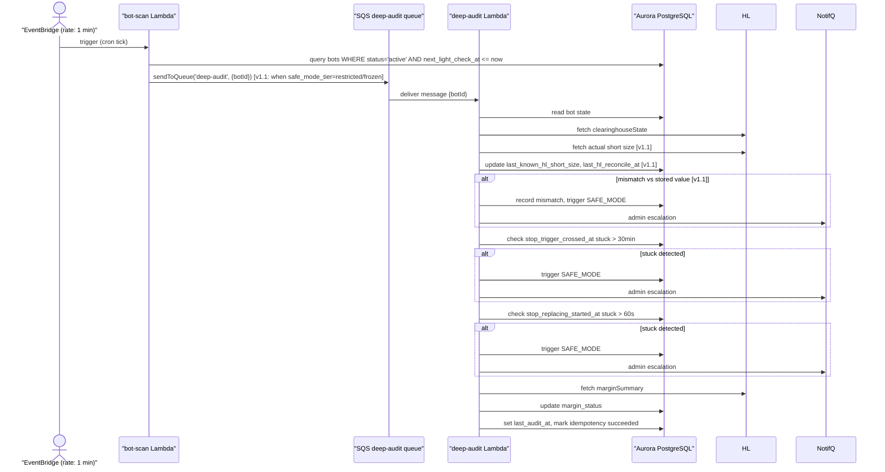

# UC-EXBOT-deep-audit: Periodic Deep Audit and Backstop SAFE_MODE Detection

## Trigger

**v1 (current):** System-initiated via SQS. `bot-scan` Lambda (triggered by EventBridge Scheduler at `rate(1 minute)`) queries `bots WHERE status='active' AND next_light_check_at <= now`, then fan-outs one SQS message per bot into the `deep-audit` queue. Deep-audit Lambda receives one `botId` per invocation and processes that single bot.

In v1, `bot_runtime_state.safe_mode_tier` column does not yet exist — `isSafeModeBlocking()` always returns `false`, so **no bot is currently routed to deep-audit via the cron path**. Deep-audit queue exists and is operational but receives no automatic messages in v1.

**v1.1 (planned):** When `safe_mode_tier` column lands, bot-scan will route bots with `safe_mode_tier IN ('restricted','frozen')` to deep-audit instead of light-check. Periodic 6-hour cadence via `bots.next_deep_audit_at` is schema-ready (field and index exist) but not yet read by any worker.

---

## 1. Actors
- **Primary:** ExBot System Operator (Deep-Audit Worker)
- **System:** bot-scan Lambda (upstream dispatcher), SQS deep-audit queue, Aurora PostgreSQL, Hyperliquid, Notification Queue

## 2. Preconditions
- Deep-audit Lambda receives a SQS message from bot-scan with a valid `botId`
- **v1:** bot-scan only dispatches to deep-audit when `safe_mode_tier IN ('restricted','frozen')` — this path is inactive in v1 because `safe_mode_tier` column does not yet exist in `bot_runtime_state`
- **v1.1 (planned):** periodic cadence controlled via `bots.next_deep_audit_at` — after each invocation, Lambda writes `now+6h` (normal completion) or `now+1h` (HL unreachable or high-risk condition detected); bot-scan queries `WHERE status='active' AND next_deep_audit_at <= now` (via `idx_bots_due_audit`) every minute and fan-outs per-bot SQS message

## 3. Main Success Scenario
1. Worker reads bot state from Aurora PostgreSQL: `bots.status`, `bots.lifecycle_state`, `hedge_legs`, `circuit_breakers.state`, `margin_status`
2. Worker fetches `clearinghouseState` from HL (weight=2; gated by HL Rate Limiter (ElastiCache Redis) FR-EXBOT-091)
3. *(v1.1 planned)* Fetch actual short size from HL; update `bot_runtime_state.last_known_hl_short_size = actual size`, `last_hl_reconcile_at = now` — regardless of match result; if mismatch vs stored value: record mismatch in Aurora PostgreSQL, trigger SAFE_MODE entry (see A3)
4. Detect `stop_trigger_crossed_at` set AND `(now − stop_trigger_crossed_at) > 30 minutes` — if true: trigger SAFE_MODE entry (see A4)
5. Detect `stop_replacing_started_at` set AND `(now − stop_replacing_started_at) > 60 seconds` — if true: trigger SAFE_MODE entry; secondary backstop detection path per FR-EXBOT-033 (see A4)
6. Fetch `marginSummary` from HL; update `hedge_legs.margin_status` from fresh HL data
7. Update Aurora PostgreSQL audit timestamp: `hedge_legs.last_audit_at = now`
8. Insert `queue_idempotency` row: `state='succeeded'`

## 4. Alternate Flows
- **A1 (HL unreachable):** Step 2 — HL Rate Limiter (ElastiCache Redis) returns `{allowed: false}` or HL API returns 5xx; skip HL-dependent steps (2, 3, 4, 6, 7); enqueue notification "Hyperliquid API unreachable"; record retry-pending state. *(v1.1 planned)* Lambda writes `bots.next_deep_audit_at = now + 1h` (per-bot high-risk cadence); bot-scan picks it up via `idx_bots_due_audit` on next tick
- **A2 (bot status='paused'):** *(v1.1 planned)* Full audit still runs at 6-hour cadence — pause does NOT skip deep-audit scheduling. All detection paths (steps 3–7) execute normally, including stuck marker detection (steps 4–5); if triggered, bot transitions from `paused` to `safe_mode`. *(v1 note: bot-scan query is `status='active'` only — paused bots are not currently scanned)*
- **A3 (reconcile mismatch detected):** Step 3 — actual short size ≠ stored value; update `bot_runtime_state.last_known_hl_short_size = actual size`, `last_hl_reconcile_at = now`; record mismatch in Aurora PostgreSQL; trigger SAFE_MODE entry; enqueue admin notification with size delta
- **A4 (stuck stop marker detected):** Step 4 or 5 — trigger SAFE_MODE entry; enqueue admin escalation notification with timestamp and reason (E-EXBOT-019: "stop_trigger_crossed_at stuck > 30min"; E-EXBOT-020: "stop_replacing_started_at stuck > 60s")

## 5. Postconditions
- `hedge_legs.margin_status` updated from fresh HL `marginSummary`
- `hedge_legs.last_audit_at` set to current timestamp
- Bot enters SAFE_MODE if any detection condition is met (steps 3, 4, 5)
- `queue_idempotency` row marked `succeeded`

---

## 6. Business Rules
- BR-EXBOT-003 does NOT apply here — deep-audit IS permitted to call HL API (HL weight ≠ 0 for deep-audit)
- Deep-audit is the backstop; light-check (primary ≤5 min detection, FR-EXBOT-012) is the fast path for stop_replacing_started_at overrun
- *(v1.1 planned)* Deep-audit continues for paused bots — pause ≠ skip audit
- *(v1.1 planned)* Cadence switching is per-bot via `bots.next_deep_audit_at`: Lambda writes `now+1h` when HL unreachable or high-risk condition detected (`circuit_breakers.state != 'closed'` OR `margin_status IN ('warning','critical')`), `now+6h` on normal completion. EventBridge does NOT self-switch — no EventBridge API call needed; `idx_bots_due_audit(status, next_deep_audit_at)` already exists in v1 schema

---

## Diagram

> **No diagram yet.** Add a Mermaid sequence diagram or PlantUML flow chart documenting the audit sequence and detection paths.

```mermaid
sequenceDiagram
    actor EB as "EventBridge (rate: 1 min)"
    participant BotScan as "bot-scan Lambda"
    participant SQS as "SQS deep-audit queue"
    participant Worker as "deep-audit Lambda"
    participant AuroraDB as "Aurora PostgreSQL"
    participant HL
    participant NotifQ
    EB->>BotScan: trigger (cron tick)
    BotScan->>AuroraDB: query bots WHERE status='active' AND next_light_check_at <= now
    BotScan->>SQS: sendToQueue('deep-audit', {botId}) [v1.1: when safe_mode_tier=restricted/frozen]
    SQS->>Worker: deliver message {botId}
    Worker->>AuroraDB: read bot state
    Worker->>HL: fetch clearinghouseState
    Worker->>HL: fetch actual short size [v1.1]
    Worker->>AuroraDB: update last_known_hl_short_size, last_hl_reconcile_at [v1.1]
    alt mismatch vs stored value [v1.1]
        Worker->>AuroraDB: record mismatch, trigger SAFE_MODE
        Worker->>NotifQ: admin escalation
    end
    Worker->>AuroraDB: check stop_trigger_crossed_at stuck > 30min
    alt stuck detected
        Worker->>AuroraDB: trigger SAFE_MODE
        Worker->>NotifQ: admin escalation
    end
    Worker->>AuroraDB: check stop_replacing_started_at stuck > 60s
    alt stuck detected
        Worker->>AuroraDB: trigger SAFE_MODE
        Worker->>NotifQ: admin escalation
    end
    Worker->>HL: fetch marginSummary
    Worker->>AuroraDB: update margin_status
    Worker->>AuroraDB: set last_audit_at, mark idempotency succeeded
```

## 7. FR Trace
FR-EXBOT-016, FR-EXBOT-033

> **v1 Implementation Note:** Deep-audit queue is deployed and operational. In v1, no bot is automatically routed to deep-audit — `safe_mode_tier` column (`bot_runtime_state`) and periodic `next_deep_audit_at` wiring are both pending v1.1. Steps 1–8 above describe the v1.1 target behavior. Phase A testing for deep-audit is deferred to v1.1.
