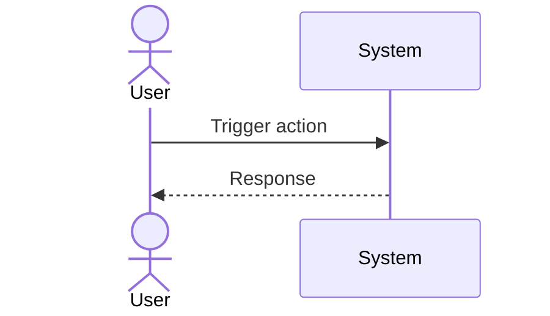

# UC-EXBOT-light-check: Execute Periodic Light-Check

## Trigger

User navigates to the relevant screen or initiates the described action.

---

## 1. Actors
- **Primary:** ExBot System Operator (Cron Worker → Scan Worker → Light-Check Worker)
- **System:** D1 (state_db_shard), MarketDataDO

## 2. Preconditions
- Bot `status='active'` and `next_light_check_at <= now`
- `lifecycle_state NOT IN ('lp_rebalancing','lp_closing')`
- `status != 'paused'`
- Note: bots with `lifecycle_state='hedge_stopped_cooldown'` are NOT skipped — light-check runs normally; hedge-sync is suppressed only for those bots.

## 3. Main Success Scenario
1. Cron Worker (1 min) calls `chunkSendBatch` to `bot-scan` queue with shard windows
2. Scan Worker queries D1: `SELECT * FROM bots WHERE status='active' AND next_light_check_at <= now LIMIT 500`
3. Scan Worker sends per-bot messages to `light-check` queue via `chunkSendBatch`
4. Scan Worker batch-updates `next_light_check_at = now + 5min + jitter(±45s)` (1 stmt per shard)
5. Light-Check Worker inserts `message_id` into `queue_idempotency` (state='started'); UNIQUE conflict → skip
6. Light-Check Worker reads from D1: `bot_runtime_state.last_known_hl_short_size`, `lifecycle_state`, `hedge_legs` (stop_price, margin_status, circuit_state)
7. Light-Check Worker reads from `MarketDataDO`: `sqrtPriceX96`, `currentTick` (zero HL API calls)
8. Computes `lpEthAmount` via TickMath + LiquidityAmounts (local, no RPC)
9. Evaluates `RebalanceReason[]` using only D1 + MarketDataDO state
10. If reasons include `range_out`: set `lifecycle_state='lp_rebalancing'`; enqueue `lp_rebalancing` message + `partial_repair`. Other reasons AND `circuit_state != 'open'`: enqueue `hedge-sync` with `{botId, reasons, stateVersion}`
11. If `markPrice >= stop_price`: set `stop_trigger_crossed_at` (guarded); enqueue `price-near-stop-audit`
    - Note: `hlMarkPrice` source TBD pending OQ-EXBOT-017; candidate: `bot_runtime_state.eth_price_usd`
12. Check `stop_replacing_started_at`: if set and overrun > 60s → enqueue `partial_repair(reason='stop_replacing_overrun')`; set `lifecycle_state='safe_mode'`
13. Update `queue_idempotency.state='succeeded'`

## 4. Alternate Flows
- **A1 (circuit open):** Step 10 — suppress hedge-sync; continue to step 11 (stop monitoring always runs)
- **A2 (circuit half_open):** Step 10 — atomically claim `half_open_probe_used`; enqueue one probe hedge-sync
- **A3 (stop trigger crossed_at already set):** Step 11 — do NOT overwrite; still enqueue price-near-stop-audit
- **A4 (range_boundary_near):** `range_boundary_near` is a `RebalanceReason[]` → routed to hedge-sync (not price-near-stop-audit). `price-near-stop-audit` is only for `stop_trigger_crossed`.

## 5. Postconditions
- One of: no action needed, hedge-sync enqueued, or price-near-stop-audit enqueued
- `next_light_check_at` updated in D1 (batch write per shard)
- HL API call count: 0 (invariant)

## 6. Business Rules
- BR-EXBOT-003 (HL weight = 0), BR-EXBOT-005 (stop_trigger_crossed_at write-once)

---

## Diagram

> **No diagram yet.** Add a Mermaid sequence diagram or PlantUML flow chart documenting the actor-system interaction for this use case.

## 7. FR Trace
FR-EXBOT-013, FR-EXBOT-014, FR-EXBOT-015, FR-EXBOT-016, FR-EXBOT-023, FR-EXBOT-032, FR-EXBOT-033
