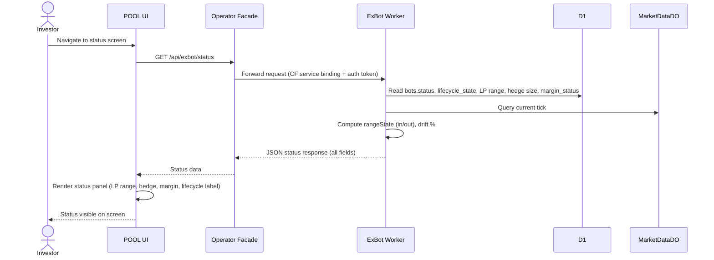

# UC-EXBOT-monitor-status: View Active ExBot Status

## Trigger

Investor navigates to the ExBot status screen in the POOL UI.

---

## 1. Actors
- **Primary:** USDC Investor (read-only)
- **System:** Operator Facade Worker, ExBot Worker, D1

## 2. Preconditions
- Investor is authenticated and has an active ExBot
- Operator Facade service is available with valid CF service binding to ExBot Worker

## 3. Main Success Scenario
1. POOL UI calls `GET /api/exbot/status` via Operator Facade
2. Operator Facade forwards request to ExBot Worker via CF service binding with internal auth token
3. ExBot Worker reads from D1:
   - `bots.status`, `lifecycle_state`
   - `bot_runtime_state.last_known_hl_short_size` (actual hedge size)
   - `positions.tickLower`, `positions.tickUpper` (LP range)
   - `hedge_legs.margin_status`
   - `next_light_check_at` (last light-check timestamp)
4. ExBot Worker queries current tick from MarketDataDO
5. ExBot Worker computes `rangeState` by comparing current tick against `tickLower`/`tickUpper` (in-range or out-of-range)
6. ExBot Worker computes drift %: `(|actualShortEth - targetShortEth| / targetShortEth) × 100`
7. ExBot Worker composes JSON status response with all fields
8. Response returned to Operator Facade → POOL UI
9. POOL UI renders ExBot status panel:
   - Status label (Active/Safe Mode/Cooldown)
   - LP range (tickLower/tickUpper), current tick
   - Range state indicator (in/out)
   - Current hedge size (ETH), target hedge size, drift %
   - Margin status (ok/warning/critical)
   - Last light-check timestamp
10. Investor views complete bot status

## 4. Alternate Flows
- **A1 (status='safe_mode'):** Response includes `safe_mode_reason`; UI displays "Safe Mode — No new actions" banner; all mutation buttons disabled except "Close Bot (emergency)"
- **A2 (lifecycle_state='hedge_stopped_cooldown'):** Response includes cooldown end timestamp; UI displays "Stop Fired — Cooldown (Xh remaining)" with explanation
- **A3 (lifecycle_state='cooldown' after bot_safe_close):** UI displays "Bot safely closed. USDC parked. Re-entry will be attempted automatically."
- **A4 (no active bot for user):** 404 response; UI shows empty state "No active bot"
- **A5 (Operator Facade unavailable):** 503 Service Unavailable; UI shows error banner "Status service temporarily unavailable"

## 5. Postconditions
- Investor successfully views current ExBot status including LP range, hedge size, margin health, and lifecycle state
- All displayed data reflects the latest state from D1 and current market data (current tick)

---

## Business Rules
- BR-EXBOT-007 (SAFE_MODE is not a terminal state)

---

## Diagram

## 6. FR Trace
FR-EXBOT-002, FR-EXBOT-003, FR-EXBOT-090
