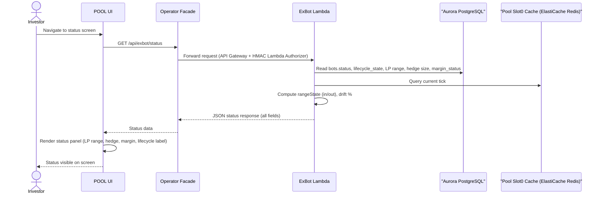

# UC-EXBOT-monitor-status: View Active ExBot Status

## Trigger

Investor navigates to the ExBot status screen in the POOL UI.

---

## 1. Actors
- **Primary:** USDC Investor (read-only, must match `bot.user_wallet_address`)
- **Secondary:** Admin (read-only, bypasses wallet ownership check)
- **System:** Operator Facade, ExBot Lambda, Aurora PostgreSQL

## 2. Preconditions
- Caller is authenticated via `X-Wallet-Address` header (Investor or Admin)
- Investor: `wallet_address` must match `bot.user_wallet_address`; Admin: bypasses ownership check
- Operator Facade validates `X-Wallet-Address`: missing → 401; blocked → 403; not in whitelist (when `access_mode=whitelist`) → 403
- Operator Facade forwards request to ExBot Lambda via API Gateway; HMAC Lambda Authorizer validates the request signature; invalid/missing signature → 401
- Operator Facade service is available with a valid API Gateway route to ExBot Lambda

## 3. Main Success Scenario
1. POOL UI calls `GET /api/exbot/status` via Operator Facade
2. Operator Facade forwards request to ExBot Lambda via API Gateway with HMAC Lambda Authorizer
3. ExBot Lambda reads from Aurora PostgreSQL:
   - `bots.status`, `lifecycle_state`
   - `bot_runtime_state.last_known_hl_short_size` (actual hedge size)
   - `bot_runtime_state.lp_eth_amount` (required to compute targetShortEth per FR-EXBOT-021)
   - `bot_runtime_state.last_light_check_at` (last completed light-check timestamp)
   - `positions.tickLower`, `positions.tickUpper` (LP range)
   - `hedge_legs.target_ratio` (required to compute targetShortEth per FR-EXBOT-021)
   - `hedge_legs.margin_status`
4. ExBot Lambda queries current tick from the Pool Slot0 Cache (ElastiCache Redis). If the cache is unavailable or the snapshot is stale → `current_tick: null`, `range_state: null`; remaining fields returned normally (no block, no retry)
5. ExBot Lambda computes `rangeState` by comparing current tick against `tickLower`/`tickUpper` (in-range or out-of-range). If `current_tick = null` → `range_state: null`, skip computation
6. ExBot Lambda computes drift %: `(|actualShortEth - targetShortEth| / targetShortEth) × 100`. `targetShortEth` is computed as `lp_eth_amount × (target_ratio_bps / 10000)` per FR-EXBOT-021 (not read from a stored column). If `lp_eth_amount = 0` or `null` → `drift_pct = null` (no division by zero)
7. ExBot Lambda composes JSON status response:

   **Implemented fields:**
   ```json
   {
     "bot_id": "string",
     "status": "string",
     "lifecycle_state": "string",
     "safe_mode_tier": "string | null",
     "runtime_health_status": "string",
     "last_reconcile_at": "string | null",
     "last_error_code": "string | null",
     "dry_run": "boolean"
   }
   ```

   **Pending implementation (BA-defined):**
   ```json
   {
     "tick_lower": "number | null",
     "tick_upper": "number | null",
     "current_tick": "number | null",
     "range_state": "\"in\" | \"out\" | null",
     "actual_short_eth": "string | null",
     "target_short_eth": "string | null",
     "drift_pct": "number | null",
     "margin_status": "\"ok\" | \"warning\" | \"critical\" | null",
     "last_light_check_at": "string | null",
     "safe_mode_reason": "string | null",
     "cooldown_end_at": "string | null"
   }
   ```

   Null-handling: all pending fields **must be present** in the JSON response with value `null` until implemented — they must **not** be omitted from the response. ETH amounts use `string` to avoid floating-point precision loss. Timestamps use ISO 8601 string.

   > **Tester note:** assertions must verify that each pending field is present with value `null`, not absent from the response. A missing field and a `null` field are two different behaviors.
8. Response returned to Operator Facade → POOL UI
9. POOL UI renders ExBot status panel:
   - Status label (Active / Safe Mode / Stop Fired — Cooldown / Rebalancing / Closing / Closed / Error)
   - LP range (tickLower/tickUpper), current tick
   - Range state indicator (in/out)
   - Current hedge size (ETH), target hedge size, drift %
   - Margin status (ok/warning/critical)
   - Last light-check timestamp
10. Investor views complete bot status

## 4. Alternate Flows
- **A1 (status='safe_mode'):** Response includes `safe_mode_reason`; UI displays "Safe Mode — No new actions" banner; all mutation buttons disabled except "Close Bot (emergency)"
- **A2 (lifecycle_state='hedge_stopped_cooldown'):** Response includes cooldown end timestamp; UI displays "Stop Fired — Cooldown (Xh remaining)" with explanation; mutation buttons disabled
- **A3a (lifecycle_state='lp_closing'):** Bot close is in progress; UI displays "Bot close is in progress. Please wait." (E-EXBOT-021); all mutation buttons disabled
- **A3b (lifecycle_state='closed'):** Bot fully closed; record still exists in Aurora PostgreSQL; 200 response with `lifecycle_state='closed'`; UI displays "Bot safely closed. Funds have been returned to your wallet." (E-EXBOT-022); all mutation buttons disabled
- **A6 (lifecycle_state='lp_rebalancing'):** LP range rebalance in progress; 200 response with `lifecycle_state='lp_rebalancing'`; UI displays "Rebalancing in progress"; all mutation buttons disabled
- **A7 (status='error'):** Bot error requiring admin intervention; 200 response with `status='error'`; UI displays E-EXBOT-029; only "Close Bot (emergency)" enabled
- **A8 (Pool Slot0 Cache unavailable or stale):** Step 4 — `current_tick: null`, `range_state: null` returned in response; all other fields returned normally; no 503, no retry. UI displays "—" for range state indicator
- **A9 (wallet mismatch):** Investor `wallet_address` does not match `bot.user_wallet_address` → 403 (E-EXBOT-030); UI displays "Access denied: this bot does not belong to your account."
- **A4 (no bot record found for botId):** 404 response (E-EXBOT-023); UI shows empty state "No active bot found for this account." Note: `closed` bots return 200 (record retained in Aurora PostgreSQL), not 404
- **A5 (Operator Facade unavailable):** 503 Service Unavailable — AWS/infra-level response (API Gateway or Lambda cold-start/throttle), not application-defined; no E-EXBOT code required. UI shows error banner "Status service temporarily unavailable"

## 5. Postconditions
- Investor successfully views current ExBot status including LP range, hedge size, margin health, and lifecycle state
- All displayed data reflects the latest state from Aurora PostgreSQL and current market data (current tick)

---

## Business Rules
- BR-EXBOT-007 (SAFE_MODE is not a terminal state)

---

## Diagram


```mermaid
sequenceDiagram
    actor Investor
    participant PoolUI as POOL UI
    participant OpFacade as Operator Facade
    participant ExBotLambda as ExBot Lambda
    participant AuroraDB as "Aurora PostgreSQL"
    participant SlotCache as "Pool Slot0 Cache (ElastiCache Redis)"
    
    Investor->>PoolUI: Navigate to status screen
    PoolUI->>OpFacade: GET /api/exbot/status
    OpFacade->>ExBotLambda: Forward request (API Gateway + HMAC Lambda Authorizer)
    ExBotLambda->>AuroraDB: Read bots.status, lifecycle_state, LP range, hedge size, margin_status
    ExBotLambda->>SlotCache: Query current tick
    ExBotLambda->>ExBotLambda: Compute rangeState (in/out), drift %
    ExBotLambda-->>OpFacade: JSON status response (all fields)
    OpFacade-->>PoolUI: Status data
    PoolUI->>PoolUI: Render status panel (LP range, hedge, margin, lifecycle label)
    PoolUI-->>Investor: Status visible on screen
```

## 6. FR Trace
FR-EXBOT-002, FR-EXBOT-003, FR-EXBOT-021, FR-EXBOT-050, FR-EXBOT-060, FR-EXBOT-090, FR-EXBOT-093
