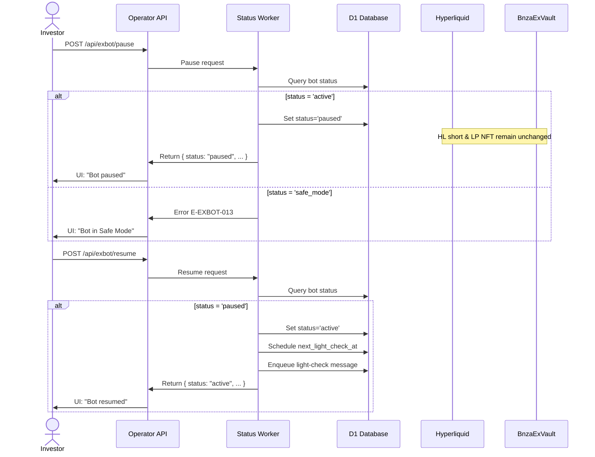

# UC-EXBOT-pause-resume: Pause and Resume Bot

## Trigger

Investor initiates pause or resume action via Operator API endpoints or UI.

---

## 1. Actors

- **Primary:** USDC Investor (pause/resume requester)
- **Secondary:** ExBot System Operator (status update worker)
- **System:** Hyperliquid (HL short position read-only), BnzaExVault (LP NFT read-only), D1

---

## 2. Preconditions

### For Pause Flow
- Bot exists with `bots.status='active'`
- Bot has `bots.lifecycle_state='active'` (fully initialized)
- Bot is NOT in `status='safe_mode'` (error E-EXBOT-013 if attempted)

### For Resume Flow
- Bot exists with `bots.status='paused'`
- Bot's `lifecycle_state` is unchanged from its pre-pause value (preserved in D1)

---

## 3. Main Success Scenario — Pause Flow

1. Investor requests pause via `POST /api/exbot/pause` with `botId`
2. Status update worker queries D1: verify `bots.status='active'` and `lifecycle_state='active'`
3. Worker sets `bots.status='paused'` and persists atomically to D1
4. Worker does NOT modify `bots.lifecycle_state` — it remains at pre-pause value (e.g., `'active'`)
5. Existing HL short position (`hedge_legs.last_known_hl_short_size`) remains untouched
6. Existing LP NFT (`positions.token_id`) remains intact
7. Operator API returns status response: `{ status: "paused", message: "Paused — hedge is maintained, LP is maintained" }`
8. Investor receives UI confirmation: "Bot paused. Hedge and LP are maintained."

---

## 4. Main Success Scenario — Resume Flow

1. Investor requests resume via `POST /api/exbot/resume` with `botId`
2. Status update worker queries D1: verify `bots.status='paused'`
3. Worker restores `bots.status='active'` and persists atomically to D1
4. Worker reads pre-pause `lifecycle_state` from D1 (unchanged) — confirms it matches expected state (e.g., `'active'`)
5. Worker schedules next light-check: set `bot_runtime_state.next_light_check_at` to `now + 5min + jitter(−45s, +45s)` and enqueues `light-check` message
6. Operator API returns status response: `{ status: "active", message: "Bot resumed. Monitoring resumed." }`
7. Investor receives UI confirmation: "Bot resumed. Monitoring will resume shortly."

---

## 5. Alternate Flows

**A1 — Pause Rejected in SAFE_MODE:**
- Precondition: bot `status='safe_mode'`
- Worker queries D1, finds `bots.status='safe_mode'`
- Worker returns error: HTTP 409, message E-EXBOT-013 "Bot is in Safe Mode. You can close the bot instead."
- No state change occurs

**A2 — Resume on Already-Active Bot:**
- Precondition: bot `status='active'` (not paused)
- Worker queries D1, finds `bots.status='active'`
- Worker returns success response (idempotent): "Bot already active. No change needed."
- No state change occurs

**A3 — Pause on Already-Paused Bot:**
- Precondition: bot `status='paused'` (already paused)
- Worker queries D1, finds `bots.status='paused'`
- Worker returns success response (idempotent): "Bot already paused. No change needed."
- No state change occurs

---

## 6. Suppression Behavior During Pause

While bot is in `status='paused'`:

- **Light-check:** Worker skips entirely (FR-EXBOT-012: `status='paused'` → skip light-check)
  - No `hedge-sync` messages are enqueued
  - No rebalance checks (`drift_threshold`, `range_out`, etc.) are evaluated
  
- **Hedge-sync:** No hedge adjustments are triggered or processed

- **Deep-audit:** Continues on its normal 6-hour cadence (or 1-hour high-risk cadence)
  - Worker fetches HL state and updates margin status
  - Any anomalies (e.g., stop stuck > 30 min) are detected and reported
  - SAFE_MODE entry conditions remain active

---

## 7. Postconditions

### After Successful Pause
- `bots.status='paused'` persisted in D1
- `bots.lifecycle_state` unchanged (e.g., still `'active'`)
- HL short position maintained at current size
- LP NFT maintained at current token ID
- Investor receives UI confirmation
- Audit log entry recorded: "Bot paused by investor"

### After Successful Resume
- `bots.status='active'` persisted in D1
- `bots.lifecycle_state` confirmed unchanged
- `bot_runtime_state.next_light_check_at` scheduled within 5 minutes
- `light-check` message enqueued for next cycle
- Investor receives UI confirmation
- Audit log entry recorded: "Bot resumed by investor"

---

## 8. Business Rules

- **BR-EXBOT-002:** Pause ≠ Close. Pause preserves hedge and LP intact; only suppresses new mutations. Close liquidates everything. UI must use distinct labels and messaging.

---

## Diagram

---

## 9. FR Trace

**FR-EXBOT-005** — Pause / Resume Bot
- Main Success Scenario (Pause/Resume flows) captures pause mechanics, status field mutation, position preservation, API response
- Acceptance criteria "Paused bot shows status" reflected in step 7 (Pause) and step 6 (Resume)

**FR-EXBOT-012** — Light-Check (Zero HL API Calls)
- Section 5 "Suppression Behavior During Pause" reflects FR-EXBOT-012 rule: skip light-check for `status='paused'`

**US-EXBOT-003** — Pause and resume ExBot
- AC-EXBOT-003-1 (happy path pause) → Main Success Scenario Pause Flow
- AC-EXBOT-003-2 (happy path resume) → Main Success Scenario Resume Flow
- AC-EXBOT-003-3 (deep-audit continues) → Section 6 "Suppression Behavior" note on deep-audit
- AC-EXBOT-003-4 (pause rejected in SAFE_MODE) → Alternate Flow A1
