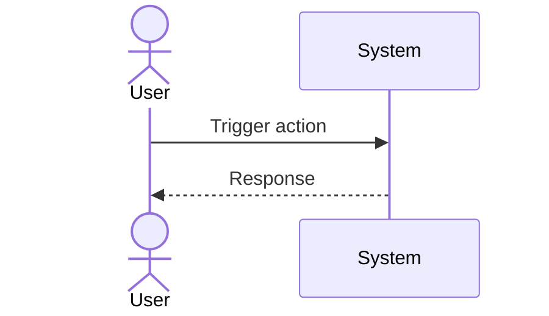

# UC-EXBOT-user-redeem: User-Initiated Redemption (LP-First)

## Trigger

User navigates to the relevant screen or initiates the described action.

---

## 1. Actors
- **Primary:** USDC Investor (on-chain tx + POOL UI)
- **System:** BnzaExVault (Solidity), Redeem Event Watcher, user_redeem Worker, Hyperliquid

## 2. Preconditions
- Bot `status='active'` (or paused/safe_mode — user may redeem from any non-closed state)
- Investor holds LP NFT redemption rights via BnzaExVault

## 3. Main Success Scenario
1. Investor calls `BnzaExVault.redeem(tokenId)` on-chain
2. BnzaExVault instantly liquidates LP (decreaseLiquidity 100% + collect + swap to USDC)
3. LP-portion USDC transferred to investor's wallet **in the same on-chain transaction** (on-chain guarantee)
4. `RedemptionEvent(botId, redeemTxHash, userAddress)` emitted
5. Redeem Event Watcher detects event; enqueues to `user_redeem` queue (highest priority)
6. Redeem Worker inserts `message_id` into `queue_idempotency` (started); UNIQUE conflict → skip
7. Redeem Worker creates `close_operations` row (kind='user_redeem', state='lp_closed→funds_returned')
8. Redeem Worker acquires `UserLockDO` lease for this user
9. Redeem Worker calls HL full close (`closeShortReduceOnlyIoc`, cloid)
10. Cancels existing stop via `§19.5 replaceStopProtected` with size=0
11. Reconcile: verify HL position size = 0
12. Update `close_operations.state='hedge_closed'`
13. Send HL-portion USDC to investor (tracked in `RedemptionQueue` ledger)
14. Update `close_operations.state='done'`; `bots.lifecycle_state='closed'`
15. Update `queue_idempotency.state='succeeded'`

## 4. Alternate Flows
- **A1 (SLA breach — hedge not closed within 5 min):** Admin alert: "user_redeem SLA breached for bot {id}"; LP-portion repayment NOT reverted
- **A2 (HL hedge close fails):** `close_operations.state='residual_hl_liability'`; admin notified with amount; LP-portion repayment NOT reversed
- **A3 (duplicate message delivery):** Step 6 — `queue_idempotency` UNIQUE conflict → return immediately

## 5. Postconditions
- `bots.lifecycle_state='closed'`
- LP-portion USDC already in investor wallet (on-chain guarantee from step 3)
- HL-portion USDC sent post-hedge-close
- `close_operations.state='done'` or `'residual_hl_liability'`

---

## Postconditions

- System state reflects the completed operation
- Relevant audit log entries recorded (NFR-ADM-005)
- Affected bot state transitions persisted in D1

## 6. Business Rules
- BR-EXBOT-006 (LP repayment unconditional — never blocked by hedge close failure)

---

## Diagram

> **No diagram yet.** Add a Mermaid sequence diagram or PlantUML flow chart documenting the actor-system interaction for this use case.

## 7. FR Trace
FR-EXBOT-070, FR-EXBOT-071
