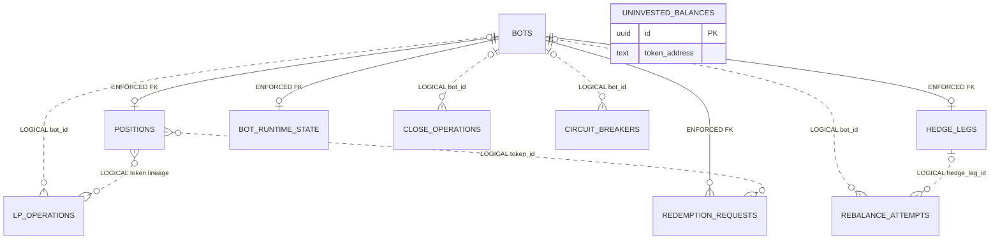
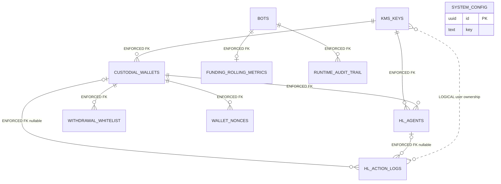
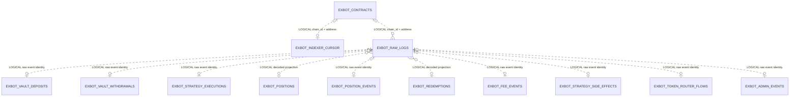
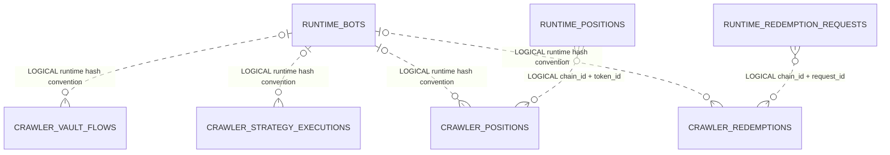
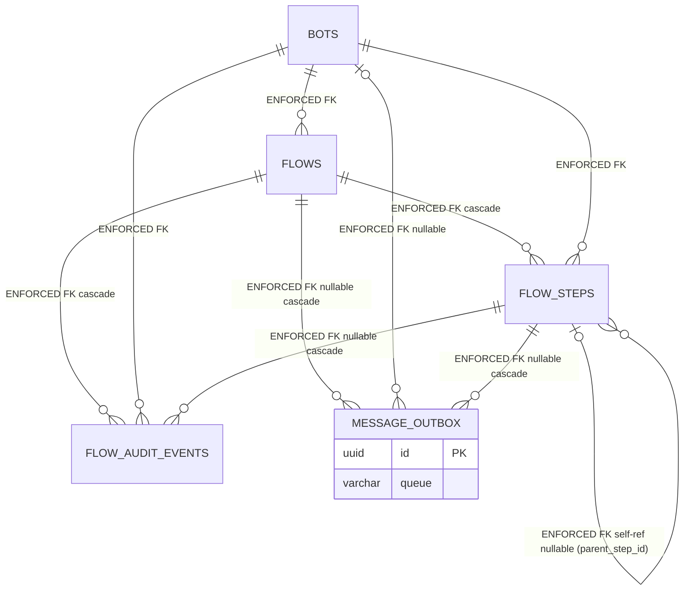

# EXBOT PostgreSQL Database ERD

## Scope and purpose

This document describes the canonical **desired** PostgreSQL application model shared by the EXBOT runtime and the EXBOT on-chain crawler. It covers 36 `public` application tables: **23 runtime tables** and **13 crawler tables**. Drizzle's `drizzle.__drizzle_migrations` bookkeeping table is separate and is not included in that count.

> **Desired model, not deployed-state evidence.** The TypeScript Drizzle schema is authoritative for the desired application model documented here. Repository migrations and bootstrap SQL show intended physical changes, but no live database was inspected. They do not prove the schema, migration history, data, indexes, or constraints of any deployed database.

Source priority:

1. [`packages/exbot-shared/src/db/schema/index.ts`](../../packages/exbot-shared/src/db/schema/index.ts) and its imported modules define the desired 36-table model.
2. [`packages/exbot-shared/drizzle/meta/_journal.json`](../../packages/exbot-shared/drizzle/meta/_journal.json) and the SQL files it references define what the standard Drizzle migrator applies. An SQL file merely being present in `drizzle/` does not make it executable migration history.
3. [`apps/bnza-exbot-crawler/db/init/001_exbot_crawler_schema.sql`](../../apps/bnza-exbot-crawler/db/init/001_exbot_crawler_schema.sql) is a generated, idempotent crawler bootstrap derived from migration `0001`; it is not an independent schema authority.

## Legend

| Notation | Meaning |
|---|---|
| PK | PostgreSQL primary key constraint. |
| UK | PostgreSQL unique constraint or unique index; the constraints line identifies which. |
| IX | Non-unique index. Composite columns are shown in index order; partial predicates are quoted. |
| ENFORCED FK | PostgreSQL foreign key. Solid Mermaid edge. Default `ON UPDATE NO ACTION ON DELETE NO ACTION`. |
| LOGICAL | Application/correlation join only; PostgreSQL does not enforce it. Dotted Mermaid edge. |
| `—` | No default, key, or relation declared by the canonical schema. |

Cardinality on a LOGICAL edge describes the normal application correlation, not a database guarantee. A logical child may be unmatched; when the correlation columns are not unique, it may match multiple rows.

Nullability and defaults below are SQL properties. `uuidv7()` and `now()` are database expressions. The model therefore requires PostgreSQL 18's native `uuidv7()` support; the current CDK target pins Aurora PostgreSQL 18.3 and local EXBOT containers use PostgreSQL 18.4. All named indexes use `btree`. Crawler `numeric(78,0)` columns preserve unsigned 256-bit values; crawler `bigint` block fields are mapped to JavaScript number mode by Drizzle, but remain SQL `bigint`.

## Relationship diagrams

### Runtime bot lifecycle

### Runtime custody and Hyperliquid

### Crawler raw logs and projections

All edges in this diagram are LOGICAL. The crawler schema declares no foreign keys.

### Runtime-to-crawler correlations

For transactions created by this runtime, crawler `bot_id` is lowercase bytes32 text equal to `keccak256(UTF-8(runtime bots.id UUID string))`, as defined by [`bot-id-utils.ts`](../../packages/shared-utils/src/bot-id-utils.ts). It is not the UUID value or a reversible encoding, so it cannot directly reference `bots.id`. [Public Vault entry points](../../contracts/bnza-exbot/src/protocol/bnza-ex-vault/BnzaExVaultImpl.sol) can accept other nonzero bytes32 values; crawler rows originating outside this runtime convention may have no runtime bot match.

### Flow infrastructure (Plan 1 foundation, 2026-07-15)

Added by the EXBOT flow refactor (`flows` / `flow_steps` / `flow_audit_events` / `message_outbox`). One row per user-initiated action chain. The `flow_outbox_dispatcher` Lambda reads `message_outbox` and ships each row to its target queue — atomic with the originating `flow_steps` insert (same DB transaction).

## Enforced foreign keys

The desired runtime schema has exactly these 22 foreign key constraints; the crawler has none:

1. `bot_runtime_state_bot_id_bots_id_fk`: `bot_runtime_state.bot_id -> bots.id`
2. `custodial_wallets_kms_key_id_kms_keys_id_fk`: `custodial_wallets.kms_key_id -> kms_keys.id`
3. `flow_audit_events_bot_id_bots_id_fk`: `flow_audit_events.bot_id -> bots.id`
4. `flow_audit_events_flow_id_flows_id_fk`: `flow_audit_events.flow_id -> flows.id` (ON DELETE cascade)
5. `flow_audit_events_step_id_flow_steps_id_fk`: `flow_audit_events.step_id -> flow_steps.id` (ON DELETE cascade, nullable)
6. `flow_steps_bot_id_bots_id_fk`: `flow_steps.bot_id -> bots.id`
7. `flow_steps_flow_id_flows_id_fk`: `flow_steps.flow_id -> flows.id` (ON DELETE cascade)
8. `flows_bot_id_bots_id_fk`: `flows.bot_id -> bots.id`
9. `funding_rolling_metrics_bot_id_bots_id_fk`: `funding_rolling_metrics.bot_id -> bots.id`
10. `hedge_legs_bot_id_bots_id_fk`: `hedge_legs.bot_id -> bots.id`
11. `hl_action_logs_wallet_id_custodial_wallets_id_fk`: `hl_action_logs.wallet_id -> custodial_wallets.id`
12. `hl_action_logs_agent_id_hl_agents_id_fk`: `hl_action_logs.agent_id -> hl_agents.id`
13. `hl_agents_wallet_id_custodial_wallets_id_fk`: `hl_agents.wallet_id -> custodial_wallets.id`
14. `hl_agents_kms_key_id_kms_keys_id_fk`: `hl_agents.kms_key_id -> kms_keys.id`
15. `message_outbox_bot_id_bots_id_fk`: `message_outbox.bot_id -> bots.id` (nullable)
16. `message_outbox_flow_id_flows_id_fk`: `message_outbox.flow_id -> flows.id` (ON DELETE cascade, nullable)
17. `message_outbox_flow_step_id_flow_steps_id_fk`: `message_outbox.flow_step_id -> flow_steps.id` (ON DELETE cascade, nullable)
18. `positions_bot_id_bots_id_fk`: `positions.bot_id -> bots.id`
19. `redemption_requests_bot_id_bots_id_fk`: `redemption_requests.bot_id -> bots.id`
20. `runtime_audit_trail_bot_id_bots_id_fk`: `runtime_audit_trail.bot_id -> bots.id`
21. `wallet_nonces_wallet_id_custodial_wallets_id_fk`: `wallet_nonces.wallet_id -> custodial_wallets.id`
22. `withdrawal_whitelist_wallet_id_custodial_wallets_id_fk`: `withdrawal_whitelist.wallet_id -> custodial_wallets.id`

`flow_steps.parent_step_id` is also an ENFORCED FK to `flow_steps.id` (self-reference, nullable), enabling the gas-station subsidiary pattern: a child step rows on the same `flow_steps` table with `parent_step_id` set, claimed by the subsidiary's target worker (foundation claim filter — see [`flow-step-repository.ts`](../../packages/exbot-shared/src/repositories/flow-step-repository.ts) comments).

All other joins described below are LOGICAL.

## Runtime table catalog (23)

### `bots`

Purpose/owner: root bot identity, lifecycle, and scheduler deadlines; EXBOT runtime / `@bnza/exbot-shared`.

| Column | SQL type | Null | Default | Key / relation | Meaning |
|---|---|---:|---|---|---|
| `id` | `uuid` | No | `uuidv7()` | PK | Runtime bot UUID. |
| `user_address` | `text` | No | — | IX; partial UK | User wallet identity. |
| `status` | `text` | No | — | IX component | Coarse runtime status. |
| `lifecycle_state` | `text` | No | `'idle'` | IX | Detailed lifecycle state. |
| `chain_id` | `integer` | No | — | LOGICAL chain scope | Runtime chain. |
| `next_light_check_at` | `timestamp with time zone` | No | — | IX component | Next light-check deadline. |
| `next_deep_audit_at` | `timestamp with time zone` | No | — | IX component | Next deep-audit deadline. |
| `created_at` | `timestamp with time zone` | No | `now()` | — | Creation time. |
| `updated_at` | `timestamp with time zone` | No | `now()` | — | Last update time. |

Constraints/indexes: `PK(id)`; IX `idx_bots_user_address(user_address)`, `idx_bots_lifecycle(lifecycle_state)`, `idx_bots_due_light(status, next_light_check_at)`, `idx_bots_due_audit(status, next_deep_audit_at)`; partial UK `idx_bots_one_open_per_user_address(user_address) WHERE status IN ('active', 'paused', 'closing', 'safe_mode')`.

### `positions`

Purpose/owner: one current Uniswap LP position per runtime bot; EXBOT runtime / `@bnza/exbot-shared`.

| Column | SQL type | Null | Default | Key / relation | Meaning |
|---|---|---:|---|---|---|
| `id` | `uuid` | No | `uuidv7()` | PK | Row identity. |
| `bot_id` | `uuid` | No | — | UK; ENFORCED FK `bots.id`; IX | Owning bot. |
| `token_id` | `text` | No | — | LOGICAL on-chain token | NFPM token ID encoded as text. |
| `pool_address` | `text` | No | — | LOGICAL on-chain pool | Pool address. |
| `token0` | `text` | No | — | — | Pool token 0 address. |
| `token1` | `text` | No | — | — | Pool token 1 address. |
| `fee` | `integer` | No | — | — | Pool fee tier. |
| `tick_lower` | `integer` | No | — | — | Lower LP tick. |
| `tick_upper` | `integer` | No | — | — | Upper LP tick. |
| `liquidity` | `text` | No | — | — | Big-integer liquidity encoded as text. |
| `weth_index` | `integer` | No | — | — | WETH side index. |
| `token0_decimals` | `integer` | No | — | — | Token 0 decimals. |
| `token1_decimals` | `integer` | No | — | — | Token 1 decimals. |
| `custodian` | `text` | No | `'vault'` | — | Custody mode. |
| `custodian_address` | `text` | No | — | LOGICAL contract identity | Custodian address. |
| `created_at` | `timestamp with time zone` | No | `now()` | — | Creation time. |
| `updated_at` | `timestamp with time zone` | No | `now()` | — | Last update time. |

Constraints/indexes: `PK(id)`; UK constraint `positions_bot_id_unique(bot_id)`; FK `positions_bot_id_bots_id_fk`; IX `idx_positions_bot_id(bot_id)`.

### `hedge_legs`

Purpose/owner: one Hyperliquid hedge/risk state row per bot; EXBOT runtime / `@bnza/exbot-shared`.

| Column | SQL type | Null | Default | Key / relation | Meaning |
|---|---|---:|---|---|---|
| `id` | `uuid` | No | `uuidv7()` | PK | Hedge leg identity. |
| `bot_id` | `uuid` | No | — | UK; ENFORCED FK `bots.id`; IX | Owning bot. |
| `hl_asset` | `text` | No | — | — | Hyperliquid asset. |
| `target_ratio` | `text` | No | — | — | Target hedge ratio. |
| `tolerance_ratio` | `text` | No | — | — | Permitted ratio tolerance. |
| `leverage` | `integer` | No | `3` | — | Configured leverage. |
| `margin_mode` | `text` | No | `'isolated'` | — | Margin mode. |
| `hl_account_address` | `text` | Yes | — | LOGICAL custody account | HL account address. |
| `stop_order_id` | `text` | Yes | — | — | Current stop order ID. |
| `stop_cloid` | `text` | Yes | — | — | Stop client order ID. |
| `stop_price` | `text` | Yes | — | — | Stop price. |
| `stop_size` | `text` | Yes | — | — | Stop size. |
| `stop_last_verified_at` | `text` | Yes | — | — | Stop verification time encoded as text. |
| `circuit_state` | `text` | No | `'closed'` | — | Hedge circuit state. |
| `entry_price` | `text` | Yes | — | — | Observed entry price. |
| `liquidation_price` | `text` | Yes | — | — | Observed liquidation price. |
| `effective_leverage` | `text` | Yes | — | — | Observed effective leverage. |
| `isolated_margin_usd` | `text` | Yes | — | — | Isolated margin in USD. |
| `stop_distance_pct` | `text` | Yes | — | — | Distance to stop. |
| `last_stop_audit_at` | `text` | Yes | — | — | Last stop audit time encoded as text. |
| `stop_trigger_crossed_at` | `text` | Yes | — | — | Stop-cross time encoded as text. |
| `margin_status` | `text` | No | `'ok'` | — | Application margin health. |
| `margin_balance_usd` | `text` | Yes | — | — | Observed margin balance. |
| `margin_required_usd` | `text` | Yes | — | — | Required margin. |
| `last_known_short_size` | `text` | Yes | — | — | Last reconciled short size. |
| `stop_replacing_started_at` | `text` | Yes | — | — | Stop-replacement critical-section time. |
| `scale_step_pct` | `integer` | Yes | — | — | Current scale step percent. |
| `scale_baseline_lp_usd` | `text` | Yes | — | — | LP value baseline for scaling. |
| `budget_breach_since` | `text` | Yes | — | — | Budget-breach start time. |
| `last_scale_change_at` | `text` | Yes | — | — | Last scale-change time. |
| `created_at` | `timestamp with time zone` | No | `now()` | — | Creation time. |
| `updated_at` | `timestamp with time zone` | No | `now()` | — | Last update time. |

Constraints/indexes: `PK(id)`; UK constraint `hedge_legs_bot_id_unique(bot_id)`; FK `hedge_legs_bot_id_bots_id_fk`; IX `idx_hedge_legs_bot_id(bot_id)`.

### `bot_runtime_state`

Purpose/owner: mutable strategy snapshot and idempotency state for one bot; EXBOT runtime / `@bnza/exbot-shared`.

| Column | SQL type | Null | Default | Key / relation | Meaning |
|---|---|---:|---|---|---|
| `id` | `uuid` | No | `uuidv7()` | PK | Snapshot row identity. |
| `bot_id` | `uuid` | No | — | UK; ENFORCED FK `bots.id` | Owning bot. |
| `state_version` | `integer` | No | `0` | — | Optimistic state version. |
| `current_tick` | `integer` | Yes | — | — | Latest pool tick. |
| `sqrt_price_x96` | `text` | Yes | — | — | Q96 square-root price. |
| `lp_amount0_raw` | `text` | Yes | — | — | Raw token 0 LP amount. |
| `lp_amount1_raw` | `text` | Yes | — | — | Raw token 1 LP amount. |
| `current_job_key` | `text` | Yes | — | — | Current job/idempotency key. |
| `runtime_health_status` | `text` | Yes | — | — | Application runtime health. |
| `expected_hedge_position` | `text` | Yes | — | — | Expected hedge snapshot. |
| `expected_stop_order_json` | `text` | Yes | — | — | Expected stop as JSON text. |
| `last_known_hl_short_size` | `text` | Yes | — | — | Last known HL short size. |
| `last_hl_reconcile_at` | `timestamp with time zone` | Yes | — | — | Last HL reconciliation. |
| `lp_eth_amount` | `text` | Yes | — | — | LP ETH amount. |
| `last_decision_at` | `timestamp with time zone` | Yes | — | — | Last strategy decision. |
| `eth_price_usd` | `text` | Yes | — | — | ETH/USD snapshot. |
| `lp_pool_address` | `text` | Yes | — | LOGICAL pool identity | Current LP pool. |
| `total_usdc` | `text` | Yes | — | — | Total strategy USDC. |
| `slippage_bps` | `integer` | Yes | — | — | Slippage basis points. |
| `bnza_buyback_fee` | `integer` | Yes | — | — | Buyback fee parameter. |
| `bnza_buyback_usdc` | `text` | Yes | — | — | Buyback USDC amount. |
| `swap_amount_usdc` | `text` | Yes | — | — | Swap input amount. |
| `amount_out_minimum` | `text` | Yes | — | — | Minimum swap output. |
| `hl_portion_usdc` | `text` | Yes | — | — | HL allocation. |
| `position_id` | `text` | Yes | — | LOGICAL `positions.token_id`/on-chain token | Active NFPM token ID. |
| `last_bridge2_check_at` | `timestamp with time zone` | Yes | — | — | Bridge2 duplicate-check gate time. |
| `created_at` | `timestamp with time zone` | No | `now()` | — | Creation time. |
| `updated_at` | `timestamp with time zone` | No | `now()` | — | Last update time. |

Constraints/indexes: `PK(id)`; FK `bot_runtime_state_bot_id_bots_id_fk`; UK `uq_bot_runtime_state_bot_id(bot_id)`.

### `lp_operations`

Purpose/owner: idempotent LP open/rebalance/close operation ledger; EXBOT runtime / `@bnza/exbot-shared`.

| Column | SQL type | Null | Default | Key / relation | Meaning |
|---|---|---:|---|---|---|
| `id` | `uuid` | No | `uuidv7()` | PK | Operation row identity. |
| `bot_id` | `text` | No | — | LOGICAL `bots.id` | Bot identity stored as text. |
| `op_id` | `text` | No | — | composite UK | Bot-scoped operation ID. |
| `op_type` | `text` | No | — | — | Open, rebalance, or close. |
| `status` | `text` | No | `'submitted'` | — | Operation state. |
| `idempotency_key` | `text` | No | — | UK | Deduplication key. |
| `chain_id` | `text` | No | — | LOGICAL chain scope | Chain ID stored as text. |
| `pre_token_id` | `text` | Yes | — | LOGICAL position token | Token before operation. |
| `post_token_id` | `text` | Yes | — | LOGICAL position token | Token after operation. |
| `vault_address` | `text` | No | — | LOGICAL contract identity | Vault used by operation. |
| `tx_hash` | `text` | Yes | — | LOGICAL on-chain transaction | Submitted transaction. |
| `error_code` | `text` | Yes | — | — | Failure code. |
| `created_at` | `timestamp with time zone` | No | `now()` | — | Creation time. |
| `updated_at` | `timestamp with time zone` | No | `now()` | — | Last update time. |

Constraints/indexes: `PK(id)`; UK constraint `lp_operations_idempotency_key_unique(idempotency_key)`; UK `uq_lp_operations_bot_op(bot_id, op_id)`.

### `close_operations`

Purpose/owner: idempotent bot close-operation ledger; EXBOT runtime / `@bnza/exbot-shared`.

| Column | SQL type | Null | Default | Key / relation | Meaning |
|---|---|---:|---|---|---|
| `id` | `uuid` | No | `uuidv7()` | PK | Operation row identity. |
| `bot_id` | `text` | No | — | LOGICAL `bots.id` | Bot identity stored as text. |
| `op_id` | `text` | No | — | composite UK | Bot-scoped close operation. |
| `status` | `text` | No | `'submitted'` | — | Operation state. |
| `idempotency_key` | `text` | No | — | UK | Deduplication key. |
| `tx_hash` | `text` | Yes | — | LOGICAL on-chain transaction | Close transaction. |
| `error_code` | `text` | Yes | — | — | Failure code. |
| `created_at` | `timestamp with time zone` | No | `now()` | — | Creation time. |
| `updated_at` | `timestamp with time zone` | No | `now()` | — | Last update time. |

Constraints/indexes: `PK(id)`; UK constraint `close_operations_idempotency_key_unique(idempotency_key)`; UK `uq_close_operations_bot_op(bot_id, op_id)`.

### `uninvested_balances`

Purpose/owner: current uninvested token balances; EXBOT runtime / `@bnza/exbot-shared`.

| Column | SQL type | Null | Default | Key / relation | Meaning |
|---|---|---:|---|---|---|
| `id` | `uuid` | No | `uuidv7()` | PK | Row identity. |
| `token_address` | `text` | No | — | LOGICAL token identity | Token address. |
| `balance` | `text` | No | — | — | Integer/decimal balance encoded as text. |
| `created_at` | `timestamp with time zone` | No | `now()` | — | Creation time. |
| `updated_at` | `timestamp with time zone` | No | `now()` | — | Last update time. |

Constraints/indexes: `PK(id)` only.

### `circuit_breakers`

Purpose/owner: bot-level runtime breaker state; EXBOT runtime / `@bnza/exbot-shared`.

| Column | SQL type | Null | Default | Key / relation | Meaning |
|---|---|---:|---|---|---|
| `id` | `uuid` | No | `uuidv7()` | PK | Breaker row identity. |
| `bot_id` | `text` | No | — | LOGICAL `bots.id`; IX | Bot lookup key. |
| `state` | `text` | No | `'closed'` | — | Breaker state. |
| `failure_count` | `integer` | No | `0` | — | Consecutive failures. |
| `half_open_probe_used` | `integer` | No | `0` | — | Probe-used flag stored as integer. |
| `opened_at` | `text` | Yes | — | — | Open time encoded as text. |
| `next_probe_at` | `text` | Yes | — | — | Next probe time encoded as text. |
| `created_at` | `timestamp with time zone` | No | `now()` | — | Creation time. |
| `updated_at` | `timestamp with time zone` | No | `now()` | — | Last update time. |

Constraints/indexes: `PK(id)`; IX `idx_breaker_bot(bot_id)`. No uniqueness enforces one breaker per bot.

### `rebalance_attempts`

Purpose/owner: append-style hedge rebalance attempt and reconciliation record; EXBOT runtime / hedge-sync.

| Column | SQL type | Null | Default | Key / relation | Meaning |
|---|---|---:|---|---|---|
| `id` | `uuid` | No | — | PK | Caller-generated attempt UUID. |
| `bot_id` | `uuid` | No | — | LOGICAL `bots.id`; IX component | Owning bot. |
| `user_address` | `text` | No | — | LOGICAL user identity | User wallet. |
| `hedge_leg_id` | `text` | No | — | LOGICAL `hedge_legs.id`; IX component | Hedge leg ID stored as text. |
| `asset` | `text` | No | — | — | Hedge asset. |
| `state_version` | `integer` | No | — | LOGICAL runtime state version | Version being acted upon. |
| `status` | `text` | No | — | IX component | Attempt state. |
| `reason` | `text` | Yes | — | — | Trigger reason. |
| `old_short_size` | `text` | Yes | — | — | Pre-attempt short size. |
| `target_short_size` | `text` | Yes | — | — | Target short size. |
| `reconciled_short_size` | `text` | Yes | — | — | Observed final short size. |
| `adjust_cloid` | `text` | Yes | — | — | Adjustment client order ID. |
| `close_cloid` | `text` | Yes | — | — | Close client order ID. |
| `open_cloid` | `text` | Yes | — | — | Open client order ID. |
| `stop_cloid` | `text` | Yes | — | — | Stop client order ID. |
| `close_order_id` | `text` | Yes | — | — | Close order ID. |
| `open_order_id` | `text` | Yes | — | — | Open order ID. |
| `adjust_order_id` | `text` | Yes | — | — | Adjustment order ID. |
| `error_code` | `text` | Yes | — | — | Failure/partial code. |
| `error_message` | `text` | Yes | — | — | Failure detail. |
| `started_at` | `timestamp with time zone` | No | — | IX component | Attempt start. |
| `finished_at` | `timestamp with time zone` | Yes | — | — | Attempt finish. |

Constraints/indexes: `PK(id)`; IX `idx_attempts_bot_time(bot_id, started_at)`, `idx_attempts_status_time(status, started_at)`, `idx_attempts_leg(hedge_leg_id, started_at)`.

### `redemption_requests`

Purpose/owner: durable runtime tracker for on-chain redemption and HL/CCTP fulfillment; EXBOT runtime / `@bnza/exbot-shared`.

| Column | SQL type | Null | Default | Key / relation | Meaning |
|---|---|---:|---|---|---|
| `id` | `uuid` | No | `uuidv7()` | PK | Runtime request identity. |
| `bot_id` | `uuid` | No | — | ENFORCED FK `bots.id`; IX | Owning bot. |
| `sc_request_id` | `text` | No | — | UK | Smart-contract request ID. |
| `token_id` | `text` | No | — | LOGICAL position token | LP token ID. |
| `principal_token` | `text` | No | — | LOGICAL token identity | Settlement token. |
| `principal_amount` | `text` | No | — | — | HL principal amount. |
| `status` | `text` | No | `'pending'` | IX component | Fulfillment pipeline state. |
| `hl_withdraw_nonce` | `integer` | Yes | — | — | HL withdraw3 nonce. |
| `bridge_tx_hash` | `text` | Yes | — | LOGICAL source transaction | CCTP source transaction. |
| `bridge_mint_tx_hash` | `text` | Yes | — | LOGICAL destination transaction | CCTP mint transaction. |
| `fulfill_tx_hash` | `text` | Yes | — | LOGICAL on-chain transaction | Fulfill transaction. |
| `approve_tx_hash` | `text` | Yes | — | LOGICAL on-chain transaction | Approval transaction. |
| `attempts` | `integer` | No | `0` | — | Fulfillment attempt count. |
| `last_error` | `text` | Yes | — | — | Latest error. |
| `created_at` | `timestamp with time zone` | No | `now()` | IX component | Creation time. |
| `updated_at` | `timestamp with time zone` | No | `now()` | — | Last update time. |

Constraints/indexes: `PK(id)`; FK `redemption_requests_bot_id_bots_id_fk`; UK `uq_redemption_sc_request_id(sc_request_id)`; IX `idx_redemption_bot_id(bot_id)`, `idx_redemption_status_created(status, created_at)`.

### `kms_keys`

Purpose/owner: KMS key registry for custody and HL agents; EXBOT runtime custody.

| Column | SQL type | Null | Default | Key / relation | Meaning |
|---|---|---:|---|---|---|
| `id` | `uuid` | No | `uuidv7()` | PK | Key row identity. |
| `user_address` | `text` | No | — | composite UK; LOGICAL user | Owning user. |
| `key_type` | `text` | No | — | composite UK | Custody/agent key purpose. |
| `address` | `text` | No | — | UK | Derived blockchain address. |
| `aws_key_id` | `text` | No | — | — | AWS KMS key ID. |
| `arn` | `text` | No | — | UK | KMS ARN. |
| `alias` | `text` | No | — | UK | KMS alias. |
| `state` | `text` | No | `'ENABLED'` | — | Application key state. |
| `rotation_enabled` | `boolean` | No | `true` | — | Rotation flag. |
| `created_at` | `timestamp with time zone` | No | `now()` | — | Creation time. |
| `updated_at` | `timestamp with time zone` | No | `now()` | — | Last update time. |

Constraints/indexes: `PK(id)`; UK constraints `kms_keys_address_unique(address)`, `kms_keys_arn_unique(arn)`, `kms_keys_alias_unique(alias)`; UK `uq_user_address_key_type(user_address, key_type)`.

### `custodial_wallets`

Purpose/owner: one runtime custodial wallet per user; EXBOT runtime custody.

| Column | SQL type | Null | Default | Key / relation | Meaning |
|---|---|---:|---|---|---|
| `id` | `uuid` | No | `uuidv7()` | PK | Wallet row identity. |
| `user_address` | `text` | No | — | UK; LOGICAL user | User wallet identity. |
| `chain_id` | `integer` | No | — | LOGICAL chain scope | Custody chain. |
| `kms_key_id` | `uuid` | No | — | ENFORCED FK `kms_keys.id`; IX | Backing KMS key. |
| `status` | `text` | No | `'ACTIVE'` | — | Application wallet status. |
| `created_at` | `timestamp with time zone` | No | `now()` | — | Creation time. |
| `updated_at` | `timestamp with time zone` | No | `now()` | — | Last update time. |

Constraints/indexes: `PK(id)`; UK constraint `custodial_wallets_user_address_unique(user_address)`; FK `custodial_wallets_kms_key_id_kms_keys_id_fk`; IX `idx_custodial_wallets_kms_key(kms_key_id)`.

### `hl_agents`

Purpose/owner: Hyperliquid agent identity and approval state; EXBOT runtime custody/HL.

| Column | SQL type | Null | Default | Key / relation | Meaning |
|---|---|---:|---|---|---|
| `id` | `uuid` | No | `uuidv7()` | PK | Agent row identity. |
| `user_address` | `text` | No | — | UK; LOGICAL user | Owning user. |
| `wallet_id` | `uuid` | No | — | ENFORCED FK `custodial_wallets.id`; IX | Custodial wallet. |
| `kms_key_id` | `uuid` | No | — | ENFORCED FK `kms_keys.id`; IX | Agent signing key. |
| `approved` | `boolean` | No | `false` | — | HL approval flag. |
| `status` | `text` | No | `'ACTIVE'` | — | Application agent status. |
| `created_at` | `timestamp with time zone` | No | `now()` | — | Creation time. |
| `updated_at` | `timestamp with time zone` | No | `now()` | — | Last update time. |

Constraints/indexes: `PK(id)`; UK constraint `hl_agents_user_address_unique(user_address)`; FKs `hl_agents_wallet_id_custodial_wallets_id_fk`, `hl_agents_kms_key_id_kms_keys_id_fk`; IX `idx_hl_agents_wallet(wallet_id)`, `idx_hl_agents_kms_key(kms_key_id)`.

### `hl_action_logs`

Purpose/owner: append-style audit of Hyperliquid requests and responses; EXBOT runtime custody/HL.

| Column | SQL type | Null | Default | Key / relation | Meaning |
|---|---|---:|---|---|---|
| `id` | `uuid` | No | `uuidv7()` | PK | Log identity. |
| `user_address` | `text` | No | — | LOGICAL user; IX component | Acting user. |
| `wallet_id` | `uuid` | Yes | — | ENFORCED FK `custodial_wallets.id`; IX | Optional wallet. |
| `agent_id` | `uuid` | Yes | — | ENFORCED FK `hl_agents.id`; IX | Optional agent. |
| `request_id` | `uuid` | Yes | — | IX | Request correlation ID. |
| `action_type` | `text` | No | — | — | HL action category. |
| `request` | `text` | Yes | — | — | Request JSON encoded as text. |
| `response` | `text` | Yes | — | — | Response JSON encoded as text. |
| `tx_hash` | `text` | Yes | — | LOGICAL transaction | Related transaction. |
| `success` | `boolean` | No | — | — | Success result. |
| `error_code` | `text` | Yes | — | — | Error code. |
| `error_message` | `text` | Yes | — | — | Error detail. |
| `latency_ms` | `integer` | Yes | — | — | Request latency. |
| `created_at` | `timestamp with time zone` | No | `now()` | IX component | Log time. |

Constraints/indexes: `PK(id)`; FKs `hl_action_logs_wallet_id_custodial_wallets_id_fk`, `hl_action_logs_agent_id_hl_agents_id_fk`; IX `idx_hl_action_logs_wallet(wallet_id)`, `idx_hl_action_logs_agent(agent_id)`, `idx_hl_action_logs_user_address_created(user_address, created_at)`, `idx_hl_action_logs_request(request_id)`.

### `withdrawal_whitelist`

Purpose/owner: allowed destination addresses per wallet and chain; EXBOT runtime custody.

| Column | SQL type | Null | Default | Key / relation | Meaning |
|---|---|---:|---|---|---|
| `id` | `uuid` | No | `uuidv7()` | PK | Whitelist row identity. |
| `user_address` | `text` | No | — | LOGICAL user; IX | Owning user. |
| `wallet_id` | `uuid` | No | — | ENFORCED FK `custodial_wallets.id`; UK component; IX | Custodial wallet. |
| `chain_id` | `integer` | No | — | UK component; LOGICAL chain | Destination chain. |
| `address` | `text` | No | — | UK component | Allowed destination. |
| `label` | `text` | Yes | — | — | Human label. |
| `enabled` | `boolean` | No | `true` | — | Active flag. |
| `created_at` | `timestamp with time zone` | No | `now()` | — | Creation time. |
| `updated_at` | `timestamp with time zone` | No | `now()` | — | Last update time. |

Constraints/indexes: `PK(id)`; FK `withdrawal_whitelist_wallet_id_custodial_wallets_id_fk`; UK `uq_whitelist_wallet_chain_addr(wallet_id, chain_id, address)`; IX `idx_withdrawal_whitelist_user_address(user_address)`, `idx_withdrawal_whitelist_wallet(wallet_id)`.

### `wallet_nonces`

Purpose/owner: per-wallet, per-chain transaction nonce; EXBOT runtime custody.

| Column | SQL type | Null | Default | Key / relation | Meaning |
|---|---|---:|---|---|---|
| `id` | `uuid` | No | `uuidv7()` | PK | Nonce row identity. |
| `wallet_id` | `uuid` | No | — | ENFORCED FK `custodial_wallets.id`; UK component | Custodial wallet. |
| `chain_id` | `integer` | No | — | UK component; LOGICAL chain | Chain scope. |
| `nonce` | `bigint` | No | `0` | — | Next/current nonce. |
| `created_at` | `timestamp with time zone` | No | `now()` | — | Creation time. |
| `updated_at` | `timestamp with time zone` | No | `now()` | — | Last update time. |

Constraints/indexes: `PK(id)`; FK `wallet_nonces_wallet_id_custodial_wallets_id_fk`; UK `uq_wallet_nonces_wallet_chain(wallet_id, chain_id)`.

### `funding_rolling_metrics`

Purpose/owner: one rolling funding-rate aggregate per bot; EXBOT runtime market metrics.

| Column | SQL type | Null | Default | Key / relation | Meaning |
|---|---|---:|---|---|---|
| `id` | `uuid` | No | `uuidv7()` | PK | Metrics row identity. |
| `bot_id` | `uuid` | No | — | UK; ENFORCED FK `bots.id` | Owning bot. |
| `funding_rate_1h_pct` | `numeric` | Yes | — | — | One-hour funding rate percent. |
| `funding_rate_24h_pct` | `numeric` | Yes | — | — | 24-hour funding rate percent. |
| `funding_apr_7d_pct` | `numeric` | Yes | — | — | Seven-day annualized rate percent. |
| `updated_at` | `timestamp with time zone` | No | `now()` | — | Last refresh time. |

Constraints/indexes: `PK(id)`; UK constraint `funding_rolling_metrics_bot_id_unique(bot_id)`; FK `funding_rolling_metrics_bot_id_bots_id_fk`; UK `uq_funding_rolling_metrics_bot_id(bot_id)`.

### `runtime_audit_trail`

Purpose/owner: append-only runtime event audit trail; EXBOT runtime.

| Column | SQL type | Null | Default | Key / relation | Meaning |
|---|---|---:|---|---|---|
| `id` | `uuid` | No | `uuidv7()` | PK | Audit event identity. |
| `bot_id` | `uuid` | No | — | ENFORCED FK `bots.id`; IX component | Owning bot. |
| `event_type` | `text` | No | — | IX | Application event name. |
| `severity` | `text` | No | — | — | Application severity. |
| `payload` | `text` | Yes | — | — | JSON encoded as text. |
| `created_at` | `timestamp with time zone` | No | `now()` | IX component | Event time. |

Constraints/indexes: `PK(id)`; FK `runtime_audit_trail_bot_id_bots_id_fk`; IX `idx_runtime_audit_trail_bot_created(bot_id, created_at)`, `idx_runtime_audit_trail_event_type(event_type)`.

### `flows`

Purpose/owner: one row per user-initiated action chain; top-level container for `flow_steps` rows that the foundation worker pool claims and processes; EXBOT runtime / `@bnza/exbot-shared`.

| Column | SQL type | Null | Default | Key / relation | Meaning |
|---|---|---:|---|---|---|
| `id` | `uuid` | No | `uuidv7()` | PK | Flow identity; used as the idempotency key for downstream worker messages. |
| `bot_id` | `uuid` | No | — | ENFORCED FK `bots.id`; IX component | Owning bot. |
| `action` | `varchar(50)` | No | — | UK partial component | Action this flow drives — `open`, `rebalance`, `scale_up`, `scale_down`, `close`. |
| `status` | `varchar(50)` | No | `'pending'` | UK partial component | Flow lifecycle — `pending`, `running`, `completed`, `failed`, `poisoned`, `cancelled`, `needs_repair`. |
| `trigger_payload` | `jsonb` | No | — | — | Application payload that started the flow (raw request body or admin trigger). |
| `session_id` | `varchar(100)` | Yes | — | — | Cross-message correlation id; propagated into every SQS message enqueued by this flow. |
| `created_at` | `timestamp with time zone` | No | `now()` | IX | Creation time. |
| `updated_at` | `timestamp with time zone` | No | `now()` | — | Last update time. |
| `finished_at` | `timestamp with time zone` | Yes | — | — | Set when status enters a terminal state (`completed` / `failed` / `poisoned` / `cancelled`). |

Constraints/indexes: `PK(id)`; FK `flows_bot_id_bots_id_fk`; IX `idx_flows_bot_status(bot_id, status)`, `idx_flows_created_at(created_at)`; UK `uniq_flows_active_per_bot_action(bot_id, action) WHERE status IN ('pending', 'running', 'needs_repair')` enforces at most one active flow per (bot, action) — including `needs_repair` so the repair worker can take ownership without colliding with a fresh initiation.

### `flow_steps`

Purpose/owner: per-step state machine row claimed by the worker pool; forms the canonical chain for a `flows.id`; EXBOT runtime / `@bnza/exbot-shared`.

| Column | SQL type | Null | Default | Key / relation | Meaning |
|---|---|---:|---|---|---|
| `id` | `uuid` | No | `uuidv7()` | PK | Step identity; carried on the SQS envelope as `stepId` so workers can re-derive context without an extra DB read. |
| `flow_id` | `uuid` | No | — | ENFORCED FK `flows.id` (cascade); IX component | Owning flow. |
| `bot_id` | `uuid` | No | — | ENFORCED FK `bots.id`; IX component | Owning bot (denormalized for index-only queries). |
| `step_name` | `varchar(50)` | No | — | — | Canonical step name — `lp_leg_exec`, `bridge2_funding`, `gas_station_funding`, `hl_approve_agent`, `hedge_sync`. |
| `ordinal` | `integer` | No | — | IX component | Position in the chain (1-based, ascending within a flow). |
| `status` | `varchar(50)` | No | `'pending'` | IX component | Step state machine — `pending`, `running`, `waiting_subsidiary`, `done`, `failed`, `poison`, `skipped`, `reconciling`. |
| `target_queue` | `varchar(50)` | No | — | — | SQS queue the step's worker consumes. |
| `payload` | `jsonb` | No | — | — | Step-specific parameters (e.g. `{ action: 'open', chainId: 42161 }`). |
| `parent_step_id` | `uuid` | Yes | — | ENFORCED FK self-ref `flow_steps.id` (nullable); IX | Subsidiary-step parent (gas-station pattern); NULL for top-level chain steps. |
| `claimed_by` | `varchar(100)` | Yes | — | — | Worker-id that owns the row after `claimNextStep`; required for the fencing check in `completeStep` / `failStep` / `touchHeartbeat`. |
| `claimed_at` | `timestamp with time zone` | Yes | — | — | When the row was claimed. |
| `heartbeat_at` | `timestamp with time zone` | Yes | — | IX component | Last heartbeat from the worker; watchdog reads this to detect stalled steps. |
| `attempt` | `integer` | No | `0` | — | Number of claim attempts; bumped by `claimNextStep`. |
| `error_code` | `varchar(50)` | Yes | — | — | Typed StepErrorCode on failure (see [`flows/errors.ts`](../../packages/exbot-shared/src/flows/errors.ts)). |
| `error_message` | `text` | Yes | — | — | Free-form error message; text type to fit stack traces. |
| `started_at` | `timestamp with time zone` | Yes | — | — | First time the step entered `running`. |
| `finished_at` | `timestamp with time zone` | Yes | — | — | Time the step reached a terminal state. |
| `created_at` | `timestamp with time zone` | No | `now()` | — | Row insertion time. |
| `updated_at` | `timestamp with time zone` | No | `now()` | — | Last update time. |

Constraints/indexes: `PK(id)`; FK `flow_steps_flow_id_flows_id_fk` (cascade), `flow_steps_bot_id_bots_id_fk`, `flow_steps_parent_step_id_flow_steps_id_fk` (nullable, self-ref); IX `idx_flow_steps_flow_ordinal(flow_id, ordinal)`, `idx_flow_steps_status_heartbeat(status, heartbeat_at)`, `idx_flow_steps_parent(parent_step_id)`, `idx_flow_steps_bot_status(bot_id, status)`; UK `uniq_flow_steps_active_top(flow_id) WHERE status IN ('pending', 'running', 'waiting_subsidiary') AND parent_step_id IS NULL` enforces at most one top-level chain step in an active state per flow; CHECK `chk_flow_steps_attempt_nonneg(attempt >= 0)`, `chk_flow_steps_ordinal_positive(ordinal > 0)`.

### `flow_audit_events`

Purpose/owner: append-only audit log of flow state transitions and worker events; powers the watchdog forensic recovery and the "Flow health" ops dashboard; EXBOT runtime / `@bnza/exbot-shared`.

| Column | SQL type | Null | Default | Key / relation | Meaning |
|---|---|---:|---|---|---|
| `id` | `uuid` | No | `uuidv7()` | PK | Audit event identity. |
| `flow_id` | `uuid` | No | — | ENFORCED FK `flows.id` (cascade); IX component | Owning flow. |
| `step_id` | `uuid` | Yes | — | ENFORCED FK `flow_steps.id` (cascade, nullable); | Step this event belongs to; nullable for flow-level events (`flow_initiated`, `flow_completed`). |
| `bot_id` | `uuid` | No | — | ENFORCED FK `bots.id`; IX component | Owning bot (denormalized for index-only queries). |
| `event_type` | `varchar(50)` | No | — | IX component | Application event name — `flow_initiated`, `flow_step_done`, `flow_completed`, `step_failed`, `step_poison`, `step_subsidiary_enqueued`, `gas_probe_insufficient`, `bridge_completed`, `hl_approve_agent_completed`, etc. |
| `severity` | `varchar(50)` | No | `'info'` | — | `info` / `warning` / `critical`. |
| `payload` | `jsonb` | Yes | — | — | Application-defined structured event payload. |
| `created_at` | `timestamp with time zone` | No | `now()` | IX component | Event time. |

Constraints/indexes: `PK(id)`; FK `flow_audit_events_flow_id_flows_id_fk` (cascade), `flow_audit_events_step_id_flow_steps_id_fk` (cascade, nullable), `flow_audit_events_bot_id_bots_id_fk`; IX `idx_flow_audit_flow_created(flow_id, created_at)`, `idx_flow_audit_bot_created(bot_id, created_at)`, `idx_flow_audit_event_type(event_type, created_at)`.

### `message_outbox`

Purpose/owner: transactional outbox of pending SQS dispatches; the `flow_outbox_dispatcher` Lambda reads `status='pending'` rows, ships them to SQS, then marks `status='sent'`; rows are inserted atomically with the originating `flow_steps` insert in `enqueueNextStep`; EXBOT runtime / `@bnza/exbot-shared`.

| Column | SQL type | Null | Default | Key / relation | Meaning |
|---|---|---:|---|---|---|
| `id` | `uuid` | No | `uuidv7()` | PK | Outbox row identity. |
| `flow_id` | `uuid` | Yes | — | ENFORCED FK `flows.id` (cascade, nullable); IX | Owning flow (nullable for non-flow-driven dispatch — bot-scan fanout, reconcile partial, etc.). |
| `flow_step_id` | `uuid` | Yes | — | ENFORCED FK `flow_steps.id` (cascade, nullable); IX | Step this dispatch originates from. |
| `bot_id` | `uuid` | Yes | — | ENFORCED FK `bots.id` (nullable); IX | Owning bot (nullable for non-bot-specific dispatches like reconcile partial-repair). |
| `queue` | `varchar(50)` | No | — | — | Target SQS queue. |
| `message_json` | `jsonb` | No | — | — | SQS message body (the typed envelope for the target queue). |
| `source` | `varchar(50)` | No | — | IX | Outbox source classification — `flow_initiated`, `flow_step_next`, `watchdog_retry`, `light_check_fanout`, `bot_scan_fanout`, `reconcile_partial`, `safe_close`, `light_check_notification`. |
| `status` | `varchar(20)` | No | `'pending'` | IX | Dispatch state — `pending`, `claimed`, `sent`, `failed`. |
| `attempts` | `integer` | No | `0` | IX | Dispatch attempts; CHECK-capped at 3 to prevent infinite retries. |
| `last_error` | `text` | Yes | — | — | Error message from the last failed send attempt. |
| `created_at` | `timestamp with time zone` | No | `now()` | IX component | Row insertion time. |
| `claimed_at` | `timestamp with time zone` | Yes | — | IX | When the dispatcher picked up the row. |
| `sent_at` | `timestamp with time zone` | Yes | — | — | When the dispatcher successfully handed the message to SQS. |
| `updated_at` | `timestamp with time zone` | No | `now()` | — | Last update time. |

Constraints/indexes: `PK(id)`; FK `message_outbox_flow_id_flows_id_fk` (cascade, nullable), `message_outbox_flow_step_id_flow_steps_id_fk` (cascade, nullable), `message_outbox_bot_id_bots_id_fk` (nullable); IX `idx_message_outbox_pending(status, created_at) WHERE status = 'pending'` (dispatcher scan), `idx_message_outbox_flow(flow_id) WHERE flow_id IS NOT NULL`, `idx_message_outbox_step(flow_step_id) WHERE flow_step_id IS NOT NULL`, `idx_message_outbox_source(source, status)`, `idx_message_outbox_bot(bot_id, status) WHERE bot_id IS NOT NULL`, `idx_message_outbox_failed(status, attempts) WHERE status = 'failed'`, `idx_message_outbox_claimed(status, claimed_at) WHERE status = 'claimed'` (watchdog stale-claim scan); CHECK `chk_message_outbox_attempts_nonneg(attempts >= 0)`, `chk_message_outbox_attempts_cap(attempts <= 3)`.

### `system_config`

Purpose/owner: typed-by-convention runtime configuration values; EXBOT runtime.

| Column | SQL type | Null | Default | Key / relation | Meaning |
|---|---|---:|---|---|---|
| `id` | `uuid` | No | `uuidv7()` | PK | Configuration row identity. |
| `key` | `text` | No | — | — | Configuration key. |
| `value` | `text` | No | — | — | Serialized value. |
| `value_type` | `text` | No | — | — | Application parse type. |
| `description` | `text` | Yes | — | — | Configuration description. |
| `created_at` | `timestamp with time zone` | No | `now()` | — | Creation time. |
| `updated_at` | `timestamp with time zone` | No | `now()` | — | Last update time. |
| `updated_by` | `text` | Yes | — | LOGICAL actor | Last updater. |

Constraints/indexes: `PK(id)` only; `key` is neither unique nor indexed.

## Crawler table catalog (13)

The crawler owns these tables through `@bnza/exbot-crawler`. Every relationship is LOGICAL: the canonical crawler schema has **zero foreign keys, zero CHECK constraints, and zero PostgreSQL ENUM types**.

### `exbot_contracts`

Purpose/owner: registry of contracts to crawl; EXBOT crawler infrastructure.

| Column | SQL type | Null | Default | Key / relation | Meaning |
|---|---|---:|---|---|---|
| `id` | `uuid` | No | `uuidv7()` | PK | Registry row identity. |
| `chain_id` | `integer` | No | — | UK component; LOGICAL chain | Chain scope. |
| `address` | `text` | No | — | UK component; LOGICAL contract | Lowercase proxy address. |
| `name` | `text` | No | — | — | Contract registry name. |
| `start_block` | `bigint` | No | — | — | Deployment/start block. |

Constraints/indexes: `PK(id)`; UK `uq_exbot_contracts(chain_id, address)`.

### `exbot_indexer_cursor`

Purpose/owner: last fully persisted block per chain and contract; EXBOT crawler infrastructure.

| Column | SQL type | Null | Default | Key / relation | Meaning |
|---|---|---:|---|---|---|
| `id` | `uuid` | No | `uuidv7()` | PK | Cursor row identity. |
| `chain_id` | `integer` | No | — | UK component; LOGICAL `exbot_contracts` | Chain scope. |
| `address` | `text` | No | — | UK component; LOGICAL `exbot_contracts` | Contract address. |
| `last_block` | `bigint` | No | — | — | Last fully persisted block. |
| `updated_at` | `timestamp with time zone` | No | `now()` | — | Cursor update time. |

Constraints/indexes: `PK(id)`; UK `uq_exbot_indexer_cursor(chain_id, address)`.

### `exbot_raw_logs`

Purpose/owner: immutable raw-first event sink and durable decode backlog; EXBOT crawler infrastructure.

| Column | SQL type | Null | Default | Key / relation | Meaning |
|---|---|---:|---|---|---|
| `id` | `uuid` | No | `uuidv7()` | PK | Raw row identity. |
| `chain_id` | `integer` | No | — | UK/IX component; LOGICAL chain | Chain scope. |
| `block_number` | `bigint` | No | — | IX component | Block number. |
| `block_hash` | `text` | No | — | — | Block provenance hash. |
| `block_time` | `bigint` | No | — | — | UTC seconds. |
| `tx_hash` | `text` | No | — | UK component | Transaction hash. |
| `tx_index` | `integer` | No | — | — | Transaction position in block. |
| `log_index` | `integer` | No | — | UK/IX component | Log position in transaction/block receipt. |
| `address` | `text` | No | — | IX component; LOGICAL `exbot_contracts` | Emitting contract. |
| `contract_name` | `text` | No | — | — | Registry-resolved contract name. |
| `topic0` | `text` | No | — | — | Event signature hash. |
| `topics` | `jsonb` | No | — | — | Full topics array. |
| `data` | `text` | No | — | — | Raw event data. |
| `event_name` | `text` | Yes | — | IX | Decoded event name. |
| `removed` | `boolean` | No | `false` | partial IX predicate | Removal/reorg marker. |
| `processed` | `boolean` | No | `false` | partial IX/predicate | Decode-stage flag. |
| `decode_error` | `text` | Yes | — | — | Decode/handler dead-letter detail. |
| `ingested_at` | `timestamp with time zone` | No | `now()` | — | Ingestion time. |

Constraints/indexes: `PK(id)`; UK `uq_exbot_raw_logs(chain_id, tx_hash, log_index)`; IX `idx_exbot_raw_addr_block(chain_id, address, block_number)`, partial `idx_exbot_raw_unprocessed(processed) WHERE processed = FALSE`, partial `idx_exbot_raw_gate(chain_id, block_number, log_index) WHERE processed = FALSE AND removed = FALSE`, `idx_exbot_raw_event(event_name)`, `idx_exbot_raw_block(block_number)`.

### `exbot_vault_deposits`

Purpose/owner: decoded vault deposit events; EXBOT crawler projection.

| Column | SQL type | Null | Default | Key / relation | Meaning |
|---|---|---:|---|---|---|
| `id` | `uuid` | No | `uuidv7()` | PK | Projection row identity. |
| `chain_id` | `integer` | No | — | UK component; LOGICAL raw/chain | Chain scope. |
| `block_number` | `bigint` | No | — | — | Event block. |
| `block_time` | `bigint` | No | — | — | Event UTC seconds. |
| `tx_hash` | `text` | No | — | UK component; LOGICAL raw | Transaction hash. |
| `log_index` | `integer` | No | — | UK component; LOGICAL raw | Log index. |
| `user_address` | `text` | No | — | LOGICAL user | Depositor. |
| `bot_id` | `text` | No | — | LOGICAL runtime hash convention | On-chain bytes32 bot ID; runtime-originated rows use the hashed UUID convention. |
| `amount` | `numeric(78,0)` | No | — | — | Deposited amount. |

Constraints/indexes: `PK(id)`; UK `uq_exbot_vault_deposits(chain_id, tx_hash, log_index)`.

### `exbot_vault_withdrawals`

Purpose/owner: decoded vault withdrawal events; EXBOT crawler projection.

| Column | SQL type | Null | Default | Key / relation | Meaning |
|---|---|---:|---|---|---|
| `id` | `uuid` | No | `uuidv7()` | PK | Projection row identity. |
| `chain_id` | `integer` | No | — | UK component; LOGICAL raw/chain | Chain scope. |
| `block_number` | `bigint` | No | — | — | Event block. |
| `block_time` | `bigint` | No | — | — | Event UTC seconds. |
| `tx_hash` | `text` | No | — | UK component; LOGICAL raw | Transaction hash. |
| `log_index` | `integer` | No | — | UK component; LOGICAL raw | Log index. |
| `user_address` | `text` | No | — | LOGICAL user | Withdrawing user. |
| `bot_id` | `text` | No | — | LOGICAL runtime hash convention | On-chain bytes32 bot ID; runtime-originated rows use the hashed UUID convention. |
| `amount` | `numeric(78,0)` | No | — | — | Withdrawn amount. |

Constraints/indexes: `PK(id)`; UK `uq_exbot_vault_withdrawals(chain_id, tx_hash, log_index)`.

### `exbot_strategy_executions`

Purpose/owner: decoded strategy execution anchors; EXBOT crawler projection.

| Column | SQL type | Null | Default | Key / relation | Meaning |
|---|---|---:|---|---|---|
| `id` | `uuid` | No | `uuidv7()` | PK | Projection row identity. |
| `chain_id` | `integer` | No | — | UK component; LOGICAL raw/chain | Chain scope. |
| `block_number` | `bigint` | No | — | — | Event block. |
| `block_time` | `bigint` | No | — | — | Event UTC seconds. |
| `tx_hash` | `text` | No | — | UK component; LOGICAL raw | Transaction/correlation anchor. |
| `log_index` | `integer` | No | — | UK component; LOGICAL raw | Log index. |
| `strategy_address` | `text` | No | — | LOGICAL contract | Strategy contract. |
| `user_address` | `text` | No | — | LOGICAL user | Strategy owner. |
| `bot_id` | `text` | No | — | LOGICAL runtime hash convention | On-chain bytes32 bot ID; runtime-originated rows use the hashed UUID convention. |

Constraints/indexes: `PK(id)`; UK `uq_exbot_strategy_executions(chain_id, tx_hash, log_index)`.

### `exbot_positions`

Purpose/owner: mutable current-state on-chain position projection; EXBOT crawler projection.

| Column | SQL type | Null | Default | Key / relation | Meaning |
|---|---|---:|---|---|---|
| `id` | `uuid` | No | `uuidv7()` | PK | Projection row identity. |
| `chain_id` | `integer` | No | — | UK/IX component; LOGICAL chain | Chain scope. |
| `position_id` | `numeric(78,0)` | No | — | UK component; LOGICAL events/redemptions | Contract position ID. |
| `owner_address` | `text` | Yes | — | IX component; LOGICAL user | Position owner. |
| `bot_id` | `text` | Yes | — | LOGICAL runtime hash convention | On-chain bytes32 bot ID; runtime-originated rows may use the hashed UUID convention. |
| `token_id` | `numeric(78,0)` | Yes | — | IX component; LOGICAL NFPM token | Current token ID. |
| `pool_address` | `text` | Yes | — | LOGICAL pool | Pool address. |
| `tick_lower` | `integer` | Yes | — | — | Lower tick. |
| `tick_upper` | `integer` | Yes | — | — | Upper tick. |
| `liquidity` | `numeric(78,0)` | Yes | — | — | Current liquidity. |
| `total_usdc` | `numeric(78,0)` | Yes | — | — | Total deployed USDC. |
| `uniswap_usdc` | `numeric(78,0)` | Yes | — | — | Uniswap allocation. |
| `hyperliquid_usdc` | `numeric(78,0)` | Yes | — | — | Hyperliquid allocation. |
| `status` | `text` | Yes | — | — | Projection lifecycle. |
| `opened_tx` | `text` | Yes | — | LOGICAL raw transaction | Opening transaction. |
| `opened_block` | `bigint` | Yes | — | — | Opening block. |
| `closed_tx` | `text` | Yes | — | LOGICAL raw transaction | Closing transaction. |
| `closed_block` | `bigint` | Yes | — | — | Closing block. |
| `updated_at` | `timestamp with time zone` | No | `now()` | — | Projection update time. |

Constraints/indexes: `PK(id)`; UK `uq_exbot_positions(chain_id, position_id)`; IX `idx_exbot_positions_token(chain_id, token_id)`, `idx_exbot_positions_owner(chain_id, owner_address)`.

### `exbot_position_events`

Purpose/owner: append-only on-chain position lifecycle history; EXBOT crawler projection.

| Column | SQL type | Null | Default | Key / relation | Meaning |
|---|---|---:|---|---|---|
| `id` | `uuid` | No | `uuidv7()` | PK | Event row identity. |
| `chain_id` | `integer` | No | — | UK/IX component; LOGICAL raw/chain | Chain scope. |
| `tx_hash` | `text` | No | — | UK component; LOGICAL raw | Transaction hash. |
| `log_index` | `integer` | No | — | UK component; LOGICAL raw | Log index. |
| `event_name` | `text` | No | — | — | Position event name. |
| `position_id` | `numeric(78,0)` | Yes | — | IX component; LOGICAL `exbot_positions` | Stable position ID. |
| `token_id` | `numeric(78,0)` | Yes | — | LOGICAL NFPM token | Token ID at the event. |
| `owner_address` | `text` | Yes | — | LOGICAL user | Owner if emitted/resolved. |
| `bot_id` | `text` | Yes | — | LOGICAL runtime hash convention | On-chain bot ID; runtime-originated rows may use the hashed UUID convention. |
| `pool_address` | `text` | Yes | — | LOGICAL pool | Pool if emitted. |
| `tick_lower` | `integer` | Yes | — | — | Lower tick if emitted. |
| `tick_upper` | `integer` | Yes | — | — | Upper tick if emitted. |
| `liquidity` | `numeric(78,0)` | Yes | — | — | Liquidity if emitted. |
| `total_usdc` | `numeric(78,0)` | Yes | — | — | Total USDC if emitted. |
| `uniswap_usdc` | `numeric(78,0)` | Yes | — | — | Uniswap USDC if emitted. |
| `hyperliquid_usdc` | `numeric(78,0)` | Yes | — | — | HL USDC if emitted. |
| `block_number` | `bigint` | No | — | — | Event block. |
| `block_time` | `bigint` | No | — | — | Event UTC seconds. |

Constraints/indexes: `PK(id)`; UK `uq_exbot_position_events(chain_id, tx_hash, log_index)`; IX `idx_exbot_pos_events_pos(chain_id, position_id)`.

### `exbot_redemptions`

Purpose/owner: merged RequestCreated/RequestFulfilled projection; EXBOT crawler projection.

| Column | SQL type | Null | Default | Key / relation | Meaning |
|---|---|---:|---|---|---|
| `id` | `uuid` | No | `uuidv7()` | PK | Projection row identity. |
| `chain_id` | `integer` | No | — | UK component; LOGICAL chain | Chain scope. |
| `request_id` | `numeric(78,0)` | No | — | UK component; LOGICAL runtime request | Contract request ID. |
| `user_address` | `text` | Yes | — | LOGICAL user | Requesting user. |
| `bot_id` | `text` | Yes | — | LOGICAL runtime hash convention | On-chain bot ID; runtime-originated rows may use the hashed UUID convention. |
| `position_id` | `numeric(78,0)` | Yes | — | LOGICAL `exbot_positions` | Contract position ID. |
| `hl_portion_id` | `text` | Yes | — | LOGICAL on-chain bytes32 | HL portion identifier. |
| `status` | `text` | Yes | — | — | Pending/fulfilled projection state. |
| `created_tx` | `text` | Yes | — | LOGICAL raw transaction | Request transaction. |
| `created_block` | `bigint` | Yes | — | — | Request block. |
| `fulfilled_tx` | `text` | Yes | — | LOGICAL raw transaction | Fulfillment transaction. |
| `fulfilled_block` | `bigint` | Yes | — | — | Fulfillment block. |
| `operator_address` | `text` | Yes | — | LOGICAL operator | Fulfilling operator. |
| `tokens` | `jsonb` | Yes | — | — | Fulfilled token array. |
| `amounts` | `jsonb` | Yes | — | — | Fulfilled amount array. |
| `updated_at` | `timestamp with time zone` | No | `now()` | — | Projection update time. |

Constraints/indexes: `PK(id)`; UK `uq_exbot_redemptions(chain_id, request_id)`.

### `exbot_fee_events`

Purpose/owner: unified close/collect/rebalance fee event log; EXBOT crawler projection.

| Column | SQL type | Null | Default | Key / relation | Meaning |
|---|---|---:|---|---|---|
| `id` | `uuid` | No | `uuidv7()` | PK | Event row identity. |
| `chain_id` | `integer` | No | — | UK component; LOGICAL raw/chain | Chain scope. |
| `tx_hash` | `text` | No | — | UK component; LOGICAL raw | Transaction hash. |
| `log_index` | `integer` | No | — | UK component; LOGICAL raw | Log index. |
| `source` | `text` | No | — | — | Fee event family. |
| `user_address` | `text` | No | — | LOGICAL user | Fee owner. |
| `token_id` | `numeric(78,0)` | Yes | — | LOGICAL NFPM token | Position token. |
| `token0` | `text` | Yes | — | LOGICAL token | Token 0. |
| `token1` | `text` | Yes | — | LOGICAL token | Token 1. |
| `gross0` | `numeric(78,0)` | Yes | — | — | Gross token 0 fee. |
| `gross1` | `numeric(78,0)` | Yes | — | — | Gross token 1 fee. |
| `operation_fee0` | `numeric(78,0)` | Yes | — | — | Operation fee token 0. |
| `operation_fee1` | `numeric(78,0)` | Yes | — | — | Operation fee token 1. |
| `performance_fee0` | `numeric(78,0)` | Yes | — | — | Performance fee token 0. |
| `performance_fee1` | `numeric(78,0)` | Yes | — | — | Performance fee token 1. |
| `block_number` | `bigint` | No | — | — | Event block. |
| `block_time` | `bigint` | No | — | — | Event UTC seconds. |

Constraints/indexes: `PK(id)`; UK `uq_exbot_fee_events(chain_id, tx_hash, log_index)`.

### `exbot_strategy_side_effects`

Purpose/owner: normalized small strategy side-effect events; EXBOT crawler projection.

| Column | SQL type | Null | Default | Key / relation | Meaning |
|---|---|---:|---|---|---|
| `id` | `uuid` | No | `uuidv7()` | PK | Event row identity. |
| `chain_id` | `integer` | No | — | UK component; LOGICAL raw/chain | Chain scope. |
| `tx_hash` | `text` | No | — | UK component; LOGICAL raw | Transaction hash. |
| `log_index` | `integer` | No | — | UK component; LOGICAL raw | Log index. |
| `event_name` | `text` | No | — | — | Side-effect event name. |
| `user_address` | `text` | Yes | — | LOGICAL user | Related user. |
| `token_address` | `text` | Yes | — | LOGICAL token | Related token. |
| `token_id` | `numeric(78,0)` | Yes | — | LOGICAL NFPM token | Related position token. |
| `amount0` | `numeric(78,0)` | Yes | — | — | First amount. |
| `amount1` | `numeric(78,0)` | Yes | — | — | Second amount. |
| `meta` | `jsonb` | Yes | — | — | Event-specific metadata. |
| `block_number` | `bigint` | No | — | — | Event block. |
| `block_time` | `bigint` | No | — | — | Event UTC seconds. |

Constraints/indexes: `PK(id)`; UK `uq_exbot_strategy_side_effects(chain_id, tx_hash, log_index)`.

### `exbot_token_router_flows`

Purpose/owner: token router deposit/withdraw flow events; EXBOT crawler projection.

| Column | SQL type | Null | Default | Key / relation | Meaning |
|---|---|---:|---|---|---|
| `id` | `uuid` | No | `uuidv7()` | PK | Event row identity. |
| `chain_id` | `integer` | No | — | UK component; LOGICAL raw/chain | Chain scope. |
| `tx_hash` | `text` | No | — | UK component; LOGICAL raw | Transaction hash. |
| `log_index` | `integer` | No | — | UK component; LOGICAL raw | Log index. |
| `event_name` | `text` | No | — | — | Router event name. |
| `token_address` | `text` | No | — | LOGICAL token | Routed token. |
| `recipient` | `text` | Yes | — | LOGICAL account | Recipient when applicable. |
| `sender` | `text` | Yes | — | LOGICAL account | Sender when applicable. |
| `amount` | `numeric(78,0)` | Yes | — | — | Routed amount. |
| `block_number` | `bigint` | No | — | — | Event block. |
| `block_time` | `bigint` | No | — | — | Event UTC seconds. |

Constraints/indexes: `PK(id)`; UK `uq_exbot_token_router_flows(chain_id, tx_hash, log_index)`.

### `exbot_admin_events`

Purpose/owner: generic admin, registry, and access-control event projection; EXBOT crawler projection.

| Column | SQL type | Null | Default | Key / relation | Meaning |
|---|---|---:|---|---|---|
| `id` | `uuid` | No | `uuidv7()` | PK | Event row identity. |
| `chain_id` | `integer` | No | — | UK component; LOGICAL raw/chain | Chain scope. |
| `tx_hash` | `text` | No | — | UK component; LOGICAL raw | Transaction hash. |
| `log_index` | `integer` | No | — | UK component; LOGICAL raw | Log index. |
| `contract_name` | `text` | No | — | LOGICAL contract registry | Emitting contract name. |
| `event_name` | `text` | No | — | — | Admin/registry event name. |
| `args` | `jsonb` | No | — | — | Decoded event arguments. |
| `block_number` | `bigint` | No | — | — | Event block. |
| `block_time` | `bigint` | No | — | — | Event UTC seconds. |

Constraints/indexes: `PK(id)`; UK `uq_exbot_admin_events(chain_id, tx_hash, log_index)`.

## Application-layer statuses and enums

These are TypeScript unions/constants or values documented beside schema fields. **None is a PostgreSQL ENUM or CHECK constraint**, so direct SQL can store other text values.

| Column/concept | Application vocabulary |
|---|---|
| `bots.lifecycle_state` | `idle`, `preflight`, `lp_opening`, `lp_opened`, `hedge_pre_open`, `hedge_post_confirmed`, `stop_placing`, `stop_verified`, `active`, `lp_rebalancing`, `lp_closing`, `closed`, `safe_mode`, `error`, `hedge_stopped_cooldown`, `cooldown`, `parked`. |
| `bots.status` | Runtime services use `active`, `paused`, `closing`, `closed`, `safe_mode`, `error`; only the partial unique-index predicate constrains four values indirectly. |
| `bot_runtime_state.runtime_health_status` | `normal`, `warning`, `restricted`, `frozen`. |
| `hedge_legs.circuit_state`, `circuit_breakers.state` | `closed`, `open`, `half_open`. |
| `hedge_legs.margin_status` | `ok`, `warning`, `critical`; `margin_mode` defaults to `isolated`. |
| `lp_operations.op_type` | `open`, `rebalance`, `close`; operation tables default `status` to `submitted`, with no database vocabulary constraint. |
| `rebalance_attempts.status` | `pending`, `submitted`, `success`, `failed`, `partial`. |
| `redemption_requests.status` | `pending`, `hl_withdraw_submitted`, `bridge_pending_attestation`, `bridge_minted`, `approved`, `fulfilled`, `failed`. |
| `runtime_audit_trail.severity` | `info`, `warning`, `critical`. |
| `flows.status` | `pending`, `running`, `completed`, `failed`, `poisoned`, `cancelled`, `needs_repair` (added 2026-07-15 per `flow-refactor-decisions.md §17`). |
| `flow_steps.step_name` | `lp_leg_exec`, `bridge2_funding`, `gas_station_funding`, `hl_approve_agent`, `hedge_sync` (canonical chain per `flow-refactor-decisions.md §3`). |
| `flow_steps.status` | `pending`, `running`, `waiting_subsidiary`, `done`, `failed`, `poison`, `skipped`, `reconciling` (`reconciling` added 2026-07-15 per §18). |
| `flow_audit_events.severity` | `info`, `warning`, `critical`. |
| `message_outbox.status` | `pending`, `claimed`, `sent`, `failed`. |
| `message_outbox.source` | `flow_initiated`, `flow_step_next`, `watchdog_retry`, `light_check_fanout`, `bot_scan_fanout`, `reconcile_partial`, `safe_close`, `light_check_notification` (free-form string accepted; prefer values from `OUTBOX_SOURCES` in [`message-outbox.ts`](../../packages/exbot-shared/src/db/schema/message-outbox.ts)). |
| KMS/custody | `kms_keys.key_type`: `CUSTODY`, `AGENT`; `kms_keys.state`: `ENABLED`; wallet/agent status: `ACTIVE`. |
| `system_config.value_type` | `int`, `float`, `string`, `boolean`, `bigdecimal`. |
| Crawler projections | `exbot_positions.status`: `open`, `closed`, `unregistered`; `exbot_redemptions.status`: `pending`, `fulfilled`; `exbot_fee_events.source`: `close`, `collect`, `rebalance`; router event names: `TokenDeposited`, `TokenWithdrawn`. Other event names are ABI/handler-defined text. |

## Migration and source authority

- Canonical desired schema: [`schema/index.ts`](../../packages/exbot-shared/src/db/schema/index.ts), runtime modules in [`schema/`](../../packages/exbot-shared/src/db/schema/), and crawler modules in [`schema/crawler/`](../../packages/exbot-shared/src/db/schema/crawler/).
- SQL artifacts present in the migration directory: [`0000_initial.sql`](../../packages/exbot-shared/drizzle/0000_initial.sql), [`0001_initial_exbot_crawler.sql`](../../packages/exbot-shared/drizzle/0001_initial_exbot_crawler.sql), [`0002_update_hedge_legs.sql`](../../packages/exbot-shared/drizzle/0002_update_hedge_legs.sql), [`0003_redemption_bridge_state.sql`](../../packages/exbot-shared/drizzle/0003_redemption_bridge_state.sql), [`0003_add_last_bridge2_check_at_for_bot_runtime_state.sql`](../../packages/exbot-shared/drizzle/0003_add_last_bridge2_check_at_for_bot_runtime_state.sql), and [`0004_free_ultimo.sql`](../../packages/exbot-shared/drizzle/0004_free_ultimo.sql) (adds `flows`, `flow_steps`, `flow_audit_events`, `message_outbox` plus the three `redemption_requests` bridge-state columns). Presence alone does not mean Drizzle will execute a file.
- [`meta/_journal.json`](../../packages/exbot-shared/drizzle/meta/_journal.json) currently omits `0002_update_hedge_legs` and contains two entries with `idx: 3`, one for each `0003` file. The standard `db:migrate` path delegates to Drizzle's journal loader, so a fresh run does not apply the unjournaled `0002` file even though it exists and may appear pending in wrapper output.
- [`meta/0003_snapshot.json`](../../packages/exbot-shared/drizzle/meta/0003_snapshot.json) is stale for `redemption_requests`: it omits desired `hl_withdraw_nonce`, `bridge_tx_hash`, and `bridge_mint_tx_hash`, although those fields exist in the TypeScript schema and `0003_redemption_bridge_state.sql`.
- The generated crawler init uses `CREATE ... IF NOT EXISTS` and can be run independently by [`apps/bnza-exbot-crawler/src/migrate.ts`](../../apps/bnza-exbot-crawler/src/migrate.ts). If it runs before shared Drizzle migrations, crawler tables may exist without corresponding rows in `drizzle.__drizzle_migrations`; later non-idempotent Drizzle `CREATE TABLE` statements may then conflict. This is a potential ordering race, not a claim about any environment.
- [`apps/bnza-exbot/infra/postgres/bootstrap.sql`](../../apps/bnza-exbot/infra/postgres/bootstrap.sql) is role/privilege bootstrap only. It creates/grants the Lambda role and does not create application tables or apply Drizzle migrations.
- `drizzle.__drizzle_migrations` is Drizzle system metadata in the `drizzle` schema. It is not a `public` application table and is outside the 23 + 13 count.

## Known integrity caveats (documentation only)

No schema redesign is made by this document.

1. **Crawler position natural key is too narrow.** `exbot_positions` uniquely keys `(chain_id, position_id)`, but the contract increments `position_id` per `(owner, bot_id)` via `botPositionCounter[owner][botId]` in [`BnzaExPositionManagerStorage.sol`](../../contracts/bnza-exbot/src/protocol/bnza-ex-position-manager/BnzaExPositionManagerStorage.sol) and [`BnzaExPositionManagerImpl.sol`](../../contracts/bnza-exbot/src/protocol/bnza-ex-position-manager/BnzaExPositionManagerImpl.sol). The same numeric position ID can therefore occur for different owners/bots on one chain and collide in the projection.
2. **Runtime redemption uniqueness is not chain-scoped.** `redemption_requests.sc_request_id` is globally unique, while crawler/on-chain request identity is `(chain_id, request_id)`. Equal request numbers on different chains can collide in the runtime table.
3. **Configuration keys can duplicate.** `system_config.key` has neither a unique constraint nor an index, so multiple rows can represent the same logical key and single-row reads are not database-deterministic.
4. **One circuit breaker per bot is not enforced.** Repository code treats `circuit_breakers.bot_id` as one-per-bot, but the database provides only `idx_breaker_bot`; concurrent creation can produce duplicates.
5. **Position token lookup is indexed but not unique.** Crawler updates and lookups use `(chain_id, token_id)`, while `idx_exbot_positions_token` is non-unique. If duplicate token mappings exist, `UPDATE ... RETURNING` or `SELECT ... LIMIT 1` can affect/choose more than the intended logical position.

## References

- [Canonical schema barrel](../../packages/exbot-shared/src/db/schema/index.ts)
- [Runtime schema modules](../../packages/exbot-shared/src/db/schema/)
- [Crawler schema modules](../../packages/exbot-shared/src/db/schema/crawler/)
- [Drizzle migrations and metadata](../../packages/exbot-shared/drizzle/)
- [Generated crawler bootstrap](../../apps/bnza-exbot-crawler/db/init/001_exbot_crawler_schema.sql)
- [Crawler migration runner](../../apps/bnza-exbot-crawler/src/migrate.ts)
- [Aurora PostgreSQL version target](../../infra/cdk/lib/constructs/exbot-aurora.ts)
- [Local EXBOT PostgreSQL stack](../../apps/bnza-exbot/docker-compose.exbot.yml)
- [Runtime bot-ID-to-bytes32 encoder](../../packages/shared-utils/src/bot-id-utils.ts)
- [Vault implementation accepting on-chain bot IDs](../../contracts/bnza-exbot/src/protocol/bnza-ex-vault/BnzaExVaultImpl.sol)
- [Position manager storage](../../contracts/bnza-exbot/src/protocol/bnza-ex-position-manager/BnzaExPositionManagerStorage.sol)
- [Position manager implementation](../../contracts/bnza-exbot/src/protocol/bnza-ex-position-manager/BnzaExPositionManagerImpl.sol)
