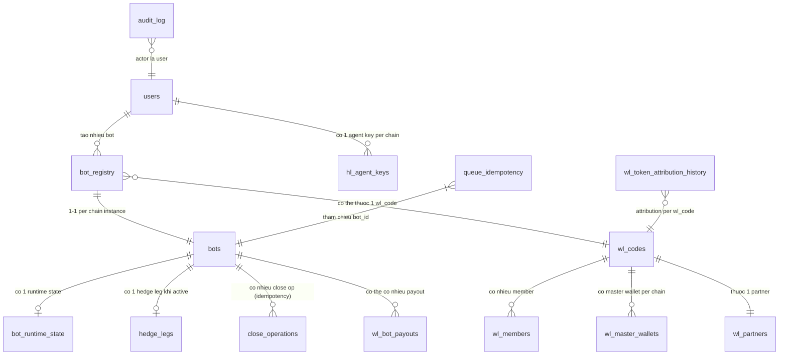
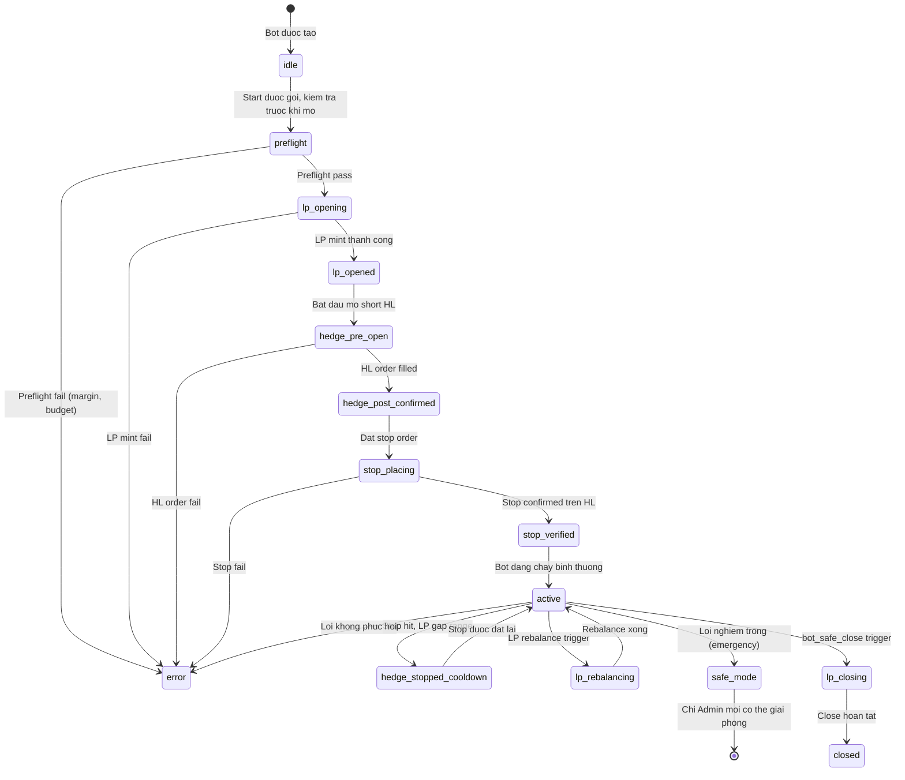
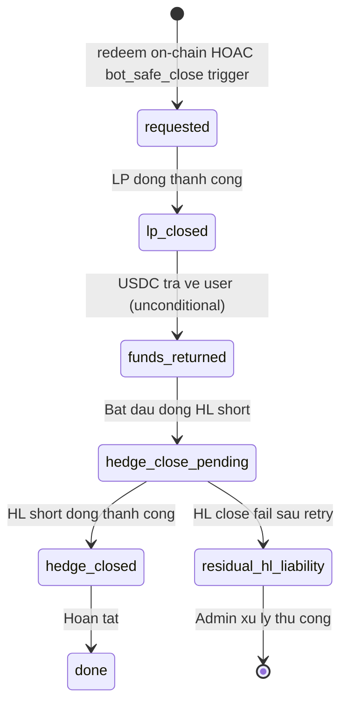
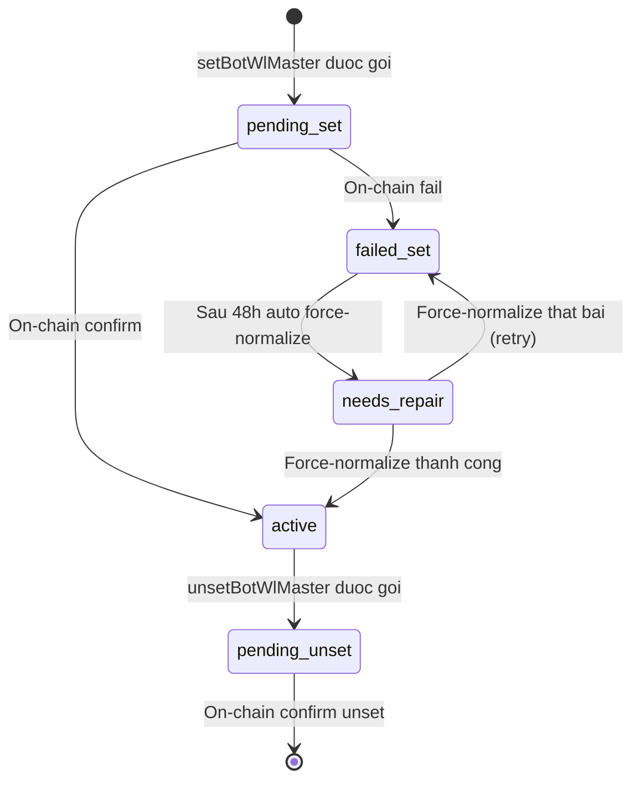

# QC Data Map: BNZA Ecosystem

**Ngay tao:** 2026-06-30
**Nguoi chuan bi:** QC Site Map Agent
**Nguoi review:** QC Lead / Trinh.Bui
**Version:** v1

---

## 1. Metadata

| Hang muc | Noi dung |
|---|---|
| Mode | Initialization |
| Chat luong nguon | Derived tu project-context-master.md + backbone.md + feature-map.md. Khong co signed-off ERD/DB schema doc. |
| Muc do san sang | Partial -- D1 schema va state machines da du de thiet ke test case cho P0 features |
| Baseline | project-context-master.md (2026-06-30), backbone.md |

---

## 2. Nguon da tham khao

| # | File | Version | Loai |
|---|---|---|---|
| 1 | project-context-master.md | Khong co version | Context + data objects + state machines + integrations |
| 2 | backbone.md | Khong co version | D1 schema, formulas, behavioral rules, state diagrams |
| 3 | feature-map.md | Khong co version | Feature index, dependency graph |

---

## 3. Kiem ke du lieu (Entity inventory)

> Cac entity duoi day duoc suy luan tu backbone.md §D1 Architecture, §8.9 behavioral rules, va project-context-master.md §7.2.
> Trang thai: `Derived` tru khi co signed-off DB schema confirm.

### 3.1 Nhom ExBot -- D1 state_db

| ENT ID | Ten Viet | Table/collection | Storage | Ownership | Cac truong QC quan trong | Trang thai nguon |
|---|---|---|---|---|---|---|
| ENT-XB-001 | Bot | bots | D1 state_db_shard_xx | User-owned (per wallet, per chain) | id, user_id, chain_id, lifecycle_state, hedge_ratio, lp_position_token_id, created_at, updated_at | Derived |
| ENT-XB-002 | Bot runtime state | bot_runtime_state | D1 state_db | System-level | bot_id, margin_status, last_light_check_at, last_deep_audit_at, budget_overflow_level | Derived |
| ENT-XB-003 | Hedge leg | hedge_legs | D1 state_db | System-level (per bot) | bot_id, hl_subaccount_id, actual_short_size, target_short_size, margin_status, stop_order_id, stop_verified, last_sync_at | Derived |
| ENT-XB-004 | Close operation | close_operations | D1 state_db | System-level (idempotency ledger) | id (close_op_id), bot_id, state, lp_closed_at, funds_returned_at, hedge_close_pending_at, hedge_closed_at, done_at, residual_hl_liability | Derived |
| ENT-XB-005 | Queue idempotency | queue_idempotency | D1 state_db | System-level | message_id (UNIQUE), status (started/succeeded), worker_type, created_at | Derived |
| ENT-XB-006 | HL agent key | hl_agent_keys | D1 control_db | System-level (encrypted) | user_id, encrypted_key, key_version, created_at | Derived -- sensitive; encrypted AES-GCM |
| ENT-XB-007 | Bot registry | bot_registry | D1 control_db | System-level | bot_id, user_id, chain_id, bot_type, wl_code, created_at | Derived |

### 3.2 Nhom WL -- D1 tables (Migrations 0024-0027)

| ENT ID | Ten Viet | Table/collection | Storage | Ownership | Cac truong QC quan trong | Trang thai nguon |
|---|---|---|---|---|---|---|
| ENT-WL-001 | WL Code | wl_codes | D1 control_db | System-level | code (unique 8-char), partner_id, status (active/suspended), post_record_url, created_at | Derived |
| ENT-WL-002 | WL Member | wl_members | D1 control_db | User-owned (per wallet) | wallet_address, wl_code, state, epoch, joined_at, left_at | Derived |
| ENT-WL-003 | WL Master Wallet | wl_master_wallets | D1 control_db | System-level | wl_code, master_wallet_address, chain_id, active | Derived |
| ENT-WL-004 | Bot config WL columns | bot_configs (altered) | D1 control_db | System-level | bot_id, wl_code, wl_activation_status, wl_set_tx_hash, wl_unset_tx_hash | Derived |
| ENT-WL-005 | WL Bot Payout | wl_bot_payouts | D1 control_db | System-level | id, bot_id, wl_code, amount_usdc, state (pending/attributed/rejected), created_at | Derived |
| ENT-WL-006 | WL Token Attribution History | wl_token_attribution_history | D1 control_db | System-level | id, event_tx_hash, token_id, wl_code, attributed_at | Derived |
| ENT-WL-007 | WL Compensation Queue | wl_compensation_queue | D1 control_db | System-level | id, bot_id, amount, reason, processed_at | Derived |

### 3.3 Nhom Admin -- D1 control_db

| ENT ID | Ten Viet | Table/collection | Storage | Ownership | Cac truong QC quan trong | Trang thai nguon |
|---|---|---|---|---|---|---|
| ENT-ADM-001 | User | users | D1 control_db | User-owned | wallet_address (PK), role (viewer/admin/super_admin), created_at | Derived |
| ENT-ADM-002 | WL Partner | wl_partners | D1 control_db | System-owned | id, name, logo_url, referral_code (unique), fixed_deposit_usd, main_wallet, languages, status | Derived |
| ENT-ADM-003 | Bot type config | bot_types | D1 control_db | System-owned | id, deposit_tiers, strategy_params, limits, cooldown_range | Derived |
| ENT-ADM-004 | Audit log | audit_log | D1 control_db | System-owned (append-only) | id, actor_wallet, module, action, reason_note, old_values, new_values, created_at | Derived -- append-only |
| ENT-ADM-005 | System config | system_config | D1 control_db | System-owned | key, value, updated_at, updated_by | Derived |


---

## 4. So do quan he giua cac entity (Entity relationship map)



### 4.1 Bang quan he chi tiet

| Entity A | Entity B | Kieu quan he | Huong phu thuoc | Cascade khi A bi xoa/vo hieu | Truong noi | Ghi chu QC |
|---|---|---|---|---|---|---|
| users | bot_registry | 1-n | A --> B | Need confirm (cascade-soft-delete?) | users.wallet_address = bot_registry.user_id | Test: xoa user co bots phai xac nhan cascade |
| bot_registry | bots | 1-1 | A --> B | cascade (bot_registry la parent) | bot_registry.bot_id = bots.id | |
| bot_registry | wl_codes | n-1 (optional) | B --> A | set-null khi wl_code suspended? | bot_registry.wl_code | Test: suspend wl_code --> bot van hoat dong khong? |
| bots | hedge_legs | 1-1 (khi active) | A --> B | cascade-delete | bots.id = hedge_legs.bot_id | Test: dong bot phai dong hedge_leg |
| bots | close_operations | 1-n | A --> B | archive-and-keep (idempotency) | bots.id = close_operations.bot_id | Test: dup redeem tao 1 hay 2 close_op? |
| bots | bot_runtime_state | 1-1 | A --> B | cascade-delete | bots.id = bot_runtime_state.bot_id | |
| wl_codes | wl_members | 1-n | A --> B | block (khong xoa member khi suspend code) | wl_codes.code = wl_members.wl_code | Test: suspend wl_code --> wl_members con active khong? |
| wl_codes | wl_master_wallets | 1-n per chain | A --> B | cascade khi code deactivated | wl_codes.code | Test: deactivate wl_code --> setBotWlMaster duoc goi de unset? |
| wl_partners | wl_codes | 1-n | A --> B | cascade-soft-delete | wl_partners.id = wl_codes.partner_id | Test: vo hieu WL Partner --> codes suspended tu dong khong? |

---

## 5. Vong doi entity (Lifecycle)

### 5.1 Bot (ENT-XB-001) -- bots table

**Tao:**
- Trigger: ACT-01 goi POOL UI (SCR-PL-005) --> OPERATOR API `/api/exbot/start` --> ExBot Worker queue bot-start
- Pre-condition: user da wallet connect, du USDC deposit, chain_id hop le (8453 hoac 10), max 10 bots/chain
- Side-effects: tao bot_registry entry, tao hl_agent_keys entry (neu chua co), tao hedge_legs entry, D1 bot row lifecycle_state = idle
- Validation: bigDecimal cho tat ca tinh toan; hedgeRatio khong doi

**Cac buoc lifecycle (bot-start flow):**
idle --> preflight --> lp_opening --> lp_opened --> hedge_pre_open --> hedge_post_confirmed --> stop_placing --> stop_verified --> active

**Trong runtime:**
- active --> hedge_stopped_cooldown (stop hit, dang trich lenh lai)
- active --> lp_rebalancing (rebalance LP range)
- active --> safe_mode (loi nghiem trong, dung moi HL mutation)

**Dong bot:**
- active --> lp_closing --> closed (qua bot_safe_close flow)
- active --> error (loi khong phuc hoi)

**Bo:**
- Khong co hard-delete -- archive-and-keep (close_operations luu lich su)
- `cooldown` va `parked` states: da bi xoa (HLD 2026-06-18). Test case KHONG con co 2 trang thai nay.

### 5.2 Close operation (ENT-XB-004) -- close_operations

**Tao:**
- Trigger: BnzaExVault.redeem() on-chain event (user-redeem) HOAC bot_safe_close (admin/auto)
- Pre-condition: bot ton tai, khong co close_op dang RUNNING cung bot_id (UNIQUE constraint)
- Initial state: requested

**Lifecycle:**
```
requested
  --> lp_closed          (sau khi dong LP position thanh cong)
  --> funds_returned     (sau khi USDC tra ve user -- UNCONDITIONAL per BR-EXBOT-006)
  --> hedge_close_pending (dang cho close HL short)
  --> hedge_closed        (HL short da dong)
  --> done                (hoan tat)
  
Terminal error path:
  hedge_close_pending --> residual_hl_liability (hedge close that bai sau retry)
```

**Rule bao ve:**
- BR-EXBOT-006: `funds_returned` phai thanh cong truoc khi bat dau close hedge. Hedge fail KHONG revert LP repayment.
- Idempotency: UNIQUE constraint tren (bot_id, close_reason) -- duplicate trigger --> return close_op hien tai, khong tao moi.

### 5.3 WL Member (ENT-WL-002) -- wl_members

**Lifecycle:**
```
(none) --> active    (join via WL code)
active --> leaving   (user gui yeu cau roi WL)
leaving --> left     (xu ly hoan tat)
left --> active      (rejoin, epoch++)
```

**Rang buoc:**
- One-wallet-one-WL constraint: mot wallet chi co the thuoc 1 wl_code tai mot thoi diem.
- Test: rejoin WL khac phai qua trang thai left truoc.

### 5.4 WL Activation Status (wl_activation_status per bot_config)

**Lifecycle:**
```
NULL --> pending_set   (yeu cau setBotWlMaster duoc gui)
pending_set --> active (on-chain confirm)
pending_set --> failed_set (on-chain fail)
active --> pending_unset (yeu cau unset)
pending_unset --> NULL  (on-chain confirm unset)
failed_set --> needs_repair (sau 48h auto force-normalize trigger)
needs_repair --> active (force-normalize thanh cong)
```

**Rule:**
- Auto force-normalize sau 48h: neu failed_set khong duoc xu ly, he thong tu dong chuyen sang needs_repair va trigger force-normalize.
- Reconciler retry backoff: 5s / 30s / 300s / 1800s, max 20 lan.

### 5.5 Queue Idempotency (ENT-XB-005)

**Lifecycle:**
- UNIQUE constraint tren `message_id`
- started: worker dang xu ly
- succeeded: xu ly xong
- Neu message_id da co (bat ky trang thai): worker return immediately, khong xu ly lai


---

## 6. So do chuyen trang thai (State transition diagrams)

### 6.1 bots.lifecycle_state



**Ghi chu chuyen trang thai cam:**
| Tu trang thai | Den trang thai | Cam / Khong hop le | Ly do |
|---|---|---|---|
| safe_mode | bat ky trang thai (tru admin reset) | Cam | safe_mode = khong co HL mutation |
| closed | bat ky trang thai (tru tao lai bot moi) | Cam | Terminal state |
| active | preflight | Cam | Bot dang chay khong the quay lai preflight |
| lp_closing | active | Cam | Close khong the revert |

> **Luu y (HLD 2026-06-18):** `cooldown` va `parked` da bi xoa. Test case cho 2 trang thai nay se fail.

### 6.2 close_operations.state



### 6.3 wl_activation_status



---

## 7. Ma tran CRUD x Role (Data-level permissions)

| Entity | ACT-01 (End User) | ACT-04 (Admin/zen) | ACT-06 (OPERATOR system) | Helix (ACT-07, HMAC server) | Ghi chu |
|---|---|---|---|---|---|
| bots (ENT-XB-001) | C(*) via POOL, R(*) own bots, D via redeem | R all, D (stop/close triggers) | CRUD full | - | ACT-01 chi thay bot cua minh |
| bot_runtime_state (ENT-XB-002) | - | R | CRUD | - | System internal only |
| hedge_legs (ENT-XB-003) | - | R | CRUD | - | System internal only |
| close_operations (ENT-XB-004) | - | R | CRUD | - | Append-only logic; no hard delete |
| queue_idempotency (ENT-XB-005) | - | - | CRU (no delete) | - | UNIQUE message_id; no delete |
| hl_agent_keys (ENT-XB-006) | C own key via approval | - | RU (encrypt/decrypt) | - | NEVER expose plaintext; audit required |
| bot_registry (ENT-XB-007) | C(†), R own | R | CRUD | - | one-wallet-many-bots per chain |
| wl_codes (ENT-WL-001) | - | CRUD | RU (status) | R (via Ledger API HMAC) | Suspend = toan bo delivery dung |
| wl_members (ENT-WL-002) | C (join), U (leave), R own | R | CRUD | R (via Bot API HMAC) | One-wallet-one-WL |
| wl_master_wallets (ENT-WL-003) | - | R | CRUD | - | |
| bot_configs WL cols (ENT-WL-004) | - | R | CRUD | - | wl_activation_status transitions critical |
| wl_bot_payouts (ENT-WL-005) | - | R | CRUD | R (Ledger API) | Min disclosure: no position_id/pool/token symbols |
| users (ENT-ADM-001) | C own, R own | CRUD (RBAC) | R | - | RBAC: viewer/admin/super_admin |
| wl_partners (ENT-ADM-002) | - | CRUD | R | - | super_admin tao; admin sua; viewer read-only |
| bot_types (ENT-ADM-003) | R | CRUD | R | - | |
| audit_log (ENT-ADM-004) | - | R (filter toi da 90 ngay) | C (append only) | - | Append-only; KHONG sua/xoa |
| system_config (ENT-ADM-005) | - | CRUD | R | - | All writes require reason note + Slack audit mirror |

**Ghi chu dac biet:**
- `(*)` = subset fields (ACT-01 khong thay cac truong noi bo nhu margin_status hay stop_verified)
- `(†)` = conditional scope (ACT-01 chi tao bot cua chinh minh)
- `hl_agent_keys`: KHONG BAO GIO log hoac return plaintext qua bat ky endpoint nao

### 7.1 Bang quyen truong nhay cam (Field-level permission)

| Entity | Truong nhay cam | Ai doc duoc | Ai khong doc duoc | Rule |
|---|---|---|---|---|
| hl_agent_keys | encrypted_key | ACT-06 OPERATOR (decrypt in memory) | Moi actor khac; khong log | Decrypted trong memory only; AES-GCM; KHONG return qua API |
| wl_bot_payouts | amount_usdc | ACT-04 Admin, ACT-06, Helix (Ledger API) | ACT-01 (End User) | Min disclosure: Helix khong nhan position_id/pool/token |
| users | wallet_address (PK) | ACT-04, ACT-06 | Khong expose cheo tenant | Cross-tenant read = critical security bug |
| audit_log | old_values, new_values | ACT-04 (Admin viewer) | ACT-01, Helix | Append-only; no delete/edit |

---

## 8. Ma tran Feature x Entity (UC x Entity coverage)

| Feature/UC | bots | hedge_legs | close_ops | queue_idem | hl_agent_keys | wl_codes | wl_members | wl_bot_payouts | wl_partners | audit_log | Hotspot |
|---|---|---|---|---|---|---|---|---|---|---|---|
| FM-XB-01 D1 Schema | C | C | C | C | C | - | - | - | - | - | High (schema parent) |
| FM-XB-09 Phase A1 / Bot Start | CRUD | CR | C | CRU | R | R | - | - | - | C | High (4+ entities) |
| Hedge Sync (queue) | RU | RU | - | CRU | R | - | - | - | - | C | Medium |
| User Redeem | RU | R | CRUD | CRU | - | - | - | CU | - | C | High (close_ops + payout) |
| Bot Safe Close | RU | RU | CRUD | CRU | R | - | - | CU | - | C | High |
| FM-ADM-01 WL Partner Onboarding | - | - | - | - | - | CRU | - | - | CRUD | C | High (wl_codes + on-chain) |
| FM-ADM-12 Audit Log | - | - | - | - | - | - | - | - | - | R | Low (read-only) |
| FM-OPW-02 Ledger API | - | - | - | - | - | R | R | R | R | - | Medium (multi-read, disclosure) |
| FM-OPW-03 Bot API | RU | - | - | - | - | R | CRUD | - | - | C | High (wl_members + on-chain) |
| FM-OPW-05 WlNetSent Scanner | R | - | - | CRU | - | R | - | CU | - | C | High (on-chain + payout) |
| FM-WLC-01 WL Contracts | R (LP NFT) | - | - | - | - | R | - | - | - | - | Medium (on-chain dep) |
| FM-ADM-10 WL Bot Monitor | RU | - | - | - | - | R | R | - | - | C | High (wl_activation_status) |

**Phan tich hotspot:**
- **High hotspot:** FM-XB-09 (Bot Start), User Redeem, Bot Safe Close, FM-ADM-01 WL Partner Onboarding, FM-OPW-03 Bot API, FM-OPW-05 WlNetSent Scanner, FM-ADM-10 WL Bot Monitor
- **Regression impact:** Moi thay doi vao bots table se anh huong toan bo 8 feature/UC co tham chieu bots
- **Cross-entity risk:** close_operations + wl_bot_payouts trong User Redeem va Bot Safe Close: test phai cover ca hai entity dong thoi

---

## 9. Phan tich khoang trong va rui ro

| ID | Loai | Mo ta | Anh huong QC | Priority |
|---|---|---|---|---|
| DMAP-001 | Khoang trong schema | Khong co signed-off ERD/DB schema doc. Tat ca entity la Derived. | Test data setup co the sai neu schema khac | High |
| DMAP-002 | NV-3 chua confirm | Duplicate reduce-only stop behavior tren HL chua duoc xac nhan (backbone.md NV-3) | Test case cho hedge_legs.stop_verified path (a) vs (b) chua thiet ke duoc | High |
| DMAP-003 | HL agent key lifecycle | Quy trinh ma hoa/giai ma AES-GCM cho hl_agent_keys chua co chi tiet spec | Test security path cua agent key kho thiet ke | High |
| DMAP-004 | wl_compensation_queue chua ro | wl_compensation_queue (migration 0027) chua co lifecycle ro rang trong tai lieu | Test case cho compensation queue can them spec | Medium |
| DMAP-005 | D1 sharding | state_db_shard_xx: Phase A la 1 shard. Sharding strategy cho multi-bot scale (10,000) chua co spec | Test scale (out of scope functional nhung can biet cho E2E) | Low |
| DMAP-006 | audit_log retention | Retention policy va archive strategy cho audit_log chua duoc xac dinh | Test cleanup/archive path chua thiet ke duoc | Low |

---

## 10. Huong dan CR impact

Khi co Change Request anh huong data:

1. Cap nhat Section 3 (Entity inventory).
2. Cap nhat Section 4 (Relationships/cascade).
3. Cap nhat Section 5 (Lifecycle).
4. Cap nhat Section 6 (State diagrams) neu trang thai thay doi.
5. Cap nhat Section 7 (CRUD role permissions).
6. Cap nhat Section 8 (Feature x Entity, hotspot analysis).

**KHONG** tich luy CR analysis trong file nay. Tao file rieng `CR-XXX-qc-impact.md` hoac them vao impact assessment cua CR do.

**Truong hop ngoai le (HLD 2026-06-18 da ap dung):**
- `cooldown` va `parked` states: da xoa khoi bots.lifecycle_state -- Section 6.1 da phan anh.
- Park/redeploy feature: da xoa -- khong co CloseDestination enum, FundsParked/Redeployed events.

